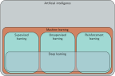
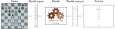

# Chapter 1 Introduction
人工智能（AI）旨在打造模仿智能行为的系统。它覆盖了众多方法，涵盖了基于逻辑、搜索和概率推理的技术。机器学习是 AI 的一个分支，它通过对观测数据进行数学模型拟合来学习决策制定。这个领域近年来迅猛发展，现在几乎（虽不完全准确）与 AI 同义。

深度神经网络是一类机器学习模型，将其应用到数据上的过程称为深度学习。目前，深度网络是最强大和最实用的机器学习模型之一，常见于日常生活中。我们常常用自然语言处理（Natural Language Processing）算法翻译文本、用计算机视觉（Computer Vision）系统搜索特定对象的图片，或通过语音识别（Speech Recognition）界面与数字助理交谈，这些都是深度学习的实际应用。

正如本书标题所示，它旨在帮助初学者理解深度学习的基本原理。本书既非理论性质太重（没有证明），也不过分侧重实践（几乎不包含代码）。其目的在于阐释深度学习的核心思想；读者在阅读完这本书后，将能够在没有现成成功方案的新情境中应用深度学习。
机器学习方法大体上分为三大类：监督学习（Supervised Learning）、无监督学习（Unsupervised Learning）和强化学习（Reinforcement Learning）。目前，这三大类的前沿方法均依赖于深度学习（见图 1.1）。本书的开篇章节从高层次上介绍了这三大类，并且这种分类也在书的结构中得到了体现。无论我们是否乐见，深度学习都将改变我们的世界，而这种改变并非全都是积极的。因此，本章还简要介绍了 AI 伦理学，并以如何充分利用本书的建议作结。
## 1.1 监督学习
监督学习模型建立了一种从输入数据到输出预测的关系。在后续几节中，我们会详细探讨输入、输出、模型本身，以及“训练”模型所指的含义。

图 1.1 机器学习是人工智能的一个分支，它专注于将数学模型应用于观测数据。它主要分为三个类别：监督学习、非监督学习和强化学习。深度神经网络在这三个领域中均发挥着重要作用。
### 1.1.1 回归和分类问题
图 1.2 展示了几个回归和分类问题的例子。在每个例子中，都有一个与现实世界相关的输入（如一个句子、一段声音文件、一幅图片等），这些输入被转换成数字向量。这个向量就是模型的输入。模型把这个输入映射到一个输出向量，随后这个输出向量被再次转换，变成一个具有现实意义的预测。目前，我们主要关注输入和输出，并把模型当作一个黑盒子，它接受一个数字向量并输出另一个数字向量。

图 1.2a 中的模型基于如房屋的平方米数和卧室数量等输入特征来预测房价。这是一个回归问题，因为模型返回的是一个连续数值（而非某个类别）。而图 1.2b 中的模型则以分子的化学结构为输入，预测其熔点和沸点。由于预测了多个数值，这是一个多变量回归问题。

图 1.2c 中的模型接收包含餐厅评论的文本字符串作为输入，并预测评论是正面的还是负面的。这是一个二元分类问题，因为模型试图将输入分配到两个不同的类别中。输出向量包含输入属于每个类别的概率。图 1.2d 和 1.2e 则展示了多类别分类问题。在这里，模型将输入分配到多于两个的类别中。第一个例子中，输入是一个音频文件，模型预测它包含的音乐类型。第二个例子中，输入是一幅图片，模型预测图片中包含的对象。在这些例子中，模型均返回一个包含各类别概率的大小为 N 的向量。

![[figures/chapter1/IntroModels.svg]]
图 1.2 回归和分类问题。a）这个回归模型使用描述房产特征的数字向量来预测其价格。b）这个多变量回归模型以化学分子的结构为输入，预测其熔点和沸点。c）这个二元分类模型接收餐厅评论，并将其划分为正面或负面。d）这个多类别分类问题将一段音频片段归类为 N 种音乐类型中的一种。e）第二个多类别分类问题中，模型根据图片可能包含的 N 种物体之一来分类图片。
### 1.1.2 输入
图 1.2 中的输入数据类型各异。在房价预测例子中，输入是一个固定长度的向量，包含了描述房产特征的值。这是一种表格数据，它没有内在结构；如果我们改变输入值的顺序再构建一个新模型，预期模型的预测结果不会改变。

另一方面，在餐厅评论的例子中，输入是一段文本。这可能根据评论中的单词数而长度不同，且输入顺序很重要；例如，“我的妻子吃了鸡肉”与“鸡肉吃了我的妻子”意义截然不同。在传递给模型之前，文本必须被编码为数字形式。这里，我们使用一个包含 10,000 个词的固定词汇表，并将单词索引简单拼接起来。

在音乐分类的例子中，输入向量可能是固定大小的（比如 10 秒音频片段），但其维度非常高。数字音频通常以 44.1 kHz 采样并以 16 位整数表示，因此一个 10 秒的音频片段包含 441,000 个整数。显然，监督学习模型必须能够处理大量输入。图像分类例子中的输入（由每个像素的 RGB 值串联起来的）也非常庞大。而且，它的结构本质上是二维的；即使在输入向量中不相邻，上下相邻的两个像素也紧密相关。

最后，考虑预测分子熔点和沸点的模型的输入。一个分子可能包含不同数量且连接方式各异的原子。在这种情况下，模型需要同时考虑分子的几何结构和组成原子。
### 1.1.3 机器学习模型
到目前为止，我们把机器学习模型当作一个黑盒子，它接受输入向量并返回输出向量。但这个黑盒子里面究竟是什么呢？考虑一个根据孩子年龄来预测身高的模型（见图 1.3）。机器学习模型其实是一个数学方程，描述了平均身高如何随年龄变化（图 1.3 中的青色曲线）。当我们把年龄输入这个方程，它就会返回相应的身高。例如，如果年龄是 10 岁，我们预测身高为 139 厘米。

更精确地说，这个模型代表了一系列方程，用于将输入映射到输出（即不同的青色曲线）。特定的方程（曲线）是根据训练数据（输入和输出对的示例）来选择的。在图 1.3 中，这些对由橙色点表示，我们可以看到模型（青色线条）合理地描述了这些数据。当我们谈到训练或拟合一个模型时，我们的意思是在可能的方程（青色曲线）中寻找一个最能准确描述训练数据的关系。

因此，图 1.2 中的模型需要标记好的输入/输出对来进行训练。例如，音乐分类模型需要大量音频片段，这些片段已由人类专家确定了各自的音乐类型。这些输入/输出对在训练过程中起到了教师或监督者的作用，这就是“监督学习”这个术语的由来。

![[figures/chapter1/IntroAgeHeight.svg]]

**图 1.3** 机器学习模型。该模型表示一系列关系，将输入（儿童年龄）与输出（儿童身高）联系起来。通过训练数据（橙色点，包括输入/输出对）来选定具体的关系。在训练模型过程中，我们寻找能够很好描述数据的关系。这里，经过训练的模型是青色曲线，可以用来计算任何年龄的儿童身高。
### 1.1.4 深度神经网络
这本书着重讨论深度神经网络，这是一种特别有效的机器学习模型。它们是方程，能够代表输入和输出之间极其广泛的关系，并且在这些关系中寻找描述训练数据的关系特别容易。

深度神经网络可以处理非常大、变化多端的输入，并且能够包含各种内部结构。它们能输出单个实数（回归）、多个数值（多变量回归）或两个或更多类别的概率（分别对应二元和多类别分类）。正如我们在下一节中将看到的，它们的输出也可能非常大、变长，并且包含内部结构。想象具有这些特性的方程可能很困难，读者应努力暂时搁置怀疑。
### 1.1.5 结构化输出
图 1.4a 展示了一个用于语义分割的多变量二元分类模型。在这里，输入图像的每个像素都被分配一个二元标签，指示它是属于牛还是背景。图 1.4b 展示了一个多变量回归模型，输入是街景图像，输出是每个像素的深度。在这两种情况下，输出都是高维且有结构的。然而，这种结构与输入紧密相关，可以被利用；如果一个像素被标记为“牛”，那么具有相似 RGB 值的邻近像素可能有相同的标签。

图 1.4c-e 描述了三个输出具有与输入不太紧密相关的复杂结构的模型。图 1.4c 展示了一个模型，输入是音频文件，输出是文件中的转录词。图 1.4d 是一个翻译模型，输入是英文文本，输出是法文翻译。图 1.4e 描述了一个极具挑战性的任务，输入是描述性文本，模型需要生成与这个描述匹配的图像。

原则上，这三个后续任务可以在标准监督学习框架下解决，但它们更为困难，原因有二。首先，输出可能确实模糊不清；从英语到法语有多种有效翻译，任何描述都可能对应多种图像。其次，输出包含大量结构；并非所有单词串都能构成有效的英语和法语句子，也不是所有 RGB 值的组合都能构成合理的图像。除了学习映射，我们还必须遵循输出的“语法”。

幸运的是，这种“语法”可以在不需要输出标签的情况下学习。例如，我们可以通过学习大量文本数据的统计信息来学习构建有效的英语句子。这为本书接下来讨论的无监督学习模型部分提供了一个联系。
![[figures/chapter1/IntroModels2a.svg]]

**图1.4** 具有结构化输出的监督学习任务。a) 这个语义分割模型把 RGB 图像映射到一个二元图像，用于指示每个像素是属于背景还是牛（改编自 Noh 等人，2015年）。b) 这个单目深度估计模型将 RGB 图像映射到一个输出图像，每个像素代表深度（改编自 Cordts 等人，2016年）。c) 这个音频转录模型将音频样本映射到音频中所说话语的文字转录。d) 这个翻译模型将英语文本字符串映射到其对应的法语翻译。e) 这个图像合成模型将文字描述映射到一幅图像（示例来自 https://openai.com/dall-e-2/ ）。在每个案例中，输出都具有复杂的内部结构或语法。在某些情况下，与输入相兼容的输出可能有多个。
## 1.2 无监督学习
从没有对应输出标签的输入数据中构建模型被称为无监督学习；缺乏输出标签意味着不存在“监督”。无监督学习的目标不是学习输入到输出的映射，而是描述或理解数据的结构。就像监督学习一样，数据可能具有非常不同的特点；它可能是离散或连续的，低维或高维的，长度固定或变化的。
### 1.2.1 生成式模型
本书着重介绍生成式无监督模型，这类模型学习如何合成新的数据实例，使其在统计上与训练数据难以区分。一些生成式模型明确描述了输入数据的概率分布，并通过从这个分布中抽样来生成新实例。其他模型则仅学习生成新实例的机制，而不直接描述其分布。

最先进的生成式模型能够合成极为逼真但与训练实例不同的实例。它们在生成图像（见图 1.5）和文本（见图 1.6）方面特别成功。这些模型还可以在某些输出预先确定的约束下合成数据（称为条件生成）。例如，包括图像修复（见图 1.7）和文本补全（见图 1.8）在内的应用。事实上，现代文本生成模型非常强大，以至于它们看起来几乎具有智能。给定一段文本后接一个问题，模型通常能通过生成文档最可能的补全来“填补”缺失的答案。然而，实际上，模型只了解语言的统计特性，并不真正理解其答案的含义。


图1.5 图像生成式模型。左图：两幅图像由训练有素的猫图模型生成。这些不是真正的猫，而是概率模型生成的样本。右图：两幅图像由专门训练的建筑图模型生成。改编自 Karras 等人 (2020b)。

```
当我到达森林边缘时，月亮已经升起，树木间筛下的光线银白而冷冽。我不由自主地颤抖起来，虽然我并不觉得冷，我加快了脚步。我从未离开过村庄这么远，对于接下来会发生什么，我心中毫无底。我已经走了数小时，感到疲惫和饥饿。我匆忙出发，连食物都没带，更别提武器了。在这个陌生的地方，我手无寸铁，孤身一人，不知所措。

我走了这么长时间，以至于完全失去了时间感。我不知道自己究竟走了多远，我只知道我必须继续前进。我必须找到她。我感觉我已经很接近了。她就在附近，而且她正处于危险之中。我必须找到她，并在一切为时已晚之前救助她。
```
图1.6 文本数据生成式模型合成的短篇故事。该模型描述了一个为每个输出字符串分配概率的概率分布。通过从模型中抽样，可以创造出遵循训练数据（这里是短篇故事）统计特性的字符串，这些字符串之前从未出现过。


图1.7 图像修复。原始图像（左图）中，男孩被金属缆绳遮挡。不需要的区域（中图）被移除，生成式模型在其余像素保持不变的约束下合成了新图像（右图）。改编自 Saharia 等人 (2022a)。

```
在巴斯大学进行的第一场讲座前，我有些紧张。教室里坐满了看似成百上千的学生，他们的目光让人畏惧。我走上讲台，刚要开口，却发生了一件奇怪的事情。

突然，教室里回荡着震耳欲聋的噪声，宛如巨兽的咆哮。声音太大了，我不得不捂住耳朵，什么都听不见了。我看到学生们惊慌失措地四处张望。然而，就像它来得那么突然，噪声又迅速消失，教室恢复了寂静。

`我愣在那里，试图弄清楚刚才发生了什么。然后我意识到，所有学生都在等着我说话。我本想说些风趣或聪明的话，但脑海一片空白。于是我只好说：“嗯，那真奇怪”，接着开始我的讲座。`
```
图1.8 条件性文本合成。给定一段初始文本（第一段），文本生成式模型可以通过合成“缺失”的剩余部分来合理地继续这段文字。由 GPT3 生成（Brown 等人，2020）。


图1.9 人脸的变化。人脸大约包含 42 块肌肉，因此可以用大约 42 个数字来描述同一个人在相同光照条件下的图像中的大部分变化。一般而言，图像、音乐和文本的数据集可以用相对较少的潜在变量来描述，尽管通常更难将这些变量与特定的物理机制联系起来。图像来自 Dynamic FACES 数据库（Holland 等人，2019）。
### 1.2.2 潜变量
一些生成式模型（但不是所有）利用了这样一个观点：数据的维度可以比原始观测变量的数量更小。例如，有效且有意义的英语句子的数量远少于随机组合单词形成的字符串数量。同样，真实世界的图像只占通过随机赋予每个像素 RGB 值能创建的图像的一小部分。这是因为图像是由物理过程生成的（见图 1.9）。

这就引出了一个想法，即我们可以使用较少的潜在变量来描述每个数据实例。在这里，深度学习的作用是描述这些潜变量与数据之间的映射关系。这些潜变量通常被设计为具有简单的概率分布。通过从这个分布中抽样并将结果通过深度学习模型传递，我们可以创造新的样本（见图 1.10）。


图1.10 潜变量。潜变量在许多生成模型中扮演关键角色，这些模型利用深度学习来揭示低维潜变量与观测到的高维数据之间的联系。潜变量按设计拥有简易的概率分布。因此，通过从这些潜变量的简单分布中采样，再利用深度学习模型将采样结果映射到观测数据空间，我们便能创造出新的样本。

这些模型为操纵真实数据提供了新的方法。例如，考虑找出支持两个真实实例的潜变量。我们可以通过在它们的潜在表示之间插值，并将中间位置映射回数据空间，从而在这些实例之间进行插值（见图 1.11）。


图1.11 图像插值。图像插值是一种有趣的应用。在每一行的图像中，左右两侧为真实图像，中间三张则是生成模型创造的插值序列。这些生成模型学习到了所有图像均可通过一组潜在变量来生成的原理。通过确定这两张真实图像的潜变量，对它们的值进行插值，然后用这些中间变量生成新图像，我们能创造出既视觉上合理，又融合了两张原始图像特征的中间图像。上排图片改编自 Sauer 等人 (2022)，下排图片改编自 Ramesh 等人 (2022)。
### 1.2.3 结合监督学习与无监督学习
具有潜变量的生成式模型也可以促进输出具有结构的监督学习模型的发展（见图 1.4）。例如，考虑学习如何预测与描述相对应的图像。我们可以学习文本的潜变量与图像的潜变量之间的关系，而不是直接将文本输入映射到图像上。

这种方法有三个优点。首先，由于输入和输出维度较低，我们可能需要更少的文本/图像对来学习这种映射。其次，我们更有可能生成看起来合理的图像；潜变量的任何合理值都应该产生像是一个可信的示例。第三，如果我们在两组潜变量之间的映射或潜变量到图像的映射中引入随机性，那么我们可以生成多个都与描述相匹配的图像（见图 1.12）。


图1.12 从“时代广场上的滑板泰迪熊”这个标题出发，DALL·E-2（Ramesh 等人，2022）生成了多张图片。
## 1.3 强化学习
机器学习的最后一个领域是强化学习。这个范畴引入了代理（agent）的概念，代理生活在一个世界中，在每个时间步骤中可以执行特定行动。行动会改变系统的状态，但这种改变不一定是确定性的。执行行动还可能产生奖励，强化学习的目标是让代理学会选择能够平均获得高奖励的行动。

一个复杂点是奖励可能在行动后一段时间才出现，因此把奖励与特定行动关联起来并不直接。这被称为时间性信用分配问题。在学习过程中，代理必须在探索（寻找新的可能性）和利用（使用已知的策略）之间做出平衡；也许代理已经学会了如何获得适度的奖励，它应该继续遵循这个策略（利用现有知识），还是尝试不同的行动以寻找改进的机会（探索新的可能性）？
### 1.3.1 两个例子
考虑教一个类人机器人如何行走。机器人在特定时间可以执行有限的行动（如移动各种关节），这些行动会改变世界的状态（即它的姿态）。我们可以通过设立障碍赛道上的检查点来奖励机器人。为了到达每个检查点，它必须执行许多行动，但当收到奖励时，很难确定哪些行动对奖励有贡献，哪些是无关紧要的。这就是时间性信用分配问题的一个实例。

第二个例子是学习下棋。同样，代理在任何时刻都有一组有效的行动（棋子移动）。然而，这些行动以非确定性的方式改变系统状态；对于任何行动选择，对手可能以多种不同的方式回应。这里，我们可以根据捕获棋子来设定奖励结构，或者在游戏结束时赢得比赛来获得单一奖励。在后者情况下，时间性信用分配问题非常严重；系统必须学习在众多走法中哪些是成功或失败的关键。

探索与利用的权衡在这两个例子中也很明显。机器人可能已经发现，通过侧躺并用一条腿推动可以前进。这种策略虽然能让机器人移动并获得奖励，但比最优解——站立行走——要慢得多。因此，它面临一个选择，是利用已知的策略（沿地面滑行）还是探索其他可能的行动（可能实现更快的移动）。在下棋例子中也是如此，代理可能学到了一系列合理的开局走法。它应该利用这些知识，还是探索不同的开局序列？

深度学习如何融入强化学习框架可能不那么明显。有几种可能的方法，其中一种是使用深度网络构建从观察到的世界状态到行动的映射。这被称为策略网络。在机器人的例子中，策略网络会学习从传感器测量到关节运动的映射。在下棋的例子中，网络将学习从棋盘的当前状态到走法选择的映射（见图 1.13）。


图1.13 在强化学习中使用策略网络是一种创新。通过深度神经网络，我们可以定义从状态（例如棋盘上的位置）到动作（可能的移动）的映射。这种映射即为所谓的“策略”。
## 1.4 伦理
如果不讨论人工智能的伦理影响就撰写本书，将是不负责任的。这种强大技术将至少在与电力、内燃机、晶体管或互联网相同的程度上改变世界。在医疗保健、设计、娱乐、交通、教育以及几乎所有商业领域的潜在益处都是巨大的。然而，科学家和工程师对其工作成果的影响常常过于乐观，造成的潜在伤害同样巨大。以下几点突出了五个关注点。

- **偏见与公平性**：如果我们训练一个系统基于历史数据来预测个人的薪酬水平，那么这个系统将重现历史偏见；例如，它可能会预测女性应获得比男性更低的薪酬。已有几个此类案例成为国际新闻：一个用于超分辨率人脸图像的 AI 系统使非白人看起来更白；一个用于生成图像的系统在被要求合成律师图片时只产生了男性的图片。不慎使用 AI 进行算法决策可能会加剧现有偏见。有关更多讨论，请参阅 Binns（2018）。
- **解释性**：深度学习系统做出决策，但我们通常不知道其基于何种信息或如何做出的。它们可能包含数十亿个参数，我们无法仅通过检查来理解它们的工作原理。这导致了可解释 AI 的子领域的形成。一个中等成功的领域是产生局部解释；我们无法解释整个系统，但可以提供为何做出特定决策的可解释描述。然而，目前尚不清楚是否有可能构建对其用户甚至其创建者完全透明的复杂决策系统。更多信息请参见 Grennan 等人（2022）。
- **武器化 AI**：所有重要技术都被直接或间接地用于战争。可悲的是，暴力冲突似乎是人类行为的不可避免特征。AI 可能是有史以来构建的最强大的技术，并且无疑会在军事背景中得到广泛部署。事实上，这已经在发生（参见 Heikkilä，2022）。
- **集中权力**：世界上最强大的公司之所以大力投资人工智能，并非出于改善人类命运的善意兴趣。他们意识到这些技术将使他们获得巨大利润。与任何先进技术一样，深度学习可能会使权力集中在掌握它的少数组织手中。将目前由人类完成的工作自动化，将改变经济环境，对薪资较低、技能较少的工人的生计产生不成比例的影响。乐观主义者认为，工业革命期间也发生了类似的变革，导致工作时间缩短。但事实是，我们不知道 AI 的大规模应用将对社会产生何种影响（参见 David，2015）。
- **存在风险**：人类面临的主要存在风险都来自技术。气候变化是由工业化推动的。核武器源于物理学研究。由于交通、农业和建筑的创新，使得人口更大、更密集、更相互连接，疫情因此更易发生且传播更快。人工智能带来新的存在风险。我们应该非常谨慎地构建比人类更有能力和可扩展性的系统。在最乐观的情况下，它会将巨大的权力集中在少数拥有者手中。在最悲观的情况下，我们可能无法控制它，甚至无法理解其动机（参见 Tegmark，2018）。

这份列表远非完整。AI 还可能助长监控、虚假信息、隐私侵犯、欺诈和金融市场操纵的现象，而且培训 AI 系统所需的能源也会对气候变化产生影响。此外，这些担忧并非无的放矢；AI 的伦理问题已有许多实例（参见 Dao，2021年的部分列表）。互联网的近期历史展示了新技术可能以意想不到的方式造成伤害。80年代和90年代初的在线社区几乎无法预见假新闻、垃圾邮件、网络骚扰、欺诈、网络欺凌、极端单身文化、政治操纵、个人信息泄露、网络激进化和网络报复色情的泛滥。

研究或学习（或撰写关于）AI 的每个人都应思考科学家对其技术使用的责任程度。我们应该认识到，资本主义是推动 AI 发展的主要动力，法律进步和社会利益的实施可能会大大落后。我们应反思作为科学家和工程师，是否有可能控制这个领域的进展，以减少潜在的伤害。我们还应考虑愿意为哪种组织工作。他们在减少 AI 潜在危害方面的承诺有多认真？他们是否只是为了减少声誉风险而进行“伦理洗白”，还是真正实施机制来停止伦理上可疑的项目？

鼓励所有读者进一步探索这些问题。在线课程 https://ethics-of-ai.mooc.fi/ 是一个有用的入门资源。如果您是使用本书进行教学的教授，建议您与学生讨论这些问题。如果您是在未进行此类讨论的课程中学习的学生，请敦促您的教授实现这一点。如果您在企业环境中部署或研究 AI，建议您审视雇主的价值观，并帮助改变它们（或离开），如果它们不尽人意。
## 1.5 本书结构
本书的结构遵循本导言的框架。第2至9章详细介绍监督学习流程。我们描述了浅层和深层神经网络，并讨论了如何训练它们、如何衡量和提高它们的性能。第10至13章讲述了深度神经网络的常见架构变化，包括卷积网络、残差连接和变压器，这些架构在监督学习、无监督学习和强化学习中都有应用。

第14至18章聚焦通过深度神经网络进行的无监督学习。我们专门为四种现代深度生成模型各写了一章：生成对抗网络、变分自编码器、规范化流和扩散模型。第19章简要介绍深度强化学习。这个主题本可以轻易成为一本书的核心，因此本书的处理相对浅显。然而，这一部分旨在为不熟悉这一领域的读者提供一个良好的起点。

尽管本书标题为“深度学习”，但深度学习的某些方面仍然缺乏充分理解。第20章提出了一些基础问题：为什么深度网络易于训练？为什么它们泛化能力如此强？为什么需要如此多的参数？它们是否需要深度？在此过程中，我们探讨了一些意外现象，如损失函数的结构、双重下降、理解和彩票。书籍以第21章结尾，讨论伦理和深度学习。
## 1.6  其他书籍
这本书是自成体系的，但主要聚焦于深度学习领域。它旨在成为《深度学习》（Goodfellow 等人，2016年）的精神续作，后者是一本极佳的资源，但没有涵盖近期的进展。对于更广泛的机器学习领域，最新且百科全书式的资源是《概率机器学习》（Murphy，2022年、2023年）。然而，《模式识别与机器学习》（Bishop，2006年）仍是一本优秀且相关的书籍。

如果你喜欢本书，那么我之前的作品《计算机视觉：模型、学习与推理》（Prince，2012年）也值得一读。尽管部分内容已显陈旧，但它包含了对概率的全面介绍，包括贝叶斯方法，以及潜变量模型、计算机视觉的几何学、高斯过程和图形模型的良好初步覆盖。它使用与本书相同的符号，并可以在网上找到。关于图形模型的详细处理可以在《概率图形模型：原理与技术》（Koller & Friedman，2009年）中找到，而高斯过程则由《机器学习中的高斯过程》（Williams & Rasmussen，2006年）涵盖。

对于背景数学，可以参考《机器学习的数学》（Deisenroth 等人，2020年）。更注重编程的方法可以参考《深入深度学习》（Zhang 等人，2023年）。计算机视觉最佳概述是 Szeliski（2022年），还有即将出版的《计算机视觉基础》（Torralba 等人，2024年）。学习图神经网络的好起点是《图表示学习》（Hamilton，2020年）。关于强化学习的权威著作是《强化学习导论》（Sutton & Barto，2018年）。一个很好的入门资源是《深度强化学习基础》（Graesser & Keng，2019年）。
## 1.7 如何阅读本书
本书的大多数剩余章节包含主要正文、注释部分和一组问题。主要正文旨在自成体系，可在不参考章节其他部分的情况下阅读。尽可能地，背景数学被纳入正文中。但对于那些可能会分散主要论点注意力的更大主题，背景材料被放在附录中，并在页边提供参考。本书中的大多数符号是标准的。但一些约定使用得不太广泛，鼓励读者在继续之前查阅附录A。

正文包括许多深度学习模型和结果的新颖插图和可视化。我努力提供现有观点的新解释，而不仅仅是整理他人的工作。深度学习是一个新领域，有时现象理解不足。我试图明确指出在哪些情况下是这样，以及何时我的解释应该谨慎对待。

只有在描述结果的章节主体中才包含参考文献。相反，它们可以在章节末尾的注释部分找到。我在主文中通常不尊重历史先例；如果当前技术的祖先已不再有用，我将不会提及它。然而，该领域的历史发展在注释部分有所描述，并希望公平地分配了功劳。注释被组织成段落，并提供了进一步阅读的指引。它们应该帮助读者在子领域内定位自己，并理解它与机器学习的其他部分的关系。注释部分不像正文那样自成体系。根据您的背景知识和兴趣水平，您可能会觉得这些部分更有用或更没用。

每章都有一些相关的问题。它们在主文的边栏中被引用，应在相应的点尝试解答。正如乔治·波利亚所指出的，“你看，数学不是一项观赏运动。”他是正确的，我强烈建议你在阅读时尝试解决问题。在某些情况下，它们提供了将帮助您理解正文的洞察。在相关网站上提供答案的问题用星号标记。此外，帮助您理解本书中观点的 Python 笔记本也可通过网站获得，并在正文的边栏中引用。事实上，如果您感到生疏，现在可能值得通读一下有关背景数学的笔记本。

不幸的是，AI 研究的进展速度使得这本书不可避免地成为一项持续的工作。如果有您觉得难以理解的部分、值得注意的遗漏或看似多余的部分，请通过相关网站与我联系。我们可以一起让下一版更好。
