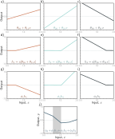
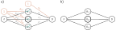
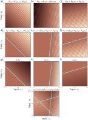
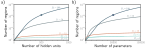
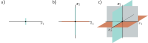
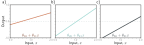

# 第三章 浅层神经网络
第二章我们学习了使用一维线性回归的监督学习方法，但这种模型只能表示出输入与输出之间简单的线性关系。在这一章里，我们将接触到浅层神经网络。这种网络可以表达分段线性函数，并且能力强大到足以近似任何复杂度的多维输入和输出之间的关系。
## 3.1 神经网络示例
浅层神经网络是带有参数 $\phi$ 的函数 $y = f[x, \phi]$，它将多变量输入 $x$ 映射成多变量输出 $y$。关于浅层神经网络的全面定义将在第3.4节中给出。首先，我们通过一个示例网络 $f[x, \phi]$ 来介绍核心概念。这个网络能够将单一变量输入 $x$ 转化为单一变量输出 $y$，并包含十个参数 $\phi = \{\phi_0, \phi_1, \phi_2, \phi_3, \theta_{10}, \theta_{11}, \theta_{20}, \theta_{21}, \theta_{30}, \theta_{31}\}$：

$$
\begin{align}
y &= f[x, \phi] \\ 
&= \phi_0 + \phi_1a[\theta_{10} + \theta_{11}x] + \phi_2a[\theta_{20} + \theta_{21}x] + \phi_3a[\theta_{30} + \theta_{31}x] \tag{3.1}
\end{align}
$$

这个计算过程可以分成三个步骤：首先，计算输入数据 $x$ 的三个线性函数（$\theta_{10} + \theta_{11}x, \theta_{20} + \theta_{21}x, \theta_{30} + \theta_{31}x$）。接着，将这三个函数的结果通过激活函数 $a[\cdot]$ 处理。最后，用 $\phi_1, \phi_2, \phi_3$ 对这三个激活结果进行加权，求和，并加上一个偏移量 $\phi_0$。

接下来，我们需要定义激活函数（activation function）$a[\cdot]$。虽然有很多选择，但最常用的是整流线性单元（ReLU）：

$$
a[z] = ReLU[z] = 
\begin{cases}
0 & \text{if } z < 0 \\
z & \text{if } z \geq 0
\end{cases} \tag{3.2}
$$

这个函数在输入为正时返回输入值，否则返回零（参见图 3.1）。

方程 3.1 描述了哪一类输入/输出关系可能不是一目了然的。但是，前一章节提到的所有概念都适用于这里。方程 3.1 表示了一个函数族，具体的函数取决于 φ 中的十个参数。如果我们知道这些参数，就可以通过对给定输入 $x$ 计算该方程来进行推断（预测 $y$）。给定一个训练数据集 $\{{x_i,y_i}\}^I_{i=1}$，我们可以定义一个最小二乘损失函数 $L[\phi]$，用它来评估对于任意参数值 $\phi$，模型描述该数据集的效果。为了训练这个模型，我们要找出能够最小化这个损失的参数值 $\hat \phi$。

`图 3.1 整流线性单元 (Rectified Linear Unit, ReLU)。这种激活函数在输入小于零时输出为零，否则保持输入值不变。简而言之，它将所有负数输入值变为零。需要注意的是，虽然有许多其他激活函数可供选择（参见图 3.13），但 ReLU 由于其简单易懂，成为最常用的选择。`

`图 3.2 由方程 3.1 定义的函数族。a-c) 展示了三种不同参数 $\phi$ 的选择下的函数。在这些函数中，输入与输出的关系均为分段线性。不过，各个拐点的位置、拐点间线段的斜率，以及整体高度各不相同。`
### 3.1.1 神经网络直观理解
事实上，方程 3.1 描述了一个连续分段线性函数族（见图 3.2），这个函数族最多包含四个线性区域。下面我们解析这个方程，阐释它是如何描绘出这样一个函数族的。为了便于理解，我们将这个函数拆分为两个部分。首先，我们定义几个中间量：

$$
\begin{align}
h1 = a[\theta_{10} + \theta_{11}x] \\
h2 = a[\theta_{20} + \theta_{21}x] \\
h3 = a[\theta_{30} + \theta_{31}x] 
\end{align} \tag{3.3}
$$
这里的 $h1, h2, h3$ 被称为隐藏单元。然后，我们通过将这些隐藏单元与一个线性函数结合来计算输出：

$$
y = \phi_0 + \phi_1h1 + \phi_2h2 + \phi_3h3 \tag{3.4}
$$

图 3.3 展示了形成图 3.2a 中函数的计算流程。每个隐藏单元内包含了一个关于输入的线性函数 $\theta_0 + \theta_1x$，该线性函数在零点以下被 ReLU 函数 $a[\cdot]$ 截断。这三条线在零点交叉的位置形成了最终输出函数的三个“拐点”。然后，分别用 $\phi_1, \phi_2, \phi_3$ 对这三条被截断的线加权。最后，加上偏移量 $\phi_0$ 来控制最终函数的整体高度。

`图 3.3 展示图 3.2a 中函数的计算过程。a-c) 输入 x 分别经过三个具有不同 y 截距 θ•0 和斜率 θ•1 的线性函数处理。d-f) 每个线性函数的输出再经过 ReLU 激活函数处理，将所有负数输出值变为零。g-i) 接着，这三个处理过的输出分别乘以权重 $\phi_1 , \phi_2 , \phi_3$ 进行加权。j) 最后，将这些加权后的输出相加，并加上一个控制整体高度的偏移量 $\phi_0$ 。每个线性段代表了隐层单元中的一种不同激活模式。在阴影区域，h2 处于非激活状态（被剪切），而 h1 和 h3 保持激活状态。`

在图 3.3j 中，每个线性区域对应于隐藏单元中的一种不同激活模式。当一个单元在 ReLU 函数下被截断时，我们称其为不活跃状态；相反，如果没有被截断，则处于活跃状态。例如，在阴影区域内，得到 $h1$ 和 $h3$（处于活跃状态）的贡献，但没有 $h2$（处于不活跃状态）的贡献。每个线性区域的斜率取决于两个因素：（i）这个区域内活跃输入的原始斜率 $\theta_1$ 和（ii）随后应用的权重 $\phi$。例如，在阴影区域（参见问题 3.3），斜率是 $\phi_1\theta_{11} + \theta_{31}\phi_3$，其中第一项是图中（g）面板的斜率，第二项是（i）面板的斜率。

由于每个隐藏单元贡献了一个拐点，所以有三个隐藏单元时，可以形成四个线性区域。但是，这些区域的斜率只有三个是相互独立的；第四个斜率要么是零（如果在这个区域所有隐藏单元都处于不活跃状态），要么是其他区域斜率的总和。
### 3.1.2 描绘神经网络
我们此前一直探讨的是一种神经网络，它由一个输入层、一个输出层和三个隐藏单元组成。在图 3.4a 中，我们将这个网络形象化。图中，最左边的是输入层，中间部分是隐藏单元，右边则是输出层。图中的每一条连接线代表了这个神经网络的十个参数中的一个。而为了图像表示的简洁，我们通常不会特别标出截距参数，所以大多数情况下，这个网络的表达方式如图 3.4b 所示。

`图 3.4 描述神经网络结构。a) 输入变量 x 位于左侧，隐层单元 h1 , h2 , 和 h3 位于中间，输出变量 y 位于右侧。计算过程从左向右进行。输入变量用于计算隐层单元的值，这些隐层单元的组合进而生成输出值。图中的十个箭头分别代表一个参数，橙色代表截距，黑色代表斜率。每个参数将其来源的值乘以自己，然后将结果加到其目标上。例如，我们将参数 φ1 与来源于 h1 的值相乘，再将结果加到 y 上。为了将偏移量纳入这一计算框架，引入了值为 1 的额外节点（橙色圆圈），例如我们将 φ0 乘以 1（实际上无变化）后加到 y 上。ReLU 函数被应用于隐层单元。b) 通常情况下，网络图中会省略截距、ReLU 函数和参数名称的显示；这种简化后的表示方式实际上描述了同一个网络。`
## 3.2 通用逼近定理（Universal approximation theorem）
在上一节中，我们介绍了一个只有一个输入、一个输出、使用ReLU激活函数，并配备了三个隐藏单元的神经网络示例。现在，让我们稍微扩展这个概念，考虑一个拥有 $D$ 个隐藏单元的网络，其中第 $d^{th}$ 个隐藏单元表示为：

$$
h_d = a[\theta_{d0} + \theta_{d1}x], \tag{3.5}
$$

这些隐藏单元通过线性方式结合，共同产生输出：

$$
y = \phi_0 + \sum_{d=1}^{D} \phi_dh_d. \tag{3.6}
$$

在浅层网络中，隐藏单元的数量是衡量网络“容量”（即其处理复杂性的能力）的一个指标。当使用 ReLU 激活函数时，具有 $D$ 个隐藏单元的网络输出最多有 $D$ 个拐点，因此它是一个最多有 $D + 1$ 个线性区域的分段线性函数。随着增加更多的隐藏单元，模型能够逼近更为复杂的函数。

实际上，如果网络有足够的“容量”（即足够多的隐藏单元），它就能够以任意精度描述定义在实数线某个紧凑子集上的任何连续一维函数。这是因为，每当我们增加一个隐藏单元，就会在函数中增加一个新的线性区域。随着这些线性区域的增多，它们代表了函数中越来越小的部分，这些部分可以被一条线越来越精确地逼近（参见图 3.5）。通用逼近定理证明了，对于任何连续函数，都存在一个浅层网络，它能以任意设定的精度逼近这个函数。

`图 3.5 用分段线性模型近似一维函数（虚线表示）。a-c) 随着分段区域的数量增加，该模型逐渐趋近于连续函数。一个只有单一输入的神经网络会为每个隐层单元新增一个线性区域。根据通用近似定理（Universal Approximation Theorem），只要隐层单元足够多，就能构建一个浅层神经网络，该网络能够以任意精度近似定义在 RDi 紧凑子集上的任何连续函数。`
## 3.3 多变量输入与输出
在前述例子中，网络仅有一个单变量标量输入 $x$ 和一个单变量标量输出 $y$。然而，对于网络将多变量输入 $x = [x_1, x_2, \dots, x_{D_i}]^T$（其中 “$^T$” 表示转置）映射到多变量输出预测 $y = [y_1, y_2, \dots, y_{D_o}]^T$ 的更广泛情况，通用逼近定理 (universal approximation theorem) 依然成立。我们首先探讨如何改进模型以预测多变量输出。接着，我们将讨论多变量输入的处理方式。最后，在第 3.4 节，我们会提出浅层神经网络的通用定义。
## 3.3 多变量输入和输出
在前面的例子中，网络有一个单变量输入 $x$ 和一个单变量输出 $y$。然而，通用逼近定理也同样适用于网络将多变量输入 $x = [x_1, x_2, \dots, x_{D_i}]^T$ 映射到多变量输出 $y = [y_1, y_2, \dots, y_{D_o}]^T$ 的更一般情况。我们首先探索如何将模型扩展到预测多变量输出。然后我们会考虑多变量输入。最后，在第3.4节中，我们将提出浅层神经网络的通用定义。
### 3.3.1 可视化多变量输出
为了将网络扩展到能产生多变量输出 $y$，我们可以简单地为每个输出使用隐藏单元的不同线性函数。例如，一个具有单变量输入 $x$、四个隐藏单元 $h_1, h_2, h_3, h_4$ 和一个二维多变量输出 $y = [y_1, y_2]^T$ 的网络可以定义为：

$$
\begin{align}
h_1 = a[\theta_{10} + \theta_{11}x] \\
h_2 = a[\theta_{20} + \theta_{21}x] \\
h_3 = a[\theta_{30} + \theta_{31}x] \\
h_4 = a[\theta_{40} + \theta_{41}x] 
\end{align} \tag{3.7}
$$
以及
$$
\begin{align}
y1 = \phi_{10} + \phi_{11}h1 + \phi_{12}h2 + \phi_{13}h3 + \phi_{14}h4 \\
y2 = \phi_{20} + \phi_{21}h1 + \phi_{22}h2 + \phi_{23}h3 + \phi_{24}h4.
\end{align} \tag{3.8}
$$

这两个输出是隐藏单元的两种不同线性组合。

如图 3.3 所示，分段函数的“接点”取决于隐藏单元处的 ReLU 函数 $a[\cdot]$ 截断的初始线性函数 $\theta_0 + \theta_1x$。由于 $y1$ 和 $y2$ 都是相同四个隐藏单元的不同线性函数，因此它们各自的四个“接点”位置必须相同。然而，这些线性区域的斜率和整体的垂直偏移可能不同（参见图 3.6）。

`图 3.6 展示了一个具有一个输入、四个隐层单元和两个输出的网络。a) 网络结构的可视化展示。b) 该网络产生两个分段线性函数，y1[x] 和 y2[x]。由于这些函数共享相同的隐层单元，它们的四个“关节”（位于垂直虚线处）位置是固定的，但它们的斜率和整体高度可能有所不同。`

### 3.3.2 可视化多变量输入

为了应对多变量输入 $x$，我们扩展了输入与隐藏单元之间的线性关联。例如，一个有两个输入 $x = [x_1, x_2]^T$ 和一个标量输出 $y$ 的网络（参见图 3.7）可能由三个隐藏单元构成，定义如下：

$$
\begin{align}
h1 = a[\theta_{10} + \theta_{11}x_1 + \theta_{12}x_2] \\
h2 = a[\theta_{20} + \theta_{21}x_1 + \theta_{22}x_2] \\
h3 = a[\theta_{30} + \theta_{31}x_1 + \theta_{32}x_2]
\end{align} \tag{3.9}
$$

这里，每个输入都对应一个斜率参数。隐藏单元以通常的方式结合，形成输出：

$$
y = \phi_0 + \phi_1h1 + \phi_2h2 + \phi_3h3 \tag{3.10}
$$

`图 3.7 展示了具有二维多变量输入 x = [x1, x2]^T 和单一输出 y 的神经网络的可视化。`

图 3.8 展示了这个网络的处理过程。每个隐藏单元接收两个输入的线性组合，这在三维输入/输出空间中形成了一个有方向的平面。激活函数将这些平面的负值剪切为零。接着，这些被剪切的平面在第二个线性函数（方程 3.10）中被重新组合，形成了一个由凸多边形区域组成的连续分段线性表面（见图 3.8j）。每个区域代表了一种不同的激活模式。例如，在中央的三角形区域中，第一个和第三个隐藏单元处于激活状态，而第二个则未激活。当模型有超过两个输入时，可视化变得更加困难。不过，其基本原理是相似的：输出将是输入的连续分段线性函数，其中线性区域在多维输入空间中呈现为凸多面体。

`图 3.8 在一个具有两个输入 $x = [x1,x2]^T$、三个隐层单元 h1,h2,h3 和一个输出 y 的网络中的处理过程。a-c) 每个隐层单元的输入是两个输入变量的线性函数，对应于一个方向性平面。亮度代表函数的输出，例如，在面板 (a) 中，亮度表示 $θ_10 + θ_{11}x_1 + θ_{12} x2$。细线代表等值线。d-f) ReLU (Rectified Linear Unit) 激活函数对每个平面进行剪切处理（青色线相当于图 3.3d-f 中的“关节”）。g-i) 这些被剪切的平面随后被加权，j) 然后和一个决定表面整体高度的偏移量相加。最终得到的是一个由凸的分段线性多边形区域构成的连续表面。`

需要注意的是，随着输入维度的增加，线性区域的数量迅速增长（参见图 3.9）。为了更好地理解这种增长速度，考虑每个隐藏单元定义了一个超平面，区分了单元活跃和不活跃的空间部分（见图 3.8d-f 中的青色线条）。如果我们的隐藏单元数量与输入维度 $D_i$ 相等，我们可以将每个超平面与一个坐标轴对齐（见图 3.10）。对于两个输入维度，这会将空间划分为四个象限。对于三个维度，这会形成八个八分区，而对于 $D_i$ 维度，则会形成 $2^{D_i}$ 个正交空间。由于浅层神经网络通常比输入维度有更多的隐藏单元，它们通常会创造出超过 $2^{D_i}$ 个线性区域。

## 3.4 浅层神经网络：一般情况

我们已经通过几个示例来展示浅层网络的工作原理。现在我们定义一个浅层神经网络的通用方程 \( y = f[x, \phi] \)，它利用 \( h \in \mathbb{R}^{D_h} \) 个隐藏单元将多维输入 \( x \in \mathbb{R}^{D_i} \) 映射到多维输出 \( y \in \mathbb{R}^{D_o} \)。每个隐藏单元的计算方式如下：

$$
h_d = a \left[ \theta_{d0} + \sum_{i=1}^{D_i} \theta_{di}x_i \right] \tag{3.11}
$$

`图 3.9 隐层单元与线性区域的关系。a) 对于五种不同输入维度 Di = {1, 5, 10, 50, 100}，展示了隐层单元数与其能够产生的最大线性区域数之间的关系。在高维度下，线性区域的数量迅速增加；例如，在 D = 500 单元和输入维度 Di = 100 的情况下，线性区域的数量可以超过 10^107（实心圆所示）。b) 将相同的数据以参数数量作为函数进行绘制。实心圆表示与 a) 面板中相同的模型，拥有 D = 500 隐层单元。这个网络有 51,001 个参数，在现代标准下被认为非常小。`

`图 3.10 输入维度与线性区域数量的关系。a) 对于单输入维度的模型，一个隐层单元可以创建一个分割点，将输入轴分为两个线性区域。b) 在两个输入维度的模型中，两个隐层单元可以使用两条线（此处与坐标轴对齐）划分输入空间，形成四个区域。c) 在三个输入维度的模型中，三个隐层单元可以用三个平面（同样与坐标轴对齐）划分输入空间，形成八个区域。延伸这一逻辑，一个具有 Di 输入维度和 Di 隐层单元的模型可以用 Di 超平面来划分输入空间，从而形成 2^Di 个线性区域。`

`图 3.11 展示了一个具有三个输入和两个输出的神经网络的可视化。该网络共有二十个参数，包括十五个斜率（由箭头指示）和五个偏移（未显示）。`

这些隐藏单元被线性方式组合，以产生输出：

$$
y_j = \phi_{j0} + \sum_{d=1}^{D_h} \phi_{jd}h_d \tag{3.12}
$$

其中 $a[\cdot]$  是一种非线性激活函数。该模型的参数为 $\phi = \{ \theta_{\cdot}, \phi_{\cdot}\}$。图 3.11 展示了一个包含三个输入、三个隐藏单元和两个输出的示例。

激活函数使得模型能描述输入与输出之间的非线性关系，因此它本身必须是非线性的；如果没有激活函数，或使用线性激活函数，从输入到输出的映射将被限制为线性映射。已尝试了多种不同的激活函数（见图 3.13），但最常用的选择是 ReLU（见图 3.1），它具有易于理解的优点。使用 ReLU 激活的网络将输入空间划分为由 ReLU 函数中的“接点”计算出的超平面交叉定义的凸多面体。每个凸多面体内包含一个不同的线性函数。尽管每个输出的多面体都相同，但它们包含的线性函数可能会有所不同。
## 3.5 术语
在本章的结尾，我们来介绍一些术语。神经网络领域有很多专业术语。通常情况下，它们是通过层来描述的。在图 3.12 中，左边是输入层，中间是隐藏层，右边是输出层。我们可以说图 3.12 中的网络有一个包含四个隐藏单元的隐藏层。隐藏单元本身有时也被称为神经元。当数据通过网络传输时，隐藏层输入的值（即在应用 ReLU 函数之前的值）被称为预激活值。隐藏层的值（即在应用 ReLU 函数之后的值）被称为激活值。

由于历史原因，任何至少有一个隐藏层的神经网络也被称为多层感知器（MLP）。本章所述的具有一个隐藏层的网络有时被称为浅层神经网络。具有多个隐藏层的网络（将在下一章中描述）被称为深度神经网络。其中连接形成一个无环图（即没有循环的图，如本章中的所有示例）的神经网络被称为前馈网络。如果一个层中的每个元素都连接到下一个层中的每个元素（如本章中的所有示例），则该网络被称为全连接网络。这些连接代表了基础方程中的斜率参数，并被称为网络权重。偏移参数（在图 3.12 中未显示）被称为偏置。

`图 3.12 术语: 一个浅层网络由一个输入层、一个隐层和一个输出层构成。每一层都通过前向连接（箭头所示）与下一层相连，因此这类模型被称为前向网络（feed-forward networks）。当每一层中的每个变量都与下一层的每个变量相连时，我们称之为全连接网络（fully connected network）。每个连接代表了底层方程中的斜率参数，这些参数称为权重（weights）。隐层中的变量被称为神经元（neurons）或隐层单元（hidden units）。进入隐层单元的值称为激活前值（pre-activations），而隐层单元上的值（即应用 ReLU 函数后的值）称为激活值（activations）。`
## 3.6 总结
浅层神经网络包含一个隐藏层。它们的工作过程包括：(i) 计算输入的多个线性函数，(ii) 将这些函数结果通过激活函数处理，然后 (iii) 将这些激活后的结果线性组合以产生输出。浅层神经网络通过将输入空间划分成连续的、由分段线性区域组成的表面来根据输入 x 进行预测 y。只要拥有足够多的隐藏单元（神经元），浅层神经网络能够以任意精度逼近任何连续函数。

第 4 章将讨论深度神经网络，这些网络通过增加更多隐藏层来扩展本章所述的模型。第 5 至 7 章将描述如何训练这些模型。
## Notes
**"神经"网络**：如果本章中的模型仅仅是函数，为什么它们被称为“神经网络”呢？这个连接实际上是比较脆弱的。像图 3.12 中的可视化包括节点（输入、隐藏单元和输出），它们之间有密集的连接。这与哺乳动物大脑中密集连接的神经元在表面上有相似之处。然而，几乎没有证据表明大脑计算的方式与神经网络相同，而且从生物学角度来考虑这一点是没有帮助的。

`图 3.13 激活函数（Activation functions）。a) Logistic sigmoid 函数和 tanh 函数。b) Leaky ReLU 函数和参数为 0.25 的 Parametric ReLU 函数。c) SoftPlus 函数、高斯误差线性激活函数（Gaussian error linear unit）和 sigmoid线性激活函数（sigmoid linear unit）。d) 参数为 0.5 和 1.0 的指数线性激活函数（Exponential Linear Unit）。e) 按比例调整的指数线性激活函数（Scaled Exponential Linear Unit）。f) 参数为 0.4，1.0，和 1.4 的 Swish 函数。`

**神经网络的历史**：1943年，McCulloch 和 Pitts 首次提出了人工神经元的概念，这种神经元能够将输入信号组合以产生输出，但缺乏有效的学习算法。1958年，Rosenblatt 开发出了感知机（Perceptron），一种通过线性组合输入信号并设定阈值来做出是/否决策的模型，并为其设计了一种从数据中学习权重的算法。1969年，Minsky 和 Papert 指出，仅用线性函数处理一般分类问题是不够的。他们认为，通过增加带有非线性激活函数的隐藏层（由此产生了“多层感知机（Multi-layer Perceptron）”这一术语），可以学习到更广泛的输入/输出关系。不过，他们也指出，Rosenblatt 的算法无法学习这些模型的参数。直到20世纪80年代，一个有效的学习算法——反向传播（Backpropagation，详见第7章）才被发明，此后神经网络的研究才重新获得显著发展。关于神经网络历史的详细记载可参见 Kurenkov (2020)、Sejnowski (2018) 和 Schmidhuber (2022) 的著作。

**激活函数**：ReLU（Rectified Linear Unit）函数最早在1969年由 Fukushima 提出并使用。然而，在神经网络的早期阶段，更常见的激活函数是逻辑 S 形（Logistic Sigmoid）或双曲正切（Tanh）函数（见图 3.13a）。2009年以后，由 Jarrett et al.、Nair & Hinton 和 Glorot et al. 等人的工作重新推广，ReLU 成为现代神经网络成功故事的重要组成部分。ReLU 的一个显著特性是，对于大于零的输入值，其输出相对于输入的导数恒为1，这有助于提高训练的稳定性和效率（详见第7章）。这与逻辑 S 形激活函数形成鲜明对比，后者的导数在大的正输入和负输入下会趋近于零，即发生饱和现象。

然而，ReLU函数存在一个明显的不足：当输入为负值时，它的导数为零。这意味着如果所有训练样本对某个ReLU函数都产生负输入，那么在训练过程中就无法改进该ReLU的输入参数。因为相对于输入权重的梯度在局部呈平坦状态，我们无法通过梯度下降法“下坡”。这种现象被称为ReLU消亡问题。为解决这一问题，提出了多种ReLU的改进版本（见图 3.13b），包括 (i) 渗漏ReLU（Leaky ReLU，Maas et al., 2013），即使对负输入值也有一定的线性输出，其斜率较小，大约为0.1；(ii) 参数化ReLU（Parametric ReLU，He et al., 2015），将负值部分的斜率作为一个可学习的参数；以及 (iii) 连接型ReLU（Concatenated ReLU，Shang et al., 2016），它生成两个输出，一个在零以下截断（类似于标准ReLU），另一个在零以上截断。

此外，还研究了多种平滑函数（见图 3.13c–d），例如soft-plus函数（Glorot et al., 2011）、高斯误差线性单元（Gaussian Error Linear Unit，Hendrycks & Gimpel, 2016）、S形线性单元（Sigmoid Linear Unit，Hendrycks & Gimpel, 2016）和指数线性单元（Exponential Linear Unit，Clevert et al., 2015）。这些函数大多旨在避免ReLU消亡问题，同时限制负值的梯度过大。Klambauer et al. (2017) 提出了缩放指数线性单元（Scaled Exponential Linear Unit，见图 3.13e），这一激活函数特别有趣，因为当输入方差在有限范围内时，它能帮助稳定激活值的方差（详见第7.5节）。2017年，Ramachandran et al. 采用了一种经验方法来选择激活函数。他们在可能的函数空间中寻找，在各种监督学习任务上表现最佳的函数。他们找到的最佳函数是 $a[x] = x/(1 + exp[−βx])$，其中 β 是一个可学习的参数（见图 3.13f）。他们将这个函数命名为Swish。有趣的是，Swish实际上是对 Hendrycks & Gimpel (2016) 和 Elfwing et al. (2018) 之前提出的激活函数的再发现。2019年，Howard et al. 提出了HardSwish函数，它近似于Swish，形状非常相似，但计算速度更快：

$$
HardSwish[z] =
\begin{cases} 
  0 & \text{for } z < -3 \\
  \frac{z(z + 3)}{6} & \text{for } -3 \leq z \leq 3 \\
  z & \text{for } z > 3 
\end{cases} \tag{3.13}

$$

尽管这些激活函数各有特点，但目前尚无定论哪种在实际应用中明显优于其他。不过，渗漏ReLU、参数化ReLU和许多连续函数在特定情况下相比ReLU确实表现出了轻微的性能提升。在本书剩余部分，我们主要关注使用基本ReLU函数的神经网络，因为它们创建的函数更容易根据线性区域数量进行刻画。

**通用逼近定理**：该定理的宽度版本指出，存在一个单隐藏层且隐藏单元数量有限的网络，能够在 Rn 的紧凑子集上以任意精度逼近任何特定的连续函数。这一理论最初由 Cybenko (1989) 针对 S 形激活函数类别证明，并后由 Hornik (1991) 扩展到更广泛的非线性激活函数。

**线性区域数量**：考虑一个拥有 $D_i \geq 2$ 维输入和 D 个隐藏单元的浅层网络。其线性区域的数量取决于由 ReLU 函数的转折点所形成的 D 个超平面的相交情况（如图 3.8d-f 所示）。每个区域由 ReLU 函数对输入的剪切或不剪切的不同组合产生。Zaslavsky (1975) 指出，在 $D_i \leq D$ 维输入空间内，由 D 个超平面所创造的区域数量最多可以达到 $\sum_{j=0}^{D_i} \binom{D}{j}$（即二项式系数之和）。一般而言，浅层神经网络的隐藏单元数 D 几乎总是大于输入维度 $D_i$，并能在 $2^{D_i}$ 到 $2^D$ 之间创造多个线性区域。

**线性、仿射与非线性函数**：严格定义下，线性变换 $f[\cdot]$ 是遵循叠加原理的任何函数，即  $f[a + b] = f[a] + f[b]$。根据这个定义，$f[2a] = 2f[a]$。加权和 $f[h1, h2, h3] = \phi_{h1} + \phi_{h2} + \phi_{h3}$ 是线性的，但加上偏移（偏置）后，$f[h1, h2, h3] = \phi_0 + \phi_{h1} + \phi_{h2} + \phi_{h3}$，就不再是线性的。例如，当我们加倍前一个函数的参数时，输出也加倍，但后一个函数不是这样。后者更恰当地被称为仿射函数。在机器学习领域，这些术语常常混用。在本书中，我们也将遵循这一习惯，把这两种函数都称为线性。我们将遇到的所有其他函数都是非线性的。
## 课后习题
**问题 3.1** 若方程 3.1 中的激活函数是线性的，即 $a[z] = \phi_0 + \phi_{1}z$，则输入到输出的映射将是怎样的？如果移除激活函数，使 $a[z] = z$，又将产生何种映射？

**问题 3.2** 在图 3.3j 的四个线性区域中，分别指出哪些隐藏单元是活跃的，哪些是不活跃的（即剪切或不剪切输入的隐藏单元）。

**问题 3.3** 导出图 3.3j 函数中“关节”位置的表达式，用十个参数 $\phi$ 和输入 x 表示。同时，导出四个线性区域斜率的表达式。

**问题 3.4** 绘制图 3.3 的一个版本，其中第三个隐藏单元的截距和斜率发生变化，如图 3.14c 所示，假定其他参数保持不变。

`图 3.14：针对问题 3.4, 描述了一个网络的处理过程，该网络具有一个输入，三个隐藏单元，以及一个输出。a-c) 所示的是，每个隐藏单元接受的输入来源是原输入的线性转换。前两个隐藏单元接收到的输入与图 3.3 中的一样，但是最后一个与它们不同。`

**问题 3.5** 证明以下性质对于 $\alpha \in \mathbb{R}^+$ 成立：
$$
ReLU[\alpha \cdot z] = \alpha \cdot ReLU[z] \tag{3.14}
$$
这是 ReLU 函数的非负齐次性质。

**问题 3.6** 继续问题 3.5，当我们将方程 3.3 和 3.4 中定义的浅层网络的参数 $\theta_{10}$ 和 $\theta_{11}$ 乘以一个正常数 $\alpha$ 并将斜率 $\phi_1$ 除以同一参数 $\alpha$ 时，会发生什么？如果 $\alpha$ 是负数呢？

**问题 3.7** 考虑使用最小二乘损失函数拟合方程 3.1 中的模型。这个损失函数是否有唯一的最小值？即，是否存在一组“最佳”参数？

**问题 3.8** 考虑将 ReLU 激活函数替换为 (i) 海维赛德阶跃函数 $heaviside[z]$，(ii) 双曲正切函数 $tanh[z]$，以及 (iii) 矩形函数 $rect[z]$。为每种激活函数重绘图 3.3，并简要描述使用一个输入、三个隐藏单元和一个输出的神经网络，对于每种激活函数所能创造的函数族。
$$
heaviside[z] = \begin{cases}
0 & z < 0 \\
1 & z \geq 0
\end{cases}
$$
$$
rect[z] = \begin{cases}
0 & z < 0 \\
1 & 0 \leq z \leq 1 \\
0 & z > 1
\end{cases} \tag{3.15}
$$

请针对以下每一个函数，重新绘制一份图 3.3。原始的参数为：$\phi = [\phi_0, \phi_1, \phi_2, \phi_3, \theta_{10}, \theta_{20}, 	\theta_{30}, 	\theta_{31}] = [-0.23, -1.3, 1.3, 0.66, -0.2, 0.4, -0.9, 0.9, 1.1, -0.7]$。对于每个激活函数，尝试用通俗的语言解释一下，对于那些神经网络来说，它们只有一个输入，三个隐藏单元和一个输出，可以创造出什么样的函数族。

**问题 3.9** 证明图 3.3 中第三个线性区域的斜率是第一个和第四个线性区域斜率之和。

**问题 3.10** 考虑一个有一个输入、一个输出和三个隐藏单元的神经网络。图 3.3 展示了如何形成四个线性区域。在什么情况下，这个网络会产生少于四个线性区域的分段线性函数？

**问题 3.11** 和 **问题 3.12** 图 3.7 中的模型包含多少个参数？

**问题 3.13** 在图 3.8 的七个区域中，每个区域的激活模式分别是什么？也就是说，在每个区域中，哪些隐藏单元是激活状态（传递输入），哪些是非激活状态（剪切输入）？

**问题 3.14** 描述图 3.11 中网络的方程。需要三个方程从输入计算出三个隐藏单元的值，以及两个方程从隐藏单元计算输出。

**问题 3.15** 图 3.11 中的网络最多能创建多少个三维线性区域？

**问题 3.16** 描述一个具有两个输入、四个隐藏单元和三个输出的网络的方程，并按照图 3.11 的风格绘制这个网络模型。

**问题 3.17** 方程 3.11 和 3.12 定义了一个具有 $D_i$ 个输入、$D_h$ 个隐藏单元的隐藏层以及 $D_o$ 个输出的通用神经网络。求出模型参数数量的表达式，以 $D_i$、$D_h$ 和 $D_o$ 作为变量。

**问题 3.18** 证明一个只有 $D_i = 2$ 维输入、$D_o = 1$ 维输出和 $D = 3$ 个隐藏单元的浅层网络所能创建的最大区域数是七个，如图 3.8j 所示。根据 Zaslavsky (1975) 的结果，即用 $D$ 个超平面划分 $D_i$ 维空间时创造的最大区域数是 $\sum_{j=0}^{D_i} \binom{D}{j}$。如果在这个模型中增加两个隐藏单元，使 $D = 5$，那么最大区域数将是多少？
