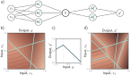
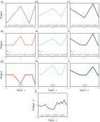
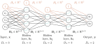
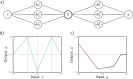
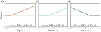

前面一章我们讨论了只有一个隐藏层的浅层神经网络。本章，我们将转向深度神经网络，这种网络拥有多个隐藏层。无论是浅层还是深层网络，当使用 ReLU (Rectified Linear Unit) 激活函数时，它们都能实现从输入到输出的分段直线式的变换。

浅层神经网络的能力随着隐藏单元数量的增加而提升。实际上，如果隐藏单元足够多，这些网络甚至能够模拟高维空间中极其复杂的函数。但是，对于某些特定的函数，所需的隐藏单元数量可能非常庞大，以至于实际应用变得不现实。相比之下，深度神经网络能够在相同数量的参数条件下创造出更多的线性判断区域。因此，从实际应用的角度来看，深度网络能够描述更加广泛的函数类型。

## 4.1 组合神经网络
为了更深入地理解深度神经网络的行为特征，我们首先考虑将两个浅层网络进行组合，使得第一个网络的输出成为第二个网络的输入。设想两个各有三个隐藏单元的浅层网络（见图 4.1a）。第一个网络接收输入 x，并产生输出 y，其定义如下：
$$
\begin{align}
h_1 = a[\theta_{10}+\theta_{11}x] \\
h_2 = a[\theta_{20}+\theta_{21}x] \\
h_3 = a[\theta_{30}+\theta_{31}x] 
\end{align} \tag{4.1}
$$
以及
$$
y = \phi_0 + \phi_1h_1 + \phi_2h_2 + \phi_3h_3 \tag{4.2}
$$
第二个网络以 y 作为输入，产生输出 y′，定义如下：
$$
\begin{align}
h^\prime_1 = a[\theta^\prime_{10}+\theta^\prime_{11}y] \\
h^\prime_2 = a[\theta^\prime_{20}+\theta^\prime_{21}y] \\
h^\prime_3 = a[\theta^\prime_{30}+\theta^\prime_{31}y]
\end{align} \tag{4.3}
$$
以及
$$
y^\prime = \phi^\prime_0 + \phi^\prime_1h^\prime_1 + \phi^\prime_2h^\prime_2 + \phi^\prime_3h^\prime_3 \tag{4.2}
$$
在使用 ReLU（线性整流单元）激活函数的情况下，该模型描述了一系列分段线性函数。然而，与拥有六个隐藏单元的浅层网络相比，这种组合网络的线性区域数量潜在地更多。例如，若第一个网络产生三个正负斜率交替的区域（见图 4.1b），这意味着三个不同范围的 x 值被映射到同一输出范围 y ∈ [−1, 1]。接下来，从该 y 范围到 y′ 的映射被重复应用三次。最终的效果是，第二个网络定义的函数被复制三次，从而形成九个线性区域。这一原理在更高维度同样适用（见图 4.2）。

`图 4.1: 结合了各含三个隐藏单元的两个单层网络。a) 第一个网络的输出 y 成为第二个网络的输入。b) 第一个网络通过一个包含三个线性区域的函数，将输入 x（取值范围为 [−1, 1]）映射到输出 y（取值范围为 [−1, 1]）。这些线性区域的设计目的是让它们的斜率符号交替出现。因此，多个输入 x（以灰色圆圈表示）可以被映射到同一个输出 y（以青色圆圈表示）。c) 第二个网络定义了一个包含三个线性区域的函数，它将输入 y 转换为输出 y′（即将青色圆圈映射到棕色圆圈）。d) 当这两个函数结合后，它们共同作用的结果是：(i) 第一个网络能将三个不同的输入 x 映射到任意一个特定的输出 y，以及 ((ii) 第二个网络以相同的方式处理这些输出；这导致第二个网络在面板 (c) 中定义的函数被重复三次，并根据面板 (b) 中各区域的斜率不同，进行了相应的翻转和缩放处理。`

`图 4.2: 结合了两个神经网络，输入为二维。a) 第一个网络（源自图 3.8）包含三个隐藏单元，它接收两个输入 x1 和 x2，并输出一个标量 y。这个输出随后被送入一个含有两个隐藏单元的第二网络，生成输出 y′。b) 第一个网络构建的函数包含七个线性区域，其中一个区域保持水平。c) 第二个网络定义了一个在 y ∈ [−1, 1] 范围内包含两个线性区域的函数。d) 当这两个网络结合时，第一个网络中的六个非平坦区域每个都被第二网络划分为两个新的区域，总共形成了 13 个线性区域。`

`图 4.3: 深层网络用于折叠输入空间。a) 对于图 4.1 中的第一个网络，一种理解方式是它把输入空间折叠，使其叠加在自身之上。b) 第二个网络则在这个已被折叠的空间上施加其功能。c) 最终的输出结果，是在再次展开这些折叠后得到的。`

组合网络的另一种思考方式是，第一个网络将输入空间 x 折叠回自身，使得多个输入产生相同的输出。随后，第二个网络在所有重叠点上应用同一函数，实现了函数在这些点上的复制（见图 4.3）。

## 4.2 从组合网络到深层网络
上一节我们展示了通过将一个浅层神经网络的输出传递给另一个网络，可以创建复杂的函数。现在我们将说明，这实际上是一个包含两个隐藏层的深层网络的特例。

第一个网络的输出（$y = \phi_0 + \phi_1h_1 + \phi_2h_2 + \phi_3h_3$）是隐藏单元激活值的线性组合。第二个网络的初始操作（根据方程 4.3，我们计算 $\theta'_{10}+\theta'_{11}y、\theta'_{20}+θ'_{21}y 和 \theta'_{30}+\theta'_{31}y$）是对第一个网络输出的线性函数。将一个线性函数应用于另一个线性函数，结果仍然是线性函数。将 y 的表达式代入方程 4.3，可以得到：

$$
\begin{align}
h'_1 = a[\psi_0 + \theta_{11} \psi_1] = a[\psi_0 + \theta_{11} \phi_0 + \theta_{11} \phi_1 h_1 + \theta_{11} \phi_2 h_2 + \theta_{11} \phi_3 h_3] \\
h'_2 = a[\psi_0 + \theta_{21} \psi_1] = a[\psi_0 + \theta_{21} \phi_0 + \theta_{21} \phi_1 h_1 + \theta_{21} \phi_2 h_2 + \theta_{21} \phi_3 h_3] \\
h'_3 = a[\psi_0 + \theta_{31} \psi_1] = a[\psi_0 + \theta_{31} \phi_0 + \theta_{31} \phi_1 h_1 + \theta_{31} \phi_2 h_2 + \theta_{31} \phi_3 h_3]
\end{align} \tag{4.5}
$$

进一步重写为：

$$
\begin{align}
h'_1 = a[\psi_0 + \psi_{11} h_1 + \psi_{12} h_2 + \psi_{13} h_3] \\
h'_2 = a[\psi_0 + \psi_{21} h_1 + \psi_{22} h_2 + \psi_{23} h_3] \\
h'_3 = a[\psi_0 + \psi_{31} h_1 + \psi_{32} h_2 + \psi_{33} h_3],
\end{align} \tag{4.6}
$$ 

其中 $\psi_{10} = \theta^\prime_{10} + \theta^\prime_{11} \psi_0, \psi_{11} = \theta^\prime_{11}\psi_1 , \psi_{12} = \theta^\prime_{11}\psi_2$ 等等。这样的结果就是一个拥有两个隐藏层的网络（见图 4.4）。

因此，一个含有两层的网络能够表示那些通过将单层网络的输出传递给另一个网络而创建的函数族。实际上，它能表示一个更广泛的函数族，因为在方程 4.6 中，九个斜率参数 $\psi_{11}, psi_{21}, ..., psi_{33}$ 可以取任意值。而在方程 4.5 中，这些参数受限于外积 $[\theta^\prime_{11},\theta^\prime_{21},\theta^\prime_{31}]^T[\psi_1, \psi_2, \psi_3]$。

### 4.3 深度神经网络
在上一节中，我们展示了将两个浅层网络组合起来可以形成一个有两个隐藏层的特殊深度网络。现在，我们将探讨一个一般情况下的深度网络，它具有两个隐藏层，每层含有三个隐藏单元（见图 4.4）。

`图 4.4: 一个神经网络，它有一个输入、一个输出，并包含两个隐藏层，每层有三个隐藏单元。`

第一层由以下公式定义：

$$
\begin{align}
h_1 = a[\theta_{10} + \theta_{11}x] \\
h_2 = a[\theta_{20} + \theta_{21}x] \\
h_3 = a[\theta_{30} + \theta_{31}x]
\end{align} \tag{4.7}
$$

接着是第二层：

$$
\begin{align}
h'_1 = a[\psi_{10} + \psi_{11}h_1 + \psi_{12}h_2 + \psi_{13}h_3] \\
h'_2 = a[\psi_{20} + \psi_{21}h_1 + \psi_{22}h_2 + \psi_{23}h_3] \\
h'_3 = a[\psi_{30} + \psi_{31}h_1 + \psi_{32}h_2 + \psi_{33}h_3]
\end{align} \tag{4.8}
$$

以及输出层：

$$
y' = \phi_0 + \phi_1h'_1 + \phi_2h'_2 + \phi_3h'_3 \tag{4.9}
$$

基于这些方程，我们可以用另一种方式思考网络是如何构建出越来越复杂的函数（见图 4.5）：

1. 第一层的三个隐藏单元 $h_1,h_2,h_3$通过对输入形成线性函数，然后通过 ReLU 激活函数来计算（参见方程 4.7）。
2. 第二层的激活前状态是通过对这些隐藏单元形成三个新的线性函数来计算的（参见方程 4.8）。此时，我们实际上构建了一个有三个输出的浅层网络，计算了三个具有相同转折点位置的分段线性函数（参见图 3.6）。 
3. 在第二隐藏层，我们对每个函数应用另一个 ReLU 函数 a[⋅] （参见方程 4.8），这会对函数进行裁剪并在每个函数中添加新的转折点。
4. 最终的输出是这些隐藏单元的线性组合（参见方程 4.9）。

``图 4.5: 图 4.4 中深层网络的计算过程。a–c) 第二隐藏层接收的输入（即预激活值）是三个分段线性函数，这些函数在相同的位置连接（参见图 3.6）。d–f) ReLU 激活函数将每个分段线性函数的值截断为零。g–i) 接着，这些被截断的函数分别以参数 φ′1、`φ′2 和 φ′3 进行加权处理。j) 最终，这些被截断且加权的函数被相加，并加上一个调节总体高度的偏移 φ′0。

`图 4.6: 描述一个具有 Di = 3维输入 x、Do = 2维输出 y 以及 K = 3个隐藏层 h1、h2、h3 的网络的矩阵表示法，这些隐藏层的维度分别是 D1 = 4、D2 = 2 和 D3 = 3。权重以矩阵 Ωk 的形式存储，通过与前一层的激活值相乘来为下一层生成预激活值。例如，Ω1 是一个 2 × 4 的矩阵，用于计算从第一层的激活值到第二层的预激活值。这个矩阵作用于第一层的四个隐藏单元，并为第二层的两个隐藏单元生成输入。偏置则以向量 βk 的形式存储，其维度与其输入的层相对应。比如，偏置向量 β2 长度为三，因为 h3 层包含三个隐藏单元。

总的来说，我们可以从两个角度来理解每一层的作用：一是将输入空间进行“折叠”处理，二是创造新的函数，这些函数经过剪切（形成新的区域）后被重新组合。前者强调了输出函数的依赖关系，但没有突出剪切如何创造新的转折点；而后者则侧重于剪切和转折点的产生，但忽视了输出函数中的依赖性。最终，这两种描述都只能提供对深度神经网络运作方式的部分理解。然而，重要的是不要忘记，这些都只是描述输入 x 与输出 y′ 之间关系的方程式。实际上，我们可以将方程式 4.7 到 4.9 结合起来，得到一个更全面的表达式：

$$
\begin{align}
y' = \phi'_0 &+ \phi'_1 a[\psi_{10} + \psi_{11} a[\theta_{10} + \theta_{11} x]] + \psi_{12} a[\psi_{20} + \psi_{21} a[\theta_{20} + \theta_{21} x]] + \psi_{13} a[\psi_{30} + \psi_{31} a[\theta_{30} + \theta_{31} x]] \\
&+ \psi'_{2} a[\psi_{20} + \psi_{21} a[\theta_{10} + \theta_{11} x]] + \psi_{22} a[\psi_{20} + \psi_{21} a[\theta_{20} + \theta_{21} x]] + \psi_{23} a[\psi_{30} + \psi_{31} a[\theta_{30} + \theta_{31} x]] \\
&+ \psi'_{3} a[\psi_{30} + \psi_{31} a[\theta_{10} + \theta_{11} x]] + \psi_{32} a[\psi_{20} + \psi_{21} a[\theta_{20} + \theta_{21} x]] + \psi_{33} a[\psi_{30} + \psi_{31} a[\theta_{30} + \theta_{31} x]]
\end{align} \tag{4.10}
$$

尽管这个表达式确实有些难以理解，但它提供了对深度神经网络内部操作更加全面的视角。

### 4.3.1 超参数
我们可以将深度网络的结构扩展到不止两个隐藏层；现代的网络可能包含超过一百层，每层拥有数千个隐藏单元。每层隐藏单元的数量称为网络的*宽度*，而隐藏层的数量则称为网络的*深度*。隐藏单元的总数量是衡量网络*容量*的重要指标。

我们用 $K$ 来代表层数，$D_1, D_2, \ldots, D_K$ 来表示每层的隐藏单元数量。这些都是*超参数*的典型例子。它们是在学习模型参数（即斜率和截距项）之前确定的量。对于给定的超参数（比如，$K = 2$ 层，每层有 $D_k = 3$ 个隐藏单元），模型就定义了一个函数族，而具体的参数则确定了这个族中的特定函数。因此，当我们考虑到超参数时，可以把神经网络看作是一系列函数族，这些函数族将输入与输出相联系。

### 4.4 矩阵表示法
我们已经了解到深度神经网络是由线性变换和激活函数交替构成的。我们也可以用矩阵表示法来等效地描述方程式 4.7 到 4.9：

$$
\begin{bmatrix}
h_1' \\
h_2' \\
h_3'
\end{bmatrix}
= a
\left(
\begin{bmatrix}
\theta_{10} \\
\theta_{20} \\
\theta_{30}
\end{bmatrix}
+
\begin{bmatrix}
\theta_{11} & \theta_{12} \\
\theta_{21} & \theta_{22} \\
\theta_{31} & \theta_{32}
\end{bmatrix}
\begin{bmatrix}
x_1 \\
x_2
\end{bmatrix}
\right),
\tag{4.11}
$$

$$
\begin{bmatrix}
h_1' \\
h_2' \\
h_3'
\end{bmatrix}
= a
\left(
\begin{bmatrix}
\psi_{10} \\
\psi_{20} \\
\psi_{30}
\end{bmatrix}
+
\begin{bmatrix}
\psi_{11} & \psi_{12} & \psi_{13} \\
\psi_{21} & \psi_{22} & \psi_{23} \\
\psi_{31} & \psi_{32} & \psi_{33}
\end{bmatrix}
\begin{bmatrix}
h_1 \\
h_2 \\
h_3
\end{bmatrix}
\right),
\tag{4.12}
$$

以及

$$
y' = \phi_0' + 
\begin{bmatrix}
\phi_1' & \phi_2' & \phi_3'
\end{bmatrix}
\begin{bmatrix}
h_1' \\
h_2' \\
h_3'
\end{bmatrix},
\tag{4.13}
$$

或者更简洁地用矩阵表示法表示为：

$$
\begin{align}
h = a[\theta_0 + \Theta x] \\
h' = a[\psi_0 + \Psi h] \\
y' = \phi_0' + \phi'^T h'
\end{align} \tag{4.14}
$$

在每种情况下，函数 $a[\cdot]$ 都是将激活函数独立地应用于其向量输入的每个元素上。

### 4.4.1 通用公式
对于层数众多的网络，上述的表示方法可能显得过于复杂。因此，我们从现在开始将第 $k$ 层的隐藏单元向量记作 $h_k$，对第 $k+1$ 层产生影响的偏置（截距）向量记作 $\beta_k$，以及作用于第 $k$ 层并影响第 $(k+1)$ 层的权重（斜率）矩阵记作 $\Omega_k$。这样，一个包含 $K$ 层的通用深度网络 $y = f[x, \phi]$ 可以表示为：

$$
\begin{align*}
h_1 &= a[\beta_0 + \Omega_0 x] \\
h_2 &= a[\beta_1 + \Omega_1 h_1] \\
h_3 &= a[\beta_2 + \Omega_2 h_2] \\
& \vdots \\
h_K &= a[\beta_{K-1} + \Omega_{K-1}h_{K-1}] \\
y &= \beta_K + \Omega_K h_K.
\end{align*}
\tag{4.15}
$$

这个模型的参数 $\phi$ 包括了所有的权重矩阵和偏置向量，表示为 $\phi = \{ \beta_k, \Omega_k \}^{K}_{k=0}$。

如果第 $k$ 层有 $D_k$ 个隐藏单元，那么偏置向量 $\beta_{k-1}$ 的维度就是 $D_k$。最后一个偏置向量 $\beta_K$ 的维度是输出的 $D_0$。第一个权重矩阵 $\Omega_0$ 的维度是 $D_1 \times D_i$，其中 $D_i$ 是输入的维度。最后一个权重矩阵 $\Omega_K$ 的维度是 $D_0 \times D_K$，其余的矩阵 $\Omega_k$ 的维度是 $D_{k+1} \times D_k$（参见图 4.6）。

我们也可以将整个网络等效地表示为一个单一函数：

$$
y = \beta_K + \Omega_K [\beta_{K-1} + \Omega_{K-1} [ \ldots a[\beta_2 + \Omega_2 [a[\beta_1 + \Omega_1 [a[\beta_0 + \Omega_0 x]] \ldots ]].
\tag{4.16}
$$

### 4.5 浅层网络与深层网络的比较
第 3 章讨论了单隐藏层的浅层网络，而本章我们讨论了多隐藏层的深层网络。现在，我们来比较这两种模型。

### 4.5.1 逼近不同函数的能力
在第 3.2 节，我们提出了一个观点：具备足够容量（隐藏单元）的浅层神经网络能够极其接近地模拟任何连续函数。本章我们了解到，一个包含两个隐藏层的深层网络能够实现两个浅层网络的功能组合。如果其中一个网络执行恒等函数，那么这个深层网络就等同于一个浅层网络。因此，它也能在拥有足够容量的情况下非常接近地逼近任何连续函数。

### 4.5.2 每个参数产生的线性区域数量
一个有一个输入、一个输出和 $D > 2$ 个隐藏单元的浅层网络能够创造最多 $D + 1$ 个线性区域，由 $3D + 1$ 个参数定义。相比之下，一个有一个输入、一个输出和 $K$ 层 $D > 2$ 个隐藏单元的深层网络能够使用 $3D + 1 + (K - 1)D(D + 1)$ 个参数创造最多 $(D + 1)^K$ 个线性区域的函数。

图 4.7a 展示了对于将标量输入 $x$ 映射到标量输出 $y$ 的网络，最大线性区域数量随参数数量增加而增加的趋势。深层神经网络在固定参数预算下可以创造出更复杂的函数。当输入维度 $D_i$ 增加时，这种效果更加显著（参见图 4.7b），尽管计算最大区域数量的方法更加复杂。

尽管这听起来很吸引人，但函数的灵活性仍然受到参数数量的限制。深度网络能够创建大量的线性区域，但这些区域中存在着复杂的依赖性和对称性。我们在之前讨论过深层网络如何通过“折叠”输入空间来实现这一点（参见图 4.3）。因此，除非我们希望逼近的现实世界函数中存在相似的对称性，或者我们有理由相信输入到输出的映射真的涉及到简单函数的组合，否则更多的区域数量并不一定是一个优势。

`图 4.7: 随着网络深度的增加，神经网络能够产生的线性区域数量急剧增加。a) 输入为 Di = 1 的网络。每条曲线代表在不同隐藏层 K 数量下，变化每层隐藏单元 D 数量的情况。在相同参数限制（水平位置）下，较深的网络能比较浅的网络产生更多线性区域。例如，一个 K = 5 层、每层 D = 10 隐藏单元的网络有 471 个参数（突出显示的点），可以产生 161,051 个区域。b) 输入为 Di = 10 的网络。曲线上的每个点代表增加了十个隐藏单元。在这种情况下，一个 K = 5 层、每层 D = 50 隐藏单元的模型拥有 10,801 个参数（突出显示的点），能创建超过 10^134 个线性区域。`
### 4.5.3 深度效率
深层和浅层网络都能模拟任意函数，但某些函数使用深层网络进行逼近会更有效率。事实上，已经发现某些函数需要浅层网络有指数级更多的隐藏单元才能与深层网络实现同等水平的逼近。这种现象被称为神经网络的“深度效率”。虽然这听起来很有吸引力，但目前尚不清楚我们想要逼近的真实世界函数是否符合这种特性。

### 4.5.4 大型结构化输入
我们讨论了每一层的每个元素都与下一层的每个元素相连的完全连接网络。但这种网络对于像图像这样的大型结构化输入来说并不实际，因为输入可能包含大约 10^6 个像素。参数数量会非常庞大，而且我们希望图像的不同部分以类似的方式进行处理；没有必要在图像的每个可能位置都独立学习识别同一对象。

解决方案是并行处理图像的局部区域，然后逐步整合来自更大区域的信息。这种由局部到全局的处理方式在没有多层结构的情况下很难实现（参见第 10 章）。

### 4.5.5 训练和泛化
深层网络相比于浅层网络的另一个潜在优势是它们更容易训练；通常训练中等深度的网络比浅层网络要容易（参见图 20.2）。这可能是因为过度参数化的深层模型存在许多大致相同且易于找到的解决方案。然而，随着隐藏层的增加，训练又变得更加困难，尽管已经发展了许多缓解这一问题的方法（参见第 11 章）。

深度神经网络在泛化到新数据方面似乎也比浅层网络表现更佳。在实际应用中，大多数任务的最佳结果是通过使用数十甚至数百层的网络实现的。这两种现象都尚未被充分理解，我们将在第 20 章中进一步探讨这些主题。
### 4.6 总结
本章首先探讨了组合两个浅层网络时所发生的情况。我们认为，第一个网络对输入空间进行了“折叠”，随后第二个网络应用了一个分段线性函数。在输入空间被折叠到其自身时，第二个网络的效果得到了复制。

接着，我们证明了这种浅层网络组合实际上是具有两个隐藏层的深层网络的一种特例。我们解释了每一层中的 ReLU 函数如何在多个位置剪切输入函数，并在输出函数中创建更多的“关节”。我们引入了超参数的概念，对于我们目前讨论的网络而言，它包括了隐藏层的数量和每层中隐藏单元的数量。

最后，我们对浅层和深层网络进行了比较。我们发现：(i) 给定足够容量，两种网络都能逼近任何函数；(ii) 相比之下，深层网络每个参数能产生更多的线性区域；(iii) 某些函数可以通过深层网络更有效率地逼近；(iv) 像图像这样的大型结构化输入更适合通过多阶段处理；(v) 实践中，大多数任务使用多层的深层网络能达到最佳效果。

了解了深层和浅层网络模型后，我们接下来将关注它们的训练过程。在下一章，我们将讨论损失函数，它对于任何给定的参数值 φ，提供了一个指标，显示模型输出与训练数据集中的真实预测之间的差异。在第 6 章和第 7 章中，我们将深入训练过程本身，探索如何寻找使损失最小化的参数值。

## Notes
**深度学习**：长期以来人们已经理解，通过组合浅层神经网络或发展具有多个隐藏层的网络，可以构建更复杂的函数。事实上，“深度学习”这个术语最早由 Dechter 在 1986 年使用。然而，由于实际问题，人们对此的兴趣有限；无法很好地训练这些网络。深度学习的现代时代是由 Krizhevsky 等人在 2012 年报告的图像分类方面的惊人改进所启动的。这一突破性进展可以说是由四个因素的汇聚造成的：更大的训练数据集、训练时更强大的处理能力、使用 ReLU 激活函数和使用随机梯度下降（见第 6 章）。LeCun 等人在 2015 年提供了现代深度学习早期进展的概览。

**线性区域数量**：对于使用总共 $D$ 个隐藏单元和 ReLU 激活的深度网络，区域数量的上限是 $2^D$（Montufar 等人，2014）。同样的作者展示了一个具有 $D_i$ 维输入和 $K$ 层、每层包含 $D \geq D_i$ 个隐藏单元的深度 ReLU 网络，具有 $O\left(\left(\frac{D}{D_i}\right)^{(K-1)D_i}D D_i\right)$ 个线性区域。Montufar（2017）、Arora 等人（2016）和 Serra 等人（2018）都提供了考虑到每层有不同数量隐藏单元的可能性的更紧密的上限。Serra 等人（2018）提供了一个计算神经网络中线性区域数量的算法，尽管它只适用于非常小的网络。

如果 $K$ 层中的每层隐藏单元数量 $D$ 相同，并且 $D$ 是输入维度 $D_i$ 的整数倍，则最大线性区域数量 $N_r$ 可以精确计算，为：

$$
N_r = \left( \frac{D}{D_i} + 1 \right)^{D_i(K-1)} \cdot \sum_{j=0}^{D_i} \binom{D}{j}
\tag{4.17}
$$

这个表达式中的第一项对应于网络的前 $K - 1$ 层，可以被认为是反复折叠输入空间。然而，我们现在需要将 $\frac{D}{D_i}$ 个

隐藏单元分配给每个输入维度以创建这些折叠。这个方程中的最后一项（二项式系数之和）是浅层网络可以创建的区域数量，归因于最后一层。更多信息，请参考 Montufar 等人（2014）、Pascanu 等人（2013）和 Montufar（2017）。

**通用逼近定理**：我们在 4.5.1 节中讨论了一个观点，即如果深度网络的各层包含足够多的隐藏单元，那么宽度版本的通用逼近定理将适用。这意味着存在一种网络结构，它能够在 $R^{D_i}$ 的一个紧凑子集上，以任意精度逼近任何给定的连续函数。Lu et al. (2017) 证实，只要层数足够，每层至少包含 $D_i + 4$ 个隐藏单元的带有 ReLU 激活函数的网络，能够以任意精度逼近任何指定的 $D_i$ 维勒贝格（Lebesgue）可积函数。这被称作通用逼近定理的*深度版本*。

**深度效率**：近期研究显示，某些函数可以被深度网络实现，但无法被容量上限呈指数级增长的浅层网络所表达。换言之，浅层网络要准确描述这些函数，需要指数级增加其单元数量。这种现象被称为神经网络的*深度效率*。

Telgarsky (2016) 指出，对于任意整数 $k$，可以构建一个具有单一输入、单一输出，并且包含 $O[k^3]$ 层恒定宽度的网络，这样的网络不能用少于 $2^k$ 宽度的 $O[k]$ 层来实现。更令人惊讶的是，Eldan & Shamir (2016) 发现，当涉及到多变量输入时，某些三层网络无法由任何两层网络实现，前提是两层网络的容量低于输入维度的亚指数级。Cohen et al. (2016)、Safran & Shamir (2017. 和 Poggio et al. (2017) 同样展示了深层网络能够有效逼近的函数，而这些函数对于浅层网络却难以做到。Liang & Srikant (2016) 则表明，在一定的逼近误差上限条件下，对于包括单变量函数在内的广泛函数类别，浅层网络需要远比深层网络多的指数级隐藏单元。

**宽度效率**：Lu et al. (2017) 探讨了这样一个问题：是否存在宽而浅的网络（即，隐藏单元众多的浅层网络），而这些网络却无法通过深度不显著增加的窄网络来实现。他们发现，确实存在一类宽而浅的网络，只有通过深度为多项式级别的窄网络才能表达。这被称为神经网络的_宽度效率_。相对于深度的指数级下界限制，宽度的多项式级下界限制显得更为宽松，这表明在网络设计中，深度比宽度更为重要。Vardi et al. (2022) 进一步证明，对于带有 ReLU 激活函数的网络，减小宽度的代价仅是网络深度的线性增加。
## Problems
**问题 4.1*** 考虑组合图 4.8 中的两个神经网络。请绘制一张图，展示当输入 $x$ 在 [-1,1] 范围内变化时，输出 $y'$ 的变化关系。

`图 4.8: 针对问题 4.1，展示了两个网络的组合。a) 第一个网络的输出 y 转化为第二个网络的输入。b) 第一个网络在输出值 y ∈ [−1, 1] 的范围内计算该函数。c) 第二个网络则在输入范围 y ∈ [−1, 1] 内计算该函数。`

**问题 4.2** 请确定图 4.6 中的四个超参数。

**问题 4.3** 利用 ReLU（修正线性单元）函数的非负同质性质（见问题 3.5），证明以下等式：
$$
ReLU[\beta_1 + \lambda_1 \cdot \Omega_1 ReLU[\beta_0 + \lambda_0 \cdot \Omega_0 x]] = \lambda_0\lambda_1 · ReLU[\frac{1}{\lambda_0\lambda_1} \beta_1 + \Omega_1 ReLU[\frac{1}{\lambda_0} \beta_0 + \Omega_0 x]] \tag{4.18}
$$

其中 $\lambda_0$ 和 $\lambda_1$ 是非负数值标量。由此可见，只要同时调整偏置，并在网络末端重新应用这些缩放因子，就可以任意缩放权重矩阵。

**问题 4.4** 编写一个深度神经网络的方程，该网络有 $D_i = 5$ 个输入、$D_o = 4$ 个输出，并且有三个隐藏层，其大小分别为 $D_1 = 20$、$D_2 = 10$ 和 $D_3 = 7$。使用方程式 4.15 和 4.16 的形式表示。每个权重矩阵（Weight Matrix）$\Omega$ 和偏置向量（Bias Vector）$\beta$ 的大小分别是多少？

**问题 4.5** 考虑一个深度神经网络，它有 $D_i = 5$ 个输入、$D_o = 1$ 个输出，以及 $K = 20$ 个隐藏层，每层含有 $D = 30$ 个隐藏单元。请问这个网络的深度和宽度分别是多少？

**问题 4.6** 考虑一个网络，它有 $D_i = 1$ 个输入、$D_o = 1$ 个输出，并且有 $K = 10$ 层，每层包含 $D = 10$ 个隐藏单元。如果我们增加一层深度或增加每层的单元数量，哪种情况下权重的数量会增加更多？请给出你的理由。

**问题 4.7** 为方程 3.1 中的浅层神经网络选择参数 $\phi = {\phi_0, \phi_1, \phi_2, \phi_3, \theta_{10}, \theta_{11}, \theta_{20}, \theta_{21}, \theta_{30}, \theta_{31}}$ 的值，使得该网络在有限范围 $x \in [a, b]$ 上定义一个恒等函数。

**问题 4.8*** 图 4.9 展示了一个浅层网络（如图 3.3 所示）中三个隐藏单元的激活情况。隐藏单元的斜率分别为 1.0, 1.0 和 -1.0，隐藏单元的“关节”位置分别在 1/6, 2/6 和 4/6。找出 $\phi_0, \phi_1, \phi_2$ 和 $\phi_3$ 的值，使得隐藏单元激活的组合为 $\phi_0 + \phi_1 h_1 + \phi_2 h_2 + \phi_3 h_3$，以创建一个具有四个线性区域的函数，这些区域的输出值在零和一之间摆动。最左边区域的斜率应该是正的，下一个是负的，依此类推。如果我们将这个网络与自身组合，将会创建多少个线性区域？如果我们将其与自身组合 $K$ 次，将会创建多少个？

`图 4.9: 针对问题 4.8 的隐藏单元激活情况。a) 第一个隐藏单元在 x = 1/6 的位置形成一个拐点，其激活区域的斜率为正一。b) 第二个隐藏单元在 x = 2/6 的位置形成一个拐点，其激活区域的斜率同样为正一。c) 第三个隐藏单元在 x = 4/6 的位置形成一个拐点，但其激活区域的斜率为负一。`

**问题 4.9*** 继续问题 4.8，使用一个有两个隐藏单元的浅层网络，能否创建一个具有三个线性区域的函数，其输出值在零和一之间来回摆动？使用一个有四个隐藏单元的浅层网络，能否创建一个以同样方式摆动的具有五个线性区域的函数？

**问题 4.10** 考虑一个深度神经网络，它有一个输入、一个输出，以及 $K$ 个隐藏层，每层包含 $D$ 个隐藏单元。展示这个网络总共有 $3D + 1 + (K - 1)D(D + 1)$ 个参数。

**问题 4.11*** 考虑两个将标量输入 $x$ 映射到标量输出 $y$ 的神经网络。第一个网络是浅层的，有 $D = 95$ 个隐藏单元。第二个是深层的，有 $K = 10$ 层，每层包含 $D = 5$ 个隐藏单元。每个网络有多少参数？每个网络可以制造多少个线性区域？哪个运行得更快？
