前三章分别介绍了线性回归、浅层神经网络和深度神经网络。这些都属于函数家族，能够实现从输入到输出的映射，其具体的函数取决于模型参数 $\phi$。在训练这些模型时，我们的目标是找到能够为特定任务提供最优输入输出映射的参数。本章将详细阐述“最优映射”的含义。

要定义“最优映射”，首先需要一组训练数据集 $\{x_i, y_i\}$，即输入和输出的配对。损失函数（Loss Function）$L[\phi]$ 能够返回一个数值，这个数值描述了模型预测 $f(x_i, \phi)$ 与其对应的真实输出 $y_i$ 之间的不匹配程度。在训练过程中，我们追求的是能最小化损失的参数值 $\phi$，以使训练输入尽可能准确地映射到输出。例如，在第2章中，我们见到了一种损失函数——最小平方损失函数，适用于目标是实数 $y \in \mathbb{R}$ 的单变量回归问题。该函数通过计算模型预测 $f(x_i, \phi)$ 与真实值 $y_i$ 之间差异的平方和来进行计算。

本章还提出了一个框架，不仅证明了在实值输出场景下选择最小平方准则的适用性，还指导我们为其他类型的预测问题构建损失函数。我们将讨论包括二元分类（其中预测结果 $y \in \{0, 1\}$ 属于两个类别中的一个）和多类别分类（预测结果 $y \in \{1, 2, \ldots, K\}$ 属于 $K$ 个类别中的一个）在内的多种情形。在接下来的两章中，我们将探讨模型训练的过程，目标是找到能最小化这些损失函数的参数值。
## 5.1 最大似然
在本节中，我们将介绍构建损失函数的具体方法。设想一个计算输入 $x$ 到输出的模型 $f(x, \phi)$，其中 $\phi$ 是模型的参数。之前，我们认为模型直接输出预测结果 $y$。现在，我们改变思路，将模型视为计算给定输入 $x$ 时，可能的输出 $y$ 的条件概率分布 $Pr(y|x)$。这种损失函数的设计目的是使得每个训练输出 $y_i$ 在由对应输入 $x_i$ 计算得到的分布 $Pr(y_i|x_i)$ 中具有较高的概率（见图 5.1）。

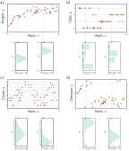

`图 5.1 输出分布预测。a) 回归任务中，目标是基于训练数据 {xi,yi}（橙色点）从输入 x 预测出一个实数输出 y。对于每个输入值 x，机器学习模型预测输出 y ∈ R 的分布 P(y|x)（青色曲线展示了 x = 2.0 和 x = 7.0 时的分布）。损失函数的目的是使根据相应输入 xi 预测出的分布最大化观测到的训练输出 yi 的概率。b) 在分类任务中，为预测离散类别 y ∈ {1, 2, 3, 4}，我们采用离散概率分布，模型因此针对 xi 的每个值预测 yi 的四个可能值的概率分布直方图。c) 在预测计数 y ∈ {0, 1, 2, ...} 和 d) 预测方向 y ∈ (−π, π] 的任务中，我们分别采用定义在正整数集和圆周域上的分布。`

#### 5.1.1 计算输出的分布
这引出了一个问题：模型 $f(x, \phi)$ 如何转化为计算概率分布的形式。答案很简单。首先，我们需要选定一个定义在输出域 $Y$ 上的参数化概率分布 $Pr(y|\theta)$。接着，我们利用神经网络来计算该分布的一个或多个参数 $\theta$。

例如，假设预测域是实数集，即 $y \in \mathbb{R}$。在这种情况下，我们可能选择单变量正态分布，它在 $\mathbb{R}$ 上有定义。该分布由均值 $\mu$ 和方差 $\sigma^2$ 所决定，因此 $\theta = \{\mu, \sigma^2\}$。机器学习模型可以用来预测均值 $\mu$，而方差 $\sigma^2$ 则可以视为一个待定的常数。
#### 5.1.2 最大似然准则
模型现在针对每个训练输入 $x_i$ 计算不同的分布参数 $\theta_i = f(x_i, \phi)$。我们的目标是使每个训练输出 $y_i$ 在其相应的分布 $Pr(y_i|\theta_i)$ 下具有较高概率。因此，我们选择模型参数 $\phi$，以最大化所有 $I$ 个训练样本的联合概率：
$$
\begin{align}
\hat{\phi} &= argmax_{\phi} \left[ \prod_{i=1}^{I} Pr(y_i|x_i) \right] \\
&= argmax_{\phi} \left[ \prod_{i=1}^{I} Pr(y_i|\theta_i) \right] \\
&= argmax_{\phi} \left[ \prod_{i=1}^{I} Pr(y_i|f(x_i, \phi)) \right]  \\
\end{align} \tag{5.1}
$$

这个联合概率项反映的是参数的似然（Likelihood），因此方程 5.1 称为最大似然准则（Maximum Likelihood Criterion）[^1]。

这里我们基于两个假设。首先，我们假设所有数据点的输出 $y_i$ 都服从相同的概率分布，即数据是同分布的。其次，我们认为给定输入的输出的条件分布 $Pr(y_i|x_i)$ 是相互独立的，因此整个训练数据集的似然可以表示为：

$$
Pr(y_1, y_2, \ldots , y_I|x_1, x_2, \ldots , x_I) = \prod_{i=1}^{I} Pr(y_i|x_i) \tag{5.2}
$$

换言之，我们假定数据是独立同分布（i.i.d.）的。

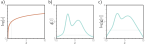

`图 5.2 对数变换。a) 对数函数是单调递增的，即若 z > z′，则 log z > log z′。因此，任何函数 g(z) 的最大值位置与 log g(z) 的最大值位置相同。b) 函数 g(z)。c) 该函数的对数 log g(z)。g(z) 上所有正斜率的位置在经过对数变换后依然保持正斜率，负斜率的位置同样保持负斜率。最大值位置不变。`
#### 5.1.3 最大化对数似然
尽管最大似然准则（方程 5.1）理论上有效，但在实际应用中并不方便。每个项 $Pr(y_i|f(x_i, \phi))$ 的值可能很小，导致这些项的乘积极小，难以用有限精度算法精确表示。幸运的是，我们可以通过最大化似然的对数来解决这个问题：

$$
\begin{align}
\hat{\phi} &= argmax_{\phi} \left[ \prod_{i=1}^{I} Pr(y_i|f(x_i, \phi)) \right] \\
&= argmax_{\phi} \left[ \log \prod_{i=1}^{I} Pr(y_i|f(x_i, \phi)) \right] \\
&= argmax_{\phi} \left[ \sum_{i=1}^{I} \log Pr(y_i|f(x_i, \phi)) \right] 
\end{align} \tag{5.3}
$$

由于对数是单调递增函数，对数似然准则与原始最大似然准则在数学上是等价的。这意味着，提高对数似然准则的同时，也就提高了最大似然准则。因此，两种准则的最大值位置是相同的，最优的模型参数 $\hat{\phi}$ 在两种情况下都是一致的。同时，对数似然准则通过求和而非乘积，避免了精度问题。
#### 5.1.4 最小化负对数似然

通常，模型拟合问题是以最小化损失的方式来定义的。为了将最大对数似然准则转换为一个最小化问题，我们通过乘以负一得到负对数似然准则：

$$
\hat{\phi} = argmin_{\phi} \left[ - \sum_{i=1}^{I} \log Pr(y_i|f(x_i, \phi)) \right]
= argmin_{\phi} [ L[\phi] ] \tag{5.4}
$$
这就构成了最终的损失函数 $L[\phi]$。

#### 5.1.5 推断

如今，网络不再直接预测输出 $y$，而是确定了一个关于 $y$ 的概率分布。在进行推断时，我们一般需要一个具体的估计值而不是整个分布，因此我们选择分布的最大值作为预测：

$$
\hat{y} = argmax_y [Pr(y|f(x, \phi))]  \tag{5.5}
$$
(5.5)

我们通常可以根据模型预测的分布参数 $\theta$ 来确定这个估计值。例如，在单变量正态分布中，最大值出现在均值 $\mu$ 处。

## 5.2 构建损失函数的步骤

根据最大似然方法，针对训练数据 $\{x_i, y_i\}$ 构建损失函数的步骤如下：

1. 选定一个适合预测结果 $y$ 的概率分布 $Pr(y|\theta)$，并确定其分布参数 $\theta$。
2. 设定机器学习模型 $f(x, \phi)$ 来预测这些参数中的一个或多个，即 $\theta = f(x, \phi)$，$Pr(y|\theta) = Pr(y|f(x, \phi))$。
3. 为训练模型，寻找最小化负对数似然损失函数的模型参数 $\phi$：

$$
\hat{\phi} = argmin_{\phi} [ L[\phi] ] = argmin_{\phi} \left[ - \sum_{i=1}^{I} \log Pr(y_i|f(x_i, \phi)) \right] \tag{5.6}
$$

4. 对于新的测试样例 $x$，返回完整分布 $Pr(y|f(x, \phi))$ 或此分布的最大值。

本章其余部分主要讨论如何使用这种方法为常见的预测类型构建损失函数。
## 5.3 示例 1：单变量回归

首先考虑单变量回归模型。这里的目标是用带有参数 $\phi$ 的模型 $f(x, \phi)$，从输入 $x$ 预测单一实数输出 $y \in \mathbb{R}$。遵循上述步骤，我们为输出域 $y$ 选择一个概率分布。我们选用单变量正态分布（见图 5.3），它定义在 $y \in \mathbb{R}$ 上。该分布有两个参数（均值 $\mu$ 和方差 $\sigma^2$），并具有概率密度函数：

$$
Pr(y|\mu, \sigma^2) = \frac{1}{\sqrt{2\pi\sigma^2}} \exp \left[ -\frac{(y - \mu)^2}{2\sigma^2} \right] \tag{5.7}
$$
接着，我们让机器学习模型 $f(x, \phi)$ 计算这个分布的一个或多个参数。在这里，我们只计算均值 $\mu = f(x, \phi)$：

$$
Pr(y|f(x, \phi), \sigma^2) = \frac{1}{\sqrt{2\pi\sigma^2}} \exp \left[ -\frac{(y - f(x, \phi))^2}{2\sigma^2} \right] \tag{5.8}
$$
我们的目标是找到使训练数据 $\{x_i, y_i\}$ 在此分布下尽可能概率最高的参数 $\phi$（参见图 5.4）。为此，我们选择了基于负对数似然的损失函数 $L[\phi]$：

$$
L[\phi] = - \sum_{i=1}^{I} \log \left[ Pr(y_i|f(x_i, \phi), \sigma^2) \right]
= - \sum_{i=1}^{I} \log \left[ \frac{1}{\sqrt{2\pi\sigma^2}} \exp \left[ -\frac{(y_i - f(x_i, \phi))^2}{2\sigma^2} \right] \right] \tag{5.9}
$$
在训练模型时，我们的目标是找到最小化这一损失的参数 $\hat{\phi}$。

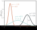

`图 5.3 单变量正态分布（也被称为高斯分布）是在实数轴 z ∈ R 上定义的，其主要由两个参数 μ 和 σ2 决定。其中，均值 μ 决定了分布的峰值位置，而方差 σ2 的标准差（即方差的正平方根）则决定了分布的宽度。因为整个概率密度的总和为一，所以当方差减小，分布变得更加集中时，其峰值也相应地变得更高。`
#### 5.3.1 最小平方损失函数

我们对损失函数进行一系列代数操作，目的是寻找：

$$
\begin{align}
\hat{\phi} &= argmin_{\phi} \left[ -\sum_{i=1}^{I} \log \left[ \frac{1}{\sqrt{2\pi\sigma^2}} \exp \left[ -\frac{(y_i - f(x_i, \phi))^2}{2\sigma^2} \right] \right] \right] \\
&= argmin_{\phi} \left[ -\sum_{i=1}^{I} ( \log \frac{1}{\sqrt{2\pi\sigma^2}} - \frac{(y_i - f(x_i, \phi))^2}{2\sigma^2} ) \right] \\
&= argmin_{\phi} \left[ \sum_{i=1}^{I} \frac{(y_i - f(x_i, \phi))^2}{2\sigma^2} \right] \tag{5.10}
\end{align}
$$
在这里，我们去除了与 $\phi$ 无关的项，并忽略了常数缩放因子，因为它不影响最小值的位置。

通过这些操作，我们得到了最小平方损失函数，这是我们在第2章讨论线性回归时首次提出的：

$$
L[\phi] = \sum_{i=1}^{I} (y_i - f(x_i, \phi))^2 \tag{5.11}
$$
最小平方损失函数的自然来源于两个假设：预测误差（i）是独立的，并且（ii）遵循均值为 $\mu = f(x_i, \phi)$ 的正态分布（参见图 5.4）。

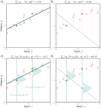

`图 5.4 最小二乘法与正态分布最大似然损失的等效性。a) 参照图 2.2 中的线性模型。最小二乘法通过最小化模型预测值 f[xi,φ]（绿线）与真实输出值 yi（橙色点）之间差异（虚线表示）的平方和来进行优化。在此例中，模型拟合非常准确，因此这些差异非常小（比如，对于被特别标出的两个点）。b) 当参数设置不当时，模型拟合效果较差，导致平方差异显著增加。c) 最小二乘法的原理是假设模型预测的是输出值的正态分布的平均值，并且我们通过最大化概率来优化它。在第一种情况下，由于模型拟合得很好，所以数据的概率 Pr(yi|xi)（水平橙色虚线）较高（相应的负对数概率较小）。d) 在第二种情况下，由于模型拟合效果差，因此概率较低，负对数概率较高。`

#### 5.3.2 推断

网络现在不直接预测 $y$，而是预测 $y$ 的正态分布均值 $\mu = f(x, \phi)$。在进行推断时，我们通常寻求一个最佳的单点估计，因此我们选择预测分布的最大值：

$$
\hat{y} = argmax_y [Pr(y|f(x, \phi))] \tag{5.12}
$$

在单变量正态分布中，最大值位置由均值参数 $\mu$ 决定（参见图 5.3）。这正是模型所计算的，因此 $\hat{y} = f(x, \phi)$。
#### 5.3.3 估计方差

在制定最小平方损失函数时，我们假定网络预测了正态分布的均值。有趣的是，方程 5.11 中的最终表达式并不依赖于方差 $\sigma^2$。但我们可以将 $\sigma^2$ 视为模型的参数之一，并对模型参数 $\phi$ 和分布的方差 $\sigma^2$ 一起最小化方程 5.9：

$$
\hat{\phi}, \hat{\sigma}^2 = \arg\min_{\phi,\sigma^2} \left[ -\sum_{i=1}^I \log \left[ \frac{1}{\sqrt{2\pi\sigma^2}} \exp \left( -\frac{(y_i - f(x_i; \phi))^2}{2\sigma^2} \right) \right] \right] \tag{5.13}
$$

在推断阶段，模型从输入中预测均值 $\mu = f[x, \hat{\phi}]$，同时我们在训练过程中得到了方差 $\hat{\sigma}^2$ 的估计。均值是最优预测，而方差反映了预测的不确定性。

#### 5.3.4 异方差回归

先前的模型假定数据方差是固定的，但这可能不太现实。当模型的不确定性随输入数据变化时，我们称之为异方差（与同方差相对，后者不确定性是固定的）。

一种处理这种情况的简单方法是训练一个神经网络 $f(x, \phi)$ 来同时计算均值和方差。举个例子，考虑一个输出两个值的浅层网络，其中第一个输出 $f_1(x, \phi)$ 预测均值，第二个输出 $f_2(x, \phi)$ 预测方差。

为了确保计算的方差始终为正，我们需要对网络的第二个输出应用一个能映射到正数的函数。一个好的选择是使用平方函数，得到：

$$
\begin{align}
\mu = f_1(x, \phi) \\
\sigma^2 = f_2(x, \phi)^2 
\end{align}\tag{5.14}
$$
这样就得到了以下损失函数：

$$
\hat{\phi} = argmin_{\phi} \left[ -\sum_{i=1}^{I} \log \left[ \frac{1}{\sqrt{2\pi f_2(x_i, \phi)^2}} \exp \left[ -\frac{(y_i - f_1(x_i, \phi))^2}{2f_2(x_i, \phi)^2} \right] \right] \right] \tag{5.15}
$$
图 5.5 对比了同方差和异方差模型。

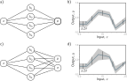

`图 5.5 同方差回归与异方差回归比较。a) 在同方差回归中，一个简单的神经网络模型根据输入 x 预测输出分布的平均值 μ。b) 这种情况下，尽管输出的均值（用蓝线表示）随输入 x 呈分段线性变化，方差却始终保持不变（通过箭头和灰色区域表示的 ±2 标准差来展示）。c) 异方差回归的浅层神经网络除了预测均值外，还会预测输出的方差 σ2（更精确地说，是计算方差的平方根，然后再平方）。d) 如此一来，标准差也随输入 x 呈分段线性变化。`
## 5.4 示例 2：二元分类

在二元分类任务中，我们的目标是根据数据 $x$ 将其划分为两个离散类别之一 $y \in \{0, 1\}$。这里的 $y$ 被称为标签。二元分类的例子包括：（i）根据文本数据 $x$ 判断餐厅评论是正面（$y = 1$）还是负面（$y = 0$）；（ii）根据 MRI 扫描 $x$ 判断肿瘤是否存在（$y = 1$）或不存在（$y = 0$）。

我们再次按照第5.2节的步骤构建损失函数。首先，我们为输出空间 $y \in \{0, 1\}$ 选择了伯努利分布，这个分布定义在 $\{0, 1\}$ 上。它有一个参数 $\lambda \in [0, 1]$，表示 $y$ 取值为 1 的概率（见图 5.6）：

$$
Pr(y|\lambda) = 
\begin{cases} 
1 - \lambda & \text{if } y = 0 \\
\lambda & \text{if } y = 1 
\end{cases} \tag{5.16}
$$

也可以写成：

$$
Pr(y|\lambda) = (1 - \lambda)^{1-y} \cdot \lambda^y \tag{5.17}
$$
然后，我们设置机器学习模型 $f(x, \phi)$ 来预测单一参数 $\lambda$。但由于 $\lambda$ 只能在 [0, 1] 范围内取值，我们需要通过一个函数将网络输出映射到这个范围内。一个合适的函数是逻辑斯蒂 sigmoid 函数（见图 5.7）：

$$
sig[z] = \frac{1}{1 + \exp[-z]} \tag{5.18}
$$
因此，我们预测的分布参数为 $\lambda = sig[f(x, \phi)]$。现在的似然表达式为：

$$
Pr(y|x) = (1 - sig[f(x, \phi)])^{1-y} \cdot sig[f(x, \phi)]^y \tag{5.19}
$$
这在图 5.8 中展示了一个浅层神经网络模型。损失函数是训练集的负对数似然：

$$
L[\phi] = \sum_{i=1}^{I} -\left[(1 - y_i) \log [1 - sig[f(x_i, \phi)]] + y_i \log [sig[f(x_i, \phi)]]\right] \tag{5.20}
$$
由于第5.7节将会解释的原因，这称为二元交叉熵损失。

变换后的模型输出 $sig[f(x, \phi)]$ 预测了伯努利分布的参数 $\lambda$。这代表 $y = 1$ 的概率，所以 $1 - \lambda$ 代表 $y = 0$ 的概率。在进行推断时，如果我们需要 $y$ 的具体估计，那么当 $\lambda > 0.5$ 时我们设定 $y = 1$，否则设定 $y = 0$。

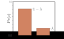

`图 5.6 伯努利分布。伯努利分布是定义在仅包含 {0,1} 的域上的分布，它由单一参数 λ 定义，λ 表示观测到结果为 1 的概率。相应地，结果为 0 的概率则为 1 − λ。`

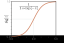

`图 5.7 逻辑 Sigmoid 函数。该函数把实数 z 映射到 0 到 1 之间的值，因此 sig[z] 的范围是 [0, 1]。当输入为 0 时，输出值为 0.5。负数输入对应于小于 0.5 的输出值，而正数输入对应于大于 0.5 的输出值。`

`图 5.8 二元分类模型。a) 网络的输出是一个分段线性函数，能够接受任意实数值。b) 这些值通过逻辑 Sigmoid 函数转换，被压缩到 [0,1] 的区间内。c) 转换后的输出用来预测概率 λ，即 y = 1 的可能性（用实线表示）。因此，y = 0 的可能性就是 1 − λ（用虚线表示）。对任一固定的 x（通过垂直切片展示），我们能得到一个与图 5.6 类似的伯努利分布的两种概率值。损失函数倾向于优化模型参数，使得在与正例 yi = 1 关联的 xi 位置上 λ 的值较大，而在与负例 yi = 0 关联的位置上 λ 的值较小。`
## 5.5 示例 3：多类别分类

多类别分类的目标是将输入数据 $x$ 分配给 $K > 2$ 个类别中的一个，即 $y \in \{1, 2, \ldots, K\}$。现实中的例子包括：（i）预测手写数字图像 $x$ 中的哪一个数字 $y$（$K = 10$）；（ii）预测不完整句子 $x$ 后面跟随的哪一个词汇 $y$（$K$ 个可能词汇）。

我们再次遵循第5.2节的步骤。首先，对于输出空间 $y \in \{1, 2, \ldots, K\}$，我们选择分类分布（见图 5.9）。这个分布有 $K$ 个参数 $\lambda_1, \lambda_2, \ldots, \lambda_K$，它们确定每个类别的概率：
$$
Pr(y = k) = \lambda_k \tag{5.21}
$$
参数被限制在零和一之间，并且总和必须为一，以形成有效的概率分布。

然后，我们利用具有 $K$ 个输出的网络 $f(x, \phi)$ 来从输入 $x$ 计算这 $K$ 个参数。为了确保网络输出符合约束，我们通过一个函数处理这 $K$ 个输出，这个函数是*softmax*函数（见图 5.10）。softmax 函数接受长度为 $K$ 的任意向量，并返回一个同样长度的向量，其元素位于 [0, 1] 范围内且总和为一。softmax 函数的第 $k$ 个输出是：

$$
softmax_k[z] = \frac{\exp[z_k]}{\sum_{k'=1}^{K} \exp[z_{k'}]} \tag{5.22}
$$
指数函数确保输出为正，分母的求和则保证这 $K$ 个数的总和为一。

因此，输入 $x$ 有标签 $y$ 的似然（见图 5.10）是：

$$
Pr(y = k|x) = softmax_k[f(x, \phi)] \tag{5.23}
$$
损失函数是训练数据的负对数似然：

$$
L[\phi] = -\sum_{i=1}^{I} \log \left[ softmax_{y_i} [f(x_i, \phi)] \right]
= -\sum_{i=1}^{I} \left[ f_{y_i}[x_i, \phi] - \log \left( \sum_{k'=1}^{K} \exp [f_{k'}[x_i, \phi]] \right) \right],
$$
(5.24)

其中 $f_k[x, \phi]$ 是神经网络的第 $k$ 个输出。由于将在第5.7节中解释的原因，这被称为多类别交叉熵损失。

模型输出的变换代表了 $y \in \{1, 2, \ldots, K\}$ 可能类别的分类分布。作为点估计，我们选择最可能的类别 $\hat{y} = argmax_k[Pr(y = k|f(x, \phi))]$，这对应于图 5.10 中对于该 $x$ 值最高的曲线。

`图 5.9 分类分布。分类分布为超过两个的 K 类别分配概率值，相应的概率为 λ1,λ2,...,λK。这里有五个类别，因此 K = 5。为保证其为一个有效的概率分布，每个参数 λk 都应处于 [0, 1] 的范围内，并且所有 K 个参数的总和必须等于 1。`

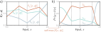
`图 5.10 针对 K = 3 类别的多类别分类。a) 该网络输出三个可以任意取值的分段线性函数。b) 通过 softmax 函数处理后，这些输出值被限制为非负数，且它们的总和必须为一。因此，对于任何给定的输入 x，我们都能得到有效的分类分布参数：图中任意垂直切片所产生的三个值的总和为一，这些值代表在类似图 5.9 的分类分布条形图中各条的高度。`
### 5.5.1 预测其他数据类型

本章主要关注回归和分类，因为这些问题非常普遍。然而，为了预测不同类型的数据，我们只需选择适合该领域的分布，并应用第5.2节中的方法。图 5.11 列出了一系列概率分布及其预测领域。其中一些将在本章末尾的问题中进行探讨。

| Data Type | Domain | Distribution | Use |
|-----------|--------|--------------|-----|
| univariate, continuous, unbounded | $y \in \mathbb{R}$ | normal | regression |
| univariate, continuous, unbounded | $y \in \mathbb{R}$ | Laplace | robust regression |
| univariate, continuous, unbounded | $y \in \mathbb{R}$ | or t-distribution | multimodal regression |
| univariate, continuous, bounded below | $y \in \mathbb{R}^+$ | exponential or gamma | predicting magnitude |
| univariate, continuous, bounded | $y \in [0, 1]$ | beta | predicting proportions |
| multivariate, continuous, unbounded | $y \in \mathbb{R}^K$ | multivariate normal | multivariate regression |
| univariate, continuous, circular | $y \in (-\pi, \pi]$ | von Mises | predicting direction |
| univariate, discrete, binary | $y \in \{0, 1\}$ | Bernoulli | binary classification |
| univariate, discrete, bounded | $y \in \{1, 2, \ldots, K\}$ | categorical | multiclass classification |
| univariate, discrete, bounded below | $y \in [0, 1, 2, 3, \ldots]$ | Poisson | predicting event counts |
| multivariate, discrete, permutation | $y \in \text{Perm}[1, 2, \ldots, K]$ | Plackett-Luce | ranking |

`图 5.11 不同预测类型下损失函数的分布。`
## 5.6 多输出预测
在许多情况下，我们需要使用同一个模型进行多个预测，因此目标输出 $y$ 是向量形式。例如，我们可能想同时预测分子的熔点和沸点（多变量回归问题），或者预测图像中每个点的物体类别（多变量分类问题）。虽然可以定义多变量概率分布，并利用神经网络模拟它们作为输入的函数参数，但更常见的做法是将每个预测视为独立的。

独立性意味着我们把概率 $Pr(y|f(x, \phi))$ 看作是对于每个元素 $y_d \in y$ 的单变量项的乘积：

$$
Pr(y|f(x, \phi)) = \prod_{d} Pr(y_d|f_d[x, \phi]) \tag{5.25}
$$
其中 $f_d[x, \phi]$ 是网络对于 $y_d$ 分布参数的第 $d$ 组输出。例如，对于预测多个连续变量 $y_d \in \mathbb{R}$，我们对每个 $y_d$ 使用正态分布，并由网络输出 $f_d[x, \phi]$ 预测这些分布的均值。对于预测多个离散变量 $y_d \in \{1, 2, \ldots, K\}$，我们对每个 $y_d$ 使用分类分布。在这种情况下，每组网络输出 $f_d[x, \phi]$ 预测对 $y_d$ 分类分布的贡献值。

最小化负对数概率时，这个乘积变为各项的求和：

$$
L[\phi] = -\sum_{i=1}^{I} \log [Pr(y_i|f(x_i, \phi))] = -\sum_{i=1}^{I} \sum_{d} \log [Pr(y_{id}|f_d[x_i, \phi])] \tag{5.26}
$$

其中 $y_{id}$ 是第 $i$ 个训练样本的第 $d$ 个输出。

为了同时进行两种或更多类型的预测，我们同样假设每种错误是独立的。比如，为了同时预测风向和风力，我们可能分别选择定义在圆形域的 von Mises 分布预测风向，以及定义在正实数上的指数分布预测风力。独立性假设意味着这两个预测的联合似然是单独似然的乘积。在计算负对数似然时，这些项会转化为加和形式。

## 5.7 交叉熵损失 (Cross-entropy loss)

在本章中，我们开发了旨在最小化负对数似然 (negative log-likelihood) 的损失函数。然而，术语“交叉熵损失 (cross-entropy loss)”也广为流传。在本节中，我们将解释交叉熵损失，并证明它与使用负对数似然是等价的。

交叉熵损失的核心思想是寻找参数 $\theta$，以最小化观测数据 $y$ 的经验分布 $q(y)$ 与模型分布 $Pr(y|\theta)$（见图 5.12）之间的差距。可以用 Kullback-Leibler (KL) 散度来衡量两个概率分布 $q(z)$ 和 $p(z)$ 之间的距离：

$$
D_{KL}(q||p) = \int_{-\infty}^{\infty} q(z) \log [q(z)] dz - \int_{-\infty}^{\infty} q(z) \log [p(z)] dz \tag{5.27}
$$
设想我们在点集 $\{y_i\}^I_{i=1}$ 观测到了一组经验数据分布。这可以表示为点质量的加权总和：

$$
q(y) = \frac{1}{I} \sum_{i=1}^{I} \delta[y - y_i] \tag{5.28}
$$

这里的 $\delta[\cdot]$ 是 Dirac delta 函数。我们的目标是最小化模型分布 $Pr(y|\theta)$ 与这一经验分布之间的 KL 散度：

$$
\begin{align}
\hat{\theta} &= argmin_{\theta} \left[ \int_{-\infty}^{\infty} q(y) \log [q(y)] dy - \int_{-\infty}^{\infty} q(y) \log [Pr(y|\theta)] dy \right] \\
&= argmin_{\theta} \left[ -\int_{-\infty}^{\infty} q(y) \log [Pr(y|\theta)] dy \right],
\end{align} \tag{5.29}
$$

由于第一项与 $\theta$ 无关，因此消失了。剩下的第二项被称为*交叉熵 (cross-entropy)*。它可以理解为在考虑到另一个分布已知信息后，一个分布中剩余的不确定性量。接下来，我们将方程 5.28 中的 $q(y)$ 定义代入：

$$
\begin{align}
\hat{\theta} &= argmin_{\theta} \left[ \int_{-\infty}^{\infty} \left( \frac{1}{I} \sum_{i=1}^{I} \delta[y - y_i] \right) \log [Pr(y|\theta)] dy \right] \\
&= argmin_{\theta} \left[ -\sum_{i=1}^{I} \log [Pr(y_i|\theta)] \right],
\end{align} \tag{5.30}
$$

第一行的两项相乘，对应于图 5.12a 中点质量与图 5.12b 中分布的对数进行逐点乘积。最终我们得到一组集中在数据点上的有限加权概率质量。在最后一行，我们去掉了不影响最小值位置的常数缩放因子 $1/I$。

在机器学习领域，分布参数 $\theta$ 由模型 $f[x_i, \phi]$ 计算得出。因此，我们有：

$$
\hat{\phi} = argmin_{\phi} \left[ -\sum_{i=1}^{I} \log [Pr(y_i|f[x_i, \phi])] \right] \tag{5.31}
$$
这正是第 5.2 节提到的负对数似然准则。由此可见，负对数似然准则（即最大化数据似然）与交叉熵准则（即最小化模型与经验数据分布间的距离）是等价的。

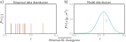

`图 5.12 交叉熵方法。a) 训练样本的实证分布（箭头标示了 Dirac delta 函数）。b) 模型分布（参数为 θ = μ,σ2 的正态分布）。通过交叉熵方法，我们尝试最小化这两个分布之间的距离（即 KL 散度），这个距离是模型参数 θ 的函数。`

## 5.8 总结

在前面的章节中，我们考虑神经网络是如何直接从数据 x 预测输出 y 的。在本章，我们改变了观点，把神经网络视为计算输出空间概率分布 $Pr(y|\theta)$ 上的参数 $\theta$。这引领我们采用了一种原理性方法构建损失函数。我们选择了能够使观测数据在这些分布下的似然最大化的模型参数 $\phi$。我们发现，这等同于最小化负对数似然 (negative log-likelihood)。

这种方法的自然结果是，回归的最小二乘准则；它基于假设 y 符合正态分布，并且我们正在预测其均值。我们还探讨了如何 (1) 扩展回归模型以估计对预测的不确定性，以及 (2) 扩展模型使不确定性依赖于输入（heteroscedastic model）。我们将同样的方法应用于二元分类和多类分类，为每种情况推导出了损失函数。我们讨论了如何处理更加复杂的数据类型以及如何处理多个输出。最后，我们指出交叉熵是另一种等效的考虑模型拟合方式。

在之前的章节中，我们开发了神经网络模型。在本章，我们为决定模型如何根据一组给定参数描述训练数据的效果，开发了损失函数。下一章将考虑模型训练，我们的目标是找到能使这种损失最小化的模型参数。

## 笔记

基于正态分布的损失函数：Nix & Weigend (1994) 和 Williams (1996) 研究了异方差非线性回归 (heteroscedastic nonlinear regression)，其中输出的均值和方差都是输入的函数。在无监督学习的背景下，Burda 等人 (2016) 使用了基于具有对角协方差的多变量正态分布的损失函数，而 Dorta 等人 (2018) 使用了基于具有完全协方差的正态分布的损失函数。

稳健回归：Qi 等人 (2020) 研究了最小化平均绝对误差而非平均平方误差的回归模型特性。这种损失函数基于对输出采用拉普拉斯分布的假设，并估计给定输入的中位数输出，而非均值。Barron (2019) 提出了一种参数化稳健度的损失函数。在概率背景下解释时，它产生了一个包括正态分布和柯西分布作为特例的单变量概率分布族。

估计分位数：有时，我们可能不想在回归任务中估计均值或中位数，而是希望预测一个分位数。例如，这对风险模型很有用，我们希望知道真实值在 90% 的时间内会小于预测值。这被称为分位数回归 (Koenker & Hallock, 2001)。这可以通过拟合一个异方差回归模型，然后基于预测的正态分布估计分位数来完成。或者，分位数可以直接使用分位数损失（也称为弹球损失）来估计。在实践中，这最小化了数据与模型的绝对偏差，但在一个方向上对偏差的权重比另一个方向更大。最近的研究探索了同时预测多个分位数以获得整体分布形状的概念（Rodrigues & Pereira, 2020）。

类别不平衡和焦点损失：Lin 等人 (2017c) 讨论了分类问题中的数据不平衡问题。如果某些类别的示例数量远大于其他类别，则标准的最大似然损失就不再适用；模型可能会专注于提高对主导类别中已分类良好示例的信心，而对代表性较差的类别分类不佳。Lin 等人 (2017c) 引入了焦点损失，该损失添加了一个额外的参数，用于减弱分类良好示例的影响，以提高性能。

学习排名：Cao 等人 (2007)，Xia 等人 (2008)，和 Chen 等人 (2009) 都在学习排名数据的损失函数中使用了 Plackett-Luce 模型。这是学习排名的列表式方法，因为模型一次性处理整个待排名的对象列表。其他方法包括点式方法，其中模型处理单个对象，以及对式方法，其中模型处理对象对。Chen 等人 (2009) 总结了学习排名的不同方法。

其他数据类型：Fan 等人 (2020) 使用基于贝塔分布的损失来预测 0 到 1 之间的值。Jacobs 等人 (1991) 和 Bishop (1994) 研究了适用于多模态数据的混合密度网络。这些模型将输出建模为基于输入的高斯混合（见图 5.14）。Prokudin 等人 (2018) 使用了 von Mises 分布来预测方向（见图 5.13）。Fallah 等人 (2009) 使用泊松分布构建了预测计数的损失函数（见图 5.15）。Ng 等人 (2017) 使用基于伽马分布的损失函数来预测持续时间。

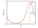

`图 5.13 冯·米塞斯分布定义在圆周上，范围是（−π, π]。它由两个参数构成：平均值 μ 决定了分布峰值的位置；浓度参数 κ（大于 0）起着类似于方差倒数的作用，因此 1/√κ 可以大致看作是与正态分布的标准差相对应的量。`

非概率方法：采用本章讨论的概率方法并不是严格必要的，但这在近年来已成为默认方法；任何旨在减少模型输出与训练输出之间距离的损失函数都是足够的，距离可以用任何看似合理的方式定义。有几种著名的非概率机器学习模型用于分类，包括支持向量机 (Vapnik, 1995; Cristianini & Shawe-Taylor, 2000)，它们使用铰链损失，以及 AdaBoost (Freund & Schapire, 1997)，它们使用指数损失。

## Problems

## 问题

**问题 5.1** 证明逻辑 sigmoid 函数 $\text{sig}[z]$ 将 $z = -\infty$ 映射到 0，$z = 0$ 映射到 0.5，$z = \infty$ 映射到 1，其中：

$$
\text{sig}[z] = \frac{1}{1 + \exp[-z]} \tag{5.32}
$$

**问题 5.2** 对于单个训练对 $\{x, y\}$ 的二元分类，损失 $L$ 为：

$$
L = -(1 - y) \log [1 - \text{sig}[f[x, \phi]]] - y \log [\text{sig}[f[x, \phi]]] \tag{5.33}
$$
其中 $\text{sig}[\cdot]$ 在方程 5.32 中定义。当训练标签 $y = 0$ 时（1）以及当 $y = 1$ 时（2），将这种损失作为变换后的网络输出 $\text{sig}[f[x, \phi]] \in [0, 1]$ 的函数绘制出来。

**问题 5.3*** 假设我们想构建一个模型，基于本地气压 $x$ 的测量来预测占主导地位的风向 $y$（以弧度表示）。适用于圆形域的分布是 von Mises distribution（见图 5.13）：

$$
Pr(y|\mu, \kappa) = \frac{\exp[\kappa \cos(y - \mu)]}{2\pi \cdot \text{Bessel}_0[\kappa]} \tag{5.34}
$$
其中 $\mu$ 是平均方向的度量，$\kappa$ 是集中度的度量（即方差的倒数）。项 $\text{Bessel}_0[\kappa]$ 是阶数为 0 的修改过的贝塞尔函数。使用第 5.2 节的配方来开发用于学习模型 $f[x, \phi]$ 参数 $\mu$ 的损失函数，以预测最有可能的风向。你的解决方案应将集中度 $\kappa$ 视为常数。你会如何进行推理？

**问题 5.4*** 有时，对于输入 $x$ 的输出 $y$ 是多模态的（见图 5.14a）；对于给定输入，有多个有效的预测。在这里，我们可能使用正态分量的加权和作为输出的分布。这被称为高斯混合 (Gaussian Mixture) 模型。例如，两个高斯的混合具有参数 $\Theta = \{\lambda, \mu_1, \sigma_1^2, \mu_2, \sigma_2^2\}$：

$$
Pr(y|\mu_1, \mu_2, \sigma_1^2, \sigma_2^2) = \frac{\lambda}{\sqrt{2\pi\sigma_1^2}} \exp \left[ -\frac{(y - \mu_1)^2}{2\sigma_1^2} \right] + \frac{1 - \lambda}{\sqrt{2\pi\sigma_2^2}} \exp \left[ -\frac{(y - \mu_2)^2}{2\sigma_2^2} \right] \tag{5.35}
$$
其中 $\lambda \in [0, 1]$ 控制两个分量的相对权重，它们分别具有均值 $\mu_1, \mu_2$ 和方差 $\sigma_1^2, \sigma_2^2$。这个模型可以表示具有两个峰的分布（见图 5.14b）或具有更复杂形状的单峰分布（见图 5.14c）。使用第 5.2 节的配方构建一个训练模型 $f[x, \phi]$ 的损失函数，该模型接收输入 $x$，具有参数 $\phi$，并预测两个高斯的混合。损失应基于 $I$ 训练数据对 $\{x_i, y_i\}$。在进行推理时，你预见会遇到什么问题？

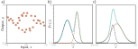

`图 5.14 多模态数据及其高斯混合密度。a) 在示例训练数据中，当输入 x 的值处于中间范围时，相应的输出 y 会沿着两种可能的路径之一变化。例如，在 x = 0 的情况下，输出 y 的值可能接近 −2 或 +3，但不太可能是介于这两个值之间。b) 高斯混合模型非常适合描述这种数据，它通过将两个或更多具有不同均值和方差的正态分布（此处为两个分布，分别用虚线蓝色和橙色曲线表示）进行加权求和（用实线青色曲线表示）来构建。当各个正态分布的均值相差较远时，便形成了多模态分布。c) 当这些均值较为接近时，这种混合模型能够描述单峰但非正态的密度分布。`

**问题 5.5** 考虑扩展问题 5.3 中的模型，使用两个 von Mises distribution 的混合来预测风向。为这个模型写出似然 $Pr(y|\theta)$ 的表达式。网络需要产生多少个输出？

**问题 5.6** 考虑构建一个模型，预测接下来一分钟内将有多少行人 $y \in \{0, 1, 2, \ldots\}$ 经过城市中给定的点，这是基于包含一天中的时间、经纬度和社区类型等信息的数据 $x$。适用于模拟计数的分布是泊松分布（见图 5.15）。它有一个称为速率的单一参数 $\lambda > 0$，代表分布的均值。该分布的概率密度函数为：

$$
Pr(y = k) = \frac{\lambda^k e^{-\lambda}}{k!} \tag{5.36}
$$
假设我们可以访问 $I$ 个训练对 $\{x_i, y_i\}$，为这个模型设计一个损失函数。

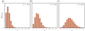

`图 5.15 泊松分布是定义在非负整数上的离散分布，具有一个参数 λ（正实数），称为分布的率，它代表了分布的平均值。a–c) 分别展示了当率为 1.4、2.8 和 6.0 时的泊松分布，展示了不同率值下分布形态的变化。`

**问题 5.7** 考虑一个多变量回归问题，我们预测十个输出，因此 $y \in \mathbb{R}^{10}$，并且用独立的正态分布对每个进行建模，其中均值 $\mu_d$ 由网络预测，方差 $\sigma^2$ 是常数。写出似然 $Pr(y|f[x, \phi])$ 的表达式。展示如果我们不估计方差 $\sigma^2$，最小化这个模型的负对数似然仍然等价于最小化一系列平方项。

**问题 5.8*** 构建一个损失函数，用于基于独立正态分布进行多变量预测 $y \in \mathbb{R}^D_i$，每个维度有不同的方差 $\sigma_d^2$。假设一个异方差模型，使得均值 $\mu_d$ 和方差 $\sigma_d^2$ 都随数据而变化。

**问题 5.9*** 考虑一个多变量回归问题，我们从数据 $x$ 预测一个人的身高（以米为单位）和体重（以千克为单位）。这里，单位的范围差异较大。你认为这会导致什么问题？提出两个解决这些问题的方案。

**问题 5.10** 扩展问题 5.3 中的模型，预测风向和风速，并定义相关的损失函数。

