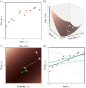
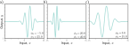
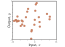
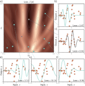
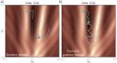
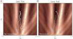
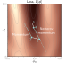
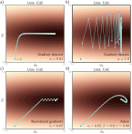
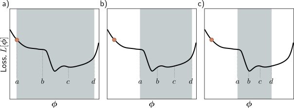
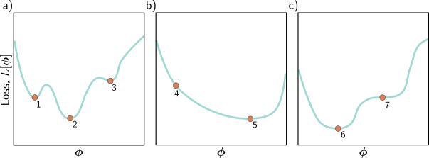

第 3 章和第 4 章详细讨论了浅层和深层神经网络，它们构成了分段线性函数族，函数的具体形式由各自的参数确定。第 5 章引入了损失概念 —— 一个反映网络预测与训练集真实值差异的单个数值。
损失与网络参数有关，本章着重于探讨如何确定能使损失最小化的参数值。这个过程称为网络参数的学习，或更通俗地说，是模型的训练或拟合。该过程首先是选取一组初始参数值，随后重复执行两个步骤：(i) 计算损失函数关于参数的导数（梯度）；(ii) 根据梯度调整参数，以期减少损失。多次迭代后，目标是使损失函数达到其全局最小值。
本章重点讨论参数调整步骤，即采用何种算法来减少损失。第 7 章将介绍如何为神经网络初始化参数并计算梯度。
## 6.1 梯度下降
为了拟合模型，我们需要一组输入/输出对的训练集 $\{x_i, y_i\}$。我们寻求模型 $f(x_i, \phi)$ 的参数 $\phi$，使得这些参数能够尽可能准确地将输入 $x_i$ 映射到输出 $y_i$。为此目的，我们定义了一个损失函数 $L(\phi)$，它通过返回一个数值来量化映射中的误差。优化算法的目标是找到一组参数 $\hat{\phi}$，使得这个损失函数达到最小值：

$$
\hat{\phi} = \arg\min_{\phi} L(\phi) \tag{6.1}
$$

虽然存在多种优化算法，但训练神经网络通常采用迭代方法。这些方法首先启发式地设定初始参数值，然后反复调整参数以降低损失值。

这个过程中最基本的方法称为梯度下降。它从初始参数 $\phi = [\phi_0, \phi_1, \ldots, \phi_N]^T$ 开始，并分两步迭代：

**步骤 1.** 计算损失相对于参数的导数：
$$
\frac{\partial L}{\partial \phi} =
\begin{bmatrix}
\frac{\partial L}{\partial \phi_0} \\
\frac{\partial L}{\partial \phi_1} \\
\vdots \\
\frac{\partial L}{\partial \phi_N}
\end{bmatrix} \tag{6.2}
$$

**步骤 2.** 根据以下规则更新参数：
$$
\phi \leftarrow \phi - \alpha \cdot \frac{\partial L}{\partial \phi} \tag{6.3}
$$
其中，正数 $\alpha$ 确定了调整的幅度。

第一步计算当前位置上损失函数的梯度，确定了损失增加的方向。第二步则是向相反方向（即下降方向）小幅移动。参数 $\alpha$ 可以固定（此时称之为学习率），或者通过线性搜索尝试多个 $\alpha$ 值，以找到能最大程度降低损失的值。

当损失函数达到最小值时，其表面必须是平坦的（否则，我们还能通过继续下降来进一步改进）。因此，梯度将变为零，参数也随之停止改变。在实践中，我们会监测梯度的大小，并在其变得过小时停止算法。

### 6.1.1 线性回归示例

考虑将梯度下降方法应用于第2章介绍的一维线性回归模型。该模型 $f(x, \phi)$ 把一个标量输入 $x$ 映射到一个标量输出 $y$，具有参数 $\phi = [\phi_0, \phi_1]^T$，分别代表了y轴截距和斜率：

$$
y = f(x, \phi) = \phi_0 + \phi_1x \tag{6.4}
$$

给定一个数据集 $\{x_i, y_i\}$，包含 $I$ 对输入/输出数据，我们采用最小二乘法作为损失函数：
$$
L(\phi) = \sum_{i=1}^I e_i = \sum_{i=1}^I (f(x_i, \phi) - y_i)^2 = \sum_{i=1}^I (\phi_0 + \phi_1x_i - y_i)^2 \tag{6.5}
$$
这里的 $e_i = (\phi_0 + \phi_1x_i - y_i)^2$ 表示第 \(i\) 个训练样本对损失的单独贡献。

损失函数对参数的导数可以表示为各个贡献导数的总和：
$$
\frac{\partial L}{\partial \phi} = \frac{\partial}{\partial \phi} \sum_{i=1}^I e_i = \sum_{i=1}^I \frac{\partial e_i}{\partial \phi} \tag{6.6}
$$
具体计算方式如下：
$$
\frac{\partial e_i}{\partial \phi} = 
\begin{bmatrix}
\frac{\partial e_i}{\partial \phi_0} \\
\frac{\partial e_i}{\partial \phi_1} 
\end{bmatrix} =
\begin{bmatrix}
2(\phi_0 + \phi_1x_i - y_i) \\
2x_i(\phi_0 + \phi_1x_i - y_i) 
\end{bmatrix} \tag{6.7}
$$

图 6.1 通过迭代地根据方程 6.6 和 6.7 计算导数，接着依据方程 6.3 的规则更新参数，展示了算法的逐步进展。在此示例中，我们采用了线搜索技术，在每次迭代中找到能够最大限度减少损失的 $\alpha$ 值。

`图 6.1 线性回归模型的梯度下降。a) 训练集由 12 对输入/输出数据对 {xi , yi} 组成。b) 损失函数图展示了梯度下降的迭代过程。从点 0 出发，我们沿最陡峭的下降方向前进，直至无法进一步降低损失，从而到达点 1。然后，我们重复此过程，测量点 1 的梯度并继续下降到点 2，以此类推。c) 通过热图可以更直观地展示这一过程，图中的亮度代表了损失大小。仅经过四轮迭代，我们已经非常接近最小损失值。d) 点 0 处参数（线条最浅）的模型对数据的描述非常不准确，但随着每轮迭代，模型的拟合度都有所提升。点 4 处参数（线条最深）的模型已能合理描述训练数据。`

### 6.1.2 Gabor模型示例
线性回归问题的损失函数（参见图 6.1c）总是有一个清晰定义的全局最小值。更形式化地说，这些函数是凸函数，意味着曲面上任意两点连线（即弦）不会穿过函数图像。凸性保证了无论参数初始化在何处，只要我们不断地“下坡”，最终都能找到最小值；这样的训练过程是不会失败的。

然而，大部分非线性模型（包括浅层和深层网络）的损失函数都是非凸的。由于参数众多，使得神经网络损失函数的可视化变得极具挑战性。因此，我们首先研究一个参数较少的简单非线性模型，以深入理解非凸损失函数的特性：

$$
f(x, \phi) = \sin[\phi_0 + 0.06 \cdot \phi_1x] \cdot \exp \left( - \frac{(\phi_0 + 0.06 \cdot \phi_1x)^2}{32.0} \right) \tag{6.8}
$$

这个Gabor模型将标量输入$x$映射到标量输出$y$，并且由一个正弦分量（产生振荡效果）和一个负指数分量（使得振幅随离中心距离增加而减小）相乘构成。模型具有两个参数$\phi = [\phi_0, \phi_1]^T$，$\phi_0 \in \mathbb{R}$ 控制函数的拉伸或压缩，而$\phi_1 \in \mathbb{R}^+$ 则决定沿x轴的拉伸或压缩（见图6.2）。

考虑一个包含$I$个样本$\{x_i, y_i\}$的训练集。定义$I$个训练样本的最小二乘损失函数为：
$$
L(\phi) = \sum_{i=1}^I (f(x_i, \phi) - y_i)^2 \tag{6.9}
$$

目标再次是找到能够最小化这个损失的参数$\hat{\phi}$。

`图 6.2 Gabor 模型。这个非线性模型将单一输入 x 映射到单一输出 y，拥有参数组 φ = [φ0 , φ1]T。它描述了一个振幅随距离中心增加而减小的正弦波函数。φ0 参数决定了波峰的位置，随 φ0 增大，波形向左移动。φ1 参数控制波形相对于中心的压缩程度，φ1 增大时，波形变得更窄。a–c) 展示了具有不同参数的模型。`

`图 6.3 用于拟合 Gabor 模型的训练数据。训练集包含了 28 组输入/输出样本 {xi,yi}。这些样本是通过在区间 [−15, 15] 内均匀采样 xi，然后将样本值通过参数设为 φ = [0.0,16.6]T 的 Gabor 模型处理，并加入正态分布的噪声生成的。`
### 6.1.3 局部最小值与鞍点
图 6.4 展示了这个数据集的 Gabor 模型损失函数。存在众多局部最小值（标记为青色圆圈）。在这些位置，梯度为零，无论向哪个方向移动，损失都会增加，然而这些并不代表函数的全局最小点。损失最小的点，即全局最小值，用灰色圆圈标出。

如果我们从随机位置出发，采用梯度下降法“下山”，无法保证最终能够达到全局最小值并找出最优参数（参见图 6.5a）。算法很可能会停在某个局部最小值，而不是最佳解。更重要的是，我们无法确定是否有更优的解存在于其他地方。

此外，损失函数中还存在鞍点（比如图 6.4中的蓝色十字处）。在鞍点，虽然梯度为零，但是函数值在某些方向上升，在其他方向下降。如果当前参数位置并非正好在鞍点上，那么通过“下山”梯度下降法仍有可能逃脱。然而，鞍点附近的曲面几乎是平坦的，这使得很难确定训练是否已经收敛。如果我们在梯度很小时就终止算法，可能会错误地在鞍点附近停止，误以为找到了解决方案。

`图 6.4 Gabor 模型的损失函数。a) 损失函数呈现非凸形状，除了一个全局最小值（灰色圆圈）外，还存在多个局部最小值（青色圆圈）。同时，该函数包含鞍点，即在这些点上，虽然梯度临时为零，但函数值在某一方向上升，在另一方向下降。例如，蓝色叉号标识的鞍点，水平方向移动导致函数值下降，而垂直方向移动则导致上升。b–f) 展示了对应于不同最小值点的模型状态。在这些状态下，任何微小的调整都无法使损失值进一步降低。图 (c) 中展示的全局最小值点，其损失值为 0.64。`

`图 6.5 梯度下降与随机梯度下降的比较。a) 使用线性搜索的梯度下降方法。只要初始设置正确，位于损失函数的适当“谷底”（如点 1 和 3），参数估计便会稳步向全局最小值靠拢。但如果初始点设在这个谷底之外（如点 2），则可能会陷入局部最小值。b) 随机梯度下降通过引入噪声到优化过程中，使得即便是从错误的“谷底”（如点 2）出发，也有可能跳出并最终找到全局最小值。`
## 6.2 随机梯度下降
Gabor 模型具有两个参数，因此我们可以通过以下两种方式找到全局最小值：（i）穷尽地搜索参数空间或（ii）重复从不同位置开始梯度下降，并选择损失最低的结果。然而，神经网络模型可能拥有数以百万计的参数，这使得上述两种方法都不现实。简言之，利用梯度下降方法寻找高维损失函数的全局最优解颇具挑战性。我们能找到一个最小值，但无法确定这是否为全局最小值或一个较优解。
一个主要问题是，梯度下降算法的最终结果完全取决于其起始点。随机梯度下降（SGD）尝试通过在每一步中为梯度引入一些噪声来解决这一问题。这样，解决方案在平均意义上仍向低处移动，但在任何给定的迭代中，所选方向不必然是最陡峭的下坡方向。实际上，有时甚至可能不是向下的。SGD算法可能暂时向上移动，因此能够从损失函数的一个“谷”跳跃到另一个（见图 6.5b）。

#### 6.2.1 批次和周期
引入随机性的机制很简单。在每次迭代时，算法随机选择训练数据的一个子集，并仅根据这些示例计算梯度。这个子集称为*小批量*（minibatch）或简称*批次*（batch）。因此，模型参数$\phi_t$在第t次迭代的更新规则为：
$$
\phi_{t+1} \leftarrow \phi_t - \alpha \cdot \sum_{i \in B_t} \frac{\partial \mathcal{L}[\phi]}{\partial \phi} \tag{6.10}
$$
其中$B_t$是当前批次中输入/输出对索引的集合，$e_i$是第\(i\)对导致的损失。$\alpha$是学习率，与梯度大小一起，决定了每次迭代的移动距离。学习率在开始时确定，并不受函数局部特性的影响。

通常，批次是从数据集中不重复抽取的。算法遍历所有训练样本直至全部使用完毕，然后再次从完整训练数据集开始抽样。整个训练数据集的单次遍历称为一个*周期*。批次的大小可以从单一样本到整个数据集不等。后者被称为*全批量梯度下降*，与常规（非随机）梯度下降相同。

SGD的另一解释是，它在每次迭代计算不同损失函数的梯度；由于损失函数依赖于模型与训练数据，因此每个随机选择的批次都会不同。从这个角度看，SGD在一个不断变化的损失函数上执行确定性梯度下降（见图 6.6）。然而，尽管存在这种变异性，任何点的期望损失和梯度与常规梯度下降保持一致。

`图 6.6 针对 Gabor 模型的随机梯度下降方法，采用的批处理大小为三。a) 针对全部训练数据集的损失函数图。每一次迭代都对应一组可能的参数变化概率分布（小图展示了样本选择）。这些分布对应于选择的三个批处理元素的不同组合。b) 某一特定批处理的损失函数图。随机梯度下降算法依据学习速率和当前梯度的大小，沿着损失函数下降方向移动一段距离。当前模型（小图中的虚线表示）将调整以更好地符合这批数据（以实线表示）。c) 另一批数据会生成不同的损失函数，并导致不同的模型更新。d) 对这批数据，算法沿着批损失函数的下降方向移动，但相对于图 (a) 中的全局损失函数可能是上升的。这展示了随机梯度下降如何帮助模型跳出局部最小值，寻找全局最优解。`

#### 6.2.2 随机梯度下降的特性
SGD具有几个吸引人的特点。首先，尽管它在路径上增加了噪声，但每次迭代都改善了对数据子集的拟合，因此更新通常是合理的，即使不是最佳的。其次，通过无重复抽取训练样本并遍历数据集，保证了所有训练样本的平等贡献。第三，仅使用训练数据的一部分计算梯度在计算上更为高效。第四，它原则上能够逃离局部最小值。第五，它减少了在鞍点附近停滞的几率；很可能至少有一些批次在损失函数的任何点上都有显著梯度。最后，有证据表明，SGD找到的参数能使神经网络在实际中对新数据具有良好的泛化能力（见第9.2节）。

SGD不一定按传统意义上“收敛”。然而，我们希望当接近全局最小值时，所有数据点都能被模型很好地描述，这样无论选择哪个批次，梯度都将很小，参数变化不大。实践中，SGD常配合学习率调度使用。学习率α起始于一个较高值，并每经过N个周期以一个固定比例降低。这样做的逻辑是，在训练初期，我们希望算法能探索参数空间，跨越不同的“谷”寻找合理的区域；而在后期，当我们大致处于正确位置时，更注重参数的微调，因此通过降低α来减小变化幅度。

## 6.3 动量
在随机梯度下降法中，增加动量（Momentum）项是一种常见的改进方法。此方法通过结合当前批次计算得到的梯度与上一步骤的移动方向的加权组合来更新参数：
$$
m_{t+1} \leftarrow \beta \cdot m_t + (1 - \beta) \sum_{i \in B_t} \frac{\partial \mathcal{L}[\phi]}{\partial \phi} \tag{6.11}
$$
$$
\phi_{t+1} \leftarrow \phi_t - \alpha \cdot m_{t+1},
$$
其中，$m_t$ 表示动量项，$\beta \in [0,1]$ 用于控制随时间变化的平滑效果，$\alpha$ 为学习率。

动量的递归计算方式导致梯度更新步骤成为所有先前梯度的无限加权和，其中随着时间的推移，权重逐渐减少。若这些梯度在多个迭代中保持一致方向，则有效的学习速率会增加；反之，如果梯度方向频繁变化，由于累加项之间的相互抵消，有效的学习速率则会降低。这样能够使参数更新路径更加平滑，减少在优化过程中的震荡现象（参见图 6.7）。

`图 6.7 带动量的随机梯度下降。a) 传统的随机梯度下降方法向最小值进发的路径曲折复杂。b) 通过引入动量项，可以将当前步的更新设定为之前更新与当前批次梯度的加权混合，从而使路径更平滑，加快收敛速度。`
### 6.3.1 Nesterov 加速动量
动量项可视为对 SGD 算法下一步移动位置的粗略预测。Nesterov 加速动量（参见图 6.8）不是在当前位置，而是在预测的位置计算梯度：

$$
\begin{align}
& m_{t+1} \leftarrow \beta \cdot m_t + (1 - \beta) \sum_{i in B} \frac{\partial L(\phi_t - \alpha \cdot m_t)}{\partial \phi} \\
& \phi_{t+1} \leftarrow \phi_t - \alpha \cdot m_{t+1}
\end{align} \tag{6.12}
$$

此处，梯度是在 $\phi_t - \alpha \cdot m_t$ 位置计算的。这种方式使得梯度项能够对仅靠动量确定的路径进行修正。

`图 6.8 Nesterov 加速动量。该方法的解沿虚线前进至点 1。在传统动量更新中，先在点 1 处计算梯度，再按此方向移动至点 2，并添加前一次迭代的动量（即延虚线方向），最终到达点 3。Nesterov 动量先应用动量（从点 1 至点 4），然后计算梯度并更新至点 5。`
## 6.4 Adam
传统的梯度下降方法采用固定步长，存在一个问题：它会对大梯度的参数做出较大调整（在这些情况下我们可能需要更加小心），而对小梯度的参数调整较小（这里可能需要进一步的探索）。当损失函数表面的梯度在一个方向比另一个方向更陡峭时，很难选择一个同时能（i）在两个方向上有效进展且（ii）保持稳定的学习率（见图 6.9a–b）。

一个简便的方法是对梯度进行标准化处理，使得在每个方向上都能按固定距离（由学习率决定）前进。首先，我们计算梯度 $m_{t+1}$ 和逐点平方梯度 $v_{t+1}$：

$$
m_{t+1} \leftarrow \frac{\partial L(\phi_t)}{\partial \phi} \tag{6.13}
$$
$$
v_{t+1} \leftarrow \left( \frac{\partial L(\phi_t)}{\partial \phi} \right)^2
$$

接下来应用更新规则：

$$
\phi_{t+1} \leftarrow \phi_t - \alpha \cdot \frac{m_{t+1}}{\sqrt{v_{t+1} + \epsilon}} \tag{6.14}
$$

其中，平方根和除法均为逐点执行，$\alpha$ 表示学习率，$\epsilon$ 是一个小常量，用于防止当梯度大小为零时除以零的情况。$v_{t+1}$ 为平方梯度，通过其正平方根来标准化梯度，使得最终只剩下每个坐标方向上的符号。算法因此沿每个坐标方向移动固定距离 $\alpha$，方向由下坡方向确定（见图 6.9c）。这种简单的算法虽然能在两个方向上取得进展，但除非刚好到达最小值点，否则不会收敛。它会在最小值周围反复跳动。

*自适应矩估计*（Adaptive Moment Estimation，简称*Adam*）在这一思路基础上，对梯度估计和平方梯度都引入了动量：
$$
m_{t+1} \leftarrow \beta \cdot m_t + (1 - \beta) \frac{\partial L(\phi_t)}{\partial \phi}
$$
$$
v_{t+1} \leftarrow \gamma \cdot v_t + (1 - \gamma) \left( \frac{\partial L(\phi_t)}{\partial \phi} \right)^2 \tag{6.15}
$$
其中 $\beta$ 和 $\gamma$ 分别是两种统计量的动量系数。

使用动量相当于对这些统计量的历史数据进行加权平均。在开始时，所有之前的测量基本上都是零，这会导致估计值过小。因此，我们通过以下规则对这些统计量进行调整：

$$
\hat{m}_{t+1} \leftarrow \frac{m_{t+1}}{1 - \beta^{t+1}}
$$
$$
\hat{v}_{t+1} \leftarrow \frac{v_{t+1}}{1 - \gamma^{t+1}} \tag{6.16}
$$

由于 $\beta$ 和 $\gamma$ 的取值范围是 [0,1]，随着时间步进，指数项 $t+1$ 逐渐减小，分母趋近于一，这种调整的效果逐渐变小。

最终，我们按之前的方式更新参数，但使用调整后的项：

$$
\phi_{t+1} \leftarrow \phi_t - \alpha \cdot \frac{\hat{m}_{t+1}}{\sqrt{\hat{v}_{t+1}} + \epsilon} \tag{6.17}
$$

这一算法能够朝整体最小值收敛，并在参数空间的每个方向上都取得良好进展。注意，Adam 通常在一个随机环境下使用，其中梯度及其平方基于小批量数据计算：

$$
m_{t+1} \leftarrow \beta \cdot m_t + (1 - \beta) \sum_{i \in B} \frac{\partial L(\phi_t)}{\partial \phi}
$$
$$
v_{t+1} \leftarrow \gamma \cdot v_t + (1 - \gamma) \sum_{i in B} \left( \frac{\partial L(\phi_t)}{\partial \phi} \right)^2 \tag{6.18}
$$

因此，实际的轨迹会有噪声。

如第7章所述，神经网络参数的梯度大小可能取决于它们在网络中的深度。Adam 有助于补偿这一趋势，并在不同层之间平衡变化。实际上，由于它避免了图 6.9a–b 中描述的情况，Adam 对初始学习率的敏感度较低，因此不需要复杂的学习率调整策略。

`图 6.9 自适应矩估计（Adam）。a) 该损失函数在垂直方向上迅速变化，在水平方向上变化缓慢。若使用适合垂直进展的学习率进行全批梯度下降，算法达到最终水平位置需时甚久。b) 若学习率设置利于水平进展，则会在垂直方向过冲，导致不稳定。c) 一个简单方法是每步沿每个轴固定距离移动，以两个方向都下降。这需要通过归一化梯度大小并保留方向来完成。但这通常不会精确收敛至最小值，而是在其周边振荡（如最后两点间）。d) Adam 算法利用动量优化梯度估计和归一化，确保路径更平滑。`
## 6.5 训练算法的超参数
选择学习算法、批量大小（Batch Size）、学习率调度（Learning Rate Schedule）和动量系数（Momentum Coefficients）都是训练算法的超参数；它们直接影响最终模型的性能，但与模型的参数本身不同。挑选这些超参数更像是一门艺术而非精确科学，常见的做法是训练多个带有不同超参数的模型，然后选出表现最佳的一个。这个过程称为超参数搜索。我们将在第8章深入讨论这一话题。

## 6.6 总结
本章围绕模型训练进行了讨论。我们将问题定义为找到使损失函数 L[φ] 达到最小的参数 φ。梯度下降法（Gradient Descent）通过测量当前参数下损失函数的梯度（即，当我们微调参数时损失如何变化）来进行。接着，它会将参数向着能使损失最快减少的方向调整。这个过程持续进行，直到达到收敛状态。

对于非线性函数，损失函数可能存在局部最小值（梯度下降可能会陷入这些点）和鞍点（梯度下降可能似乎已收敛，但实际上并未真正收敛）。随机梯度下降（Stochastic Gradient Descent）有助于缓解这些问题。每次迭代，我们都使用数据的一个不同随机子集（一个批次）来计算梯度，为过程引入噪声，避免算法陷入参数空间的非最优区域。此外，每次迭代计算成本更低，因为只利用了数据的一部分。我们还看到，引入动量项可以使收敛过程更加高效。最后，我们介绍了 Adam 算法（Adam Algorithm）。

本章内容适用于任何模型的优化。下一章将专门探讨与神经网络训练相关的两个问题。首先是如何使用著名的反向传播算法（Backpropagation Algorithm）计算损失函数相对于神经网络参数的梯度。其次是在优化开始之前如何正确初始化网络参数。如果初始化不当，优化过程使用的梯度可能会异常大或小，从而妨碍训练进程。
## Notes
**优化算法**：优化算法在工程学中被广泛使用，一般倾向于使用“目标函数”而非损失函数或成本函数。梯度下降法由 Cauchy 在 1847 年提出，而随机梯度下降的概念至少可以追溯到 Robbins & Monro 的 1951 年工作。两者之间的一种现代中间方案是随机方差减小下降（Stochastic Variance-Reduced Descent, Johnson & Zhang, 2013），在该方法中，全梯度定期计算，与随机更新交替进行。优化算法，特别是针对神经网络的，可以参考 Ruder (2016)、Bottou 等 (2018) 以及 Sun (2020) 的综述。Bottou (2012) 探讨了 SGD 的最佳实践，包括无重复的随机选择。

**凸性、极小值与鞍点**：如果函数上任意两点间的连线（弦）都不与函数相交，则该函数是凸的。这可以通过分析海森矩阵（Hessian Matrix，即二阶导数矩阵）来验证：
$$ H[\phi] = \begin{bmatrix} \frac{\partial^2 L}{\partial \phi_1 \partial \phi_0} & \frac{\partial^2 L}{\partial \phi_1^2} & \cdots & \frac{\partial^2 L}{\partial \phi_1 \partial \phi_N} \\ \frac{\partial^2 L}{\partial \phi_2 \partial \phi_0} & \frac{\partial^2 L}{\partial \phi_2^2} & \cdots & \frac{\partial^2 L}{\partial \phi_2 \partial \phi_N} \\ \vdots & \vdots & \ddots & \vdots \\ \frac{\partial^2 L}{\partial \phi_N \partial \phi_0} & \frac{\partial^2 L}{\partial \phi_N^2} & \cdots & \frac{\partial^2 L}{\partial \phi_N^2} \\ \end{bmatrix}  \tag{6.19}$$

如果海森矩阵在所有可能的参数值上都是正定的（具有正特征值），则该函数是凸的；损失函数将呈现为光滑的碗状（如图 6.1c 所示），使得训练过程相对简单。存在单一的全局最小值，不会有局部最小值或鞍点。

对于任何损失函数，梯度为零的位置处海森矩阵的特征值能够帮助我们将该位置分类为：（i）最小值（所有特征值均为正），（ii）最大值（所有特征值均为负），或（iii）鞍点（正特征值与处于最小值的方向相关，负特征值与处于最大值的方向相关）。

**线搜索**：梯度下降法使用固定步长可能效率不高，因为移动的距离完全由梯度的大小决定。函数变化快时，它可能移动较长距离（可能应更谨慎），而函数变化慢时则移动较短距离（可能应探索更远）。因此，梯度下降通常与线搜索过程结合使用，通过在期望方向上采样函数来尝试找到最优步长。一种方法是括号法（如图 6.10）。梯度下降在下降山谷时还可能导致低效的振荡行为（如图 6.5a 的路径 1）。

`图 6.10 利用夹逼法进行线性搜索。a) 当前的解在位置 a（橙色点），我们计划探索区间 [a, d]（灰色阴影部分）。在这个区间内，我们选取两个内部点 b 和 c，评估这些点的损失函数值。发现 L[b] 大于 L[c]，因此我们将区间 [a, b] 从搜索范围中剔除。b) 接下来，在细化后的搜索区间重复这一步骤，此次发现 L[b] 小于 L[c]，因此我们剔除区间 [c, d]。c) 通过不断重复这一过程，直到我们能够紧密定位到最小值的位置。`

**超越梯度下降**：已开发出许多算法解决梯度下降的问题。其中最著名的是牛顿法（Newton Method），它通过使用海森矩阵的逆矩阵（Inverse of the Hessian Matrix）来考虑表面的曲率；如果函数梯度变化迅速，则会应用更谨慎的更新策略。这种方法使线搜索变得不必要，且不会受到振荡行为的影响。然而，它在简单形式下向最近的极值移动可能是一个缺点，特别是当我们接近山顶而非山谷底部时，可能会是一个最大值。此外，对于参数众多的情况，如神经网络，计算海森矩阵的逆变得不切实际。

**SGD 的特性**：当学习率趋近于零时，SGD 的极限是一种随机微分方程。Jastrzębski 等（2018）指出，这一方程依赖于学习率与批量大小的比例，并发现学习率与批量大小比例与找到的最小值的宽度有关。较宽的最小值被认为更为理想；如果测试数据的损失函数相似，则参数估计的微小错误对测试性能的影响较小。He 等（2019）为 SGD 提出了一个泛化界限，显示了批量大小与学习率比例的正相关性。通过在不同架构和数据集上训练大量模型，他们找到了当批量大小与学习率比例较低时，测试准确率提高的实证证据。Smith 等（2018）和 Goyal 等（2018）也认为批量大小与学习率的比例对泛化至关重要（参见图 20.10）。

**动量**：Polyak 在 1964 年提出使用动量加速优化的概念。Goh（2017）对动量的属性进行了深入讨论。Nesterov 加速梯度方法由 Nesterov 在 1983 年引入，并首次由 Sutskever 等人（2013）在随机梯度下降的背景下应用 Nesterov 动量。

**自适应训练算法**：AdaGrad（Duchi 等人，2011年）是一种优化算法，它通过为每个参数分配不同的学习率来应对某些参数可能需要移动更远距离的问题。AdaGrad 使用每个参数的累计平方梯度来降低其学习率。这样做的缺点是学习率会随时间降低，可能在找到最小值之前停止学习。RMSProp（Hinton 等人，2012a）和 AdaDelta（Zeiler，2012）对该算法进行了改进，通过递归更新平方梯度项来避免这些问题。

目前最广泛使用的自适应训练算法是自适应矩估计优化（Adaptive Moment Estimation or Adam，Kingma & Ba，2015）。它结合了动量（其中梯度向量随时间平均）和 AdaGrad、AdaDelta 与 RMSProp（其中使用平滑的平方梯度项为每个参数调整学习率）的思想。尽管存在理论上的争议，原始的 Adam 算法在实践中表现出色，广泛使用，主要是因为它在广泛的超参数范围内都能良好工作，并且能够迅速取得初步进展。

自适应训练算法的一个潜在问题是学习率基于观察到的梯度的累积统计。在训练开始阶段，由于样本量少，这些统计可能极为嘈杂。通过学习率热身（Goyal 等人，2018）可以解决这一问题，其中在最初的几千次迭代中逐渐增加学习率。另一种解决方案是校正 Adam（Liu 等人，2021a），它逐渐改变动量项，有助于避免高方差。Dozat（2016）将 Nesterov 动量整合入 Adam 算法中。

**SGD 与 Adam**：关于 SGD 和 Adam 的相对优势一直存在激烈讨论。Wilson 等人（2017）提供了证据表明，带动量的 SGD 能找到比 Adam 更低的极小值，从而在多种深度学习任务中实现更好的泛化。然而，这是有些奇怪的，因为在特定条件下（当 β = γ = 0 时），SGD 实际上是 Adam 的一种特例。这表明，当使用 Adam 的默认超参数时，SGD 可能会有更好的表现。Loshchilov & Hutter（2019）提出的 AdamW，在存在 L2 正则化时显著提升了 Adam 的性能。Choi 等人（2019）的研究表明，如果寻找最佳的 Adam 超参数，它与 SGD 的表现相当且收敛更快。Keskar & Socher（2017）提出了 SWATS 方法，先使用 Adam 快速进展，然后切换到 SGD 以获得更好的最终泛化性能。

**穷尽搜索**：本章讨论的所有算法都是迭代的。一个完全不同的方法是对网络参数进行量化，并使用 SAT 解算器（Mézard & Mora，2009）穷尽搜索结果离散化的参数空间。这种方法有可能找到全局最小值，并确保没有其他更低的损失存在，但只对非常小的模型实用。

## Problems
问题 6.1 证明方程 6.5 中最小二乘损失函数的导数可以通过方程 6.7 中的表达式给出。

问题 6.2 若 Hessian 矩阵 $H[\phi]$ 的特征值在任何位置都是正值，则该表面为凸面。在这种情况下，该表面存在一个唯一的最小值，使得优化变得简单。求线性回归模型（方程 6.5）的 Hessian 矩阵的代数表达式，

$$
H[\phi] = \begin{bmatrix}
\frac{\partial^2 L}{\partial \phi_0^2} & \frac{\partial^2 L}{\partial \phi_0 \partial \phi_1} \\
\frac{\partial^2 L}{\partial \phi_1 \partial \phi_0} & \frac{\partial^2 L}{\partial \phi_1^2} \\
\end{bmatrix} \tag{6.20}
$$

通过证明其特征值始终为正来论证此函数的凸性。这可以通过证明矩阵的迹和行列式均为正值来实现。

问题 6.3 对于 Gabor 模型（方程 6.8），计算参数 $\phi_0$ 和 $\phi_1$ 对最小二乘损失 $L[\phi]$ 的导数。

问题 6.4* 逻辑回归模型通过线性函数将一个维度的输入 $x$ 分类到两个可能的类别 $y \in \{0,1\}$ 中。该模型具有两个参数，$\phi_0$ 和 $\phi_1$，定义如下：

$$
Pr(y = 1|x) = sig[\phi_0 + \phi_1x] \tag{6.21}
$$

其中 $sig[\cdot]$ 是逻辑 sigmoid 函数：

$$
sig[z] = \frac{1}{1 + exp[-z]} \tag{6.22}
$$
问题 6.5* 计算相对于方程 3.1 中介绍的简单神经网络模型的十个参数的最小二乘损失的导数：

$$
f[x,z] = \phi_0 + \phi_1a[\theta_0 + \theta_1x] + \phi_2a[\beta_0 + \beta_1x] + \phi_3a[\gamma_0 + \gamma_1x] \tag{6.23}
$$

仔细考虑 ReLU 函数 $a[\cdot]$ 的导数将如何表达。

问题 6.6 图 6.11 中哪些函数是凸函数？请给出你的论证。对每个点 1–7 进行分类，分别为（i）局部最小值，（ii）全局最小值，或（iii）两者都不是。

`图 6.11 展示了问题 6.6 中的三个一维损失函数。`

问题 6.7* 图 6.5a 中的路径 1 在向最小值方向下降时表现出来回摆动的低效率。特别是，每一步都以直角转变方向。对这一现象给出定性解释，并提出一种可能的解决方案，以避免此种行为。

问题 6.8* 固定学习率的（非随机）梯度下降法能否逃离局部最小值？

问题 6.9 在数据集大小为 100，批量大小为 20 的条件下，我们运行了 1,000 次迭代的随机梯度下降算法。模型被训练了多少个周期？

问题 6.10 证明动量项 $m_t$ （方程 6.11）是先前迭代中梯度的无限加权和，并推导出该总和中系数（权重）的表达式。

问题 6.11 如果模型有一百万个参数，Hessian 矩阵将是什么维度？
