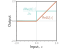
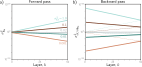
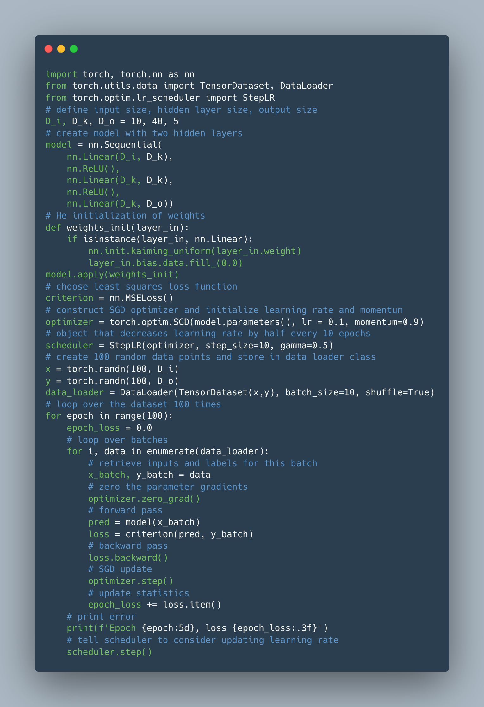

第 6 章介绍了迭代优化算法，这是一类用于找到函数最小值的通用算法。在神经网络的背景下，它们用于寻找能够最小化损失函数的参数，使模型能够根据输入准确预测训练数据的输出。基本方法是随机选择一组初始参数，然后逐步进行微小调整，平均而言这些调整会降低损失。每一次的调整都是基于当前参数位置对损失函数梯度的计算结果。

本章将讨论两个神经网络特有的问题。首先，我们将探讨如何高效地计算梯度。这是一个巨大的挑战，因为截至本文写作时，最大的模型拥有达到 10^12 的参数数量，且在训练算法的每次迭代中都需要对每个参数计算梯度。其次，我们讨论如何进行参数的初始化。如果初始化过程不被妥善处理，初始的损失及其梯度可能会非常大或非常小，这在任何情况下都将阻碍训练过程。
## 7.1 问题定义
考虑一个网络 $f(x, \phi)$，它接受多变量输入 $x$，具有参数 $\phi$，并包含三个隐藏层 $h_1, h_2$ 和 $h_3$：

$$
\begin{align}
h_1 = a(\beta_0 + \Omega_0x) \\
h_2 = a(\beta_1 + \Omega_1h_1) \\
h_3 = a(\beta_2 + \Omega_2h_2) \\
f(x, \phi) = \beta_3 + \Omega_3h_3
\end{align} \tag{7.1}
$$

其中激活函数 $a[\cdot]$ 分别作用于输入的每个元素。模型参数 $\phi = \{\beta_0,\Omega_0,\beta_1,\Omega_1,\beta_2,\Omega_2,\beta_3,\Omega_3\}$ 包括每层之间的偏置向量 $\beta_k$ 和权重矩阵 $\Omega_k$（见图 7.1）。

`图 7.1 反向传播过程中的正向传播阶段。目的是计算损失 l 对于每个权重（用箭头表示）和偏置（图中未展示）的导数。也就是说，我们希望了解每个参数的微小变化将如何影响损失。每个权重将其源头的隐藏单元的激活值乘以权重值，并将结果传递给目标隐藏单元。因此，任何权重的微小变化所产生的效果，都会根据源隐藏单元的激活水平而放大。比如，蓝色权重作用于第一层的第二个隐藏单元；如果该单元的激活值增加一倍，那么对蓝色权重的微小变化产生的影响也会相应增加一倍。因此，为了计算权重的导数，我们需要计算并记录下隐藏层的激活值。这一过程称为正向传播，因为它包括了按顺序执行网络方程的过程。`

此外，我们定义了单个损失项 $l_i$ 来返回基于模型预测 $f(x_i, \phi)$ 对训练输入 $x_i$ 的真实标签 $y_i$ 的负对数似然。例如，这可能是指最小平方损失 $l_i = (f(x_i, \phi) - y_i)^2$。总损失是所有训练数据上这些损失项的和：

$$
L(\phi) = \sum_{i=1}^{I} l_i \tag{7.2}
$$

对于训练神经网络，最常用的优化方法是随机梯度下降（SGD），通过以下方式更新参数：

$$
\phi_{t+1} \leftarrow \phi_t - \alpha \sum_{i \in B_t} \frac{\partial \mathcal{L}(i,\phi_t)}{\partial \phi} \tag{7.3}
$$

其中 $\alpha$ 表示学习率，$B_t$ 为迭代 $t$ 时的批次索引。要执行此更新，必须计算每个批次中索引 $i$ 对应的参数 $\{\beta_k, \Omega_k\}$ 在每一层 $k \in \{0, 1, \ldots, K\}$ 的导数：

$$
\frac{\partial l_i}{\partial \beta_k}, \quad \text{and} \quad \frac{\partial l_i}{\partial \Omega_k} \tag{7.4}
$$

本章的首部分阐述了反向传播算法，该算法能够高效地计算上述导数。

在章节的第二部分，我们将讨论在训练开始前如何初始化网络参数。我们将介绍方法来选择初始权重 $\Omega_k$ 和偏置 $\beta_k$，确保训练过程的稳定性。
## 7.2 计算导数

损失函数的导数揭示了，当我们对模型参数进行细微调整时，损失值会如何变化。优化算法借此信息调整参数，以减少损失值。反向传播算法负责计算这些导数。鉴于涉及的数学细节较为复杂，我们先提出两个观点来帮助理解。

**观察 1：** 每一个权重（属于 $\Omega_k$）都会乘上某个源隐藏单元的激活值，并将结果累加到下一层的目标隐藏单元中。这意味着，权重的任意微小调整都会受到源隐藏单元激活值的放大或衰减作用。因此，我们会对每批数据中的每个样本运行网络，并记录所有隐藏单元的激活值。这个过程称为 *前向传播*（图 7.1）。记录下来的激活值之后将用于梯度的计算。

**观察 2：** 对偏置或权重的微小调整会在后续网络中引发一系列变化，这种变化会修改其目标隐藏单元的值。这又会导致下一层隐藏单元的值发生变化，接着是下下层，依此类推，直至模型输出和最终的损失值发生变化。

因此，要了解参数变化如何影响损失值，我们还需要知道每个后续隐藏层的变化如何进一步影响它们的后继层。这一逻辑同样适用于考虑同一或更早层次中的其他参数时。这意味着，我们可以一次性计算这些量，并在需要时复用。例如，设想计算对输入至隐藏层 $h_3$、$h_2$、$h_1$ 的权重进行微小调整的影响：

- 要计算对隐藏层 $h_3$ 输入的权重或偏置的微小调整如何影响损失，我们需要知道 (i) $h_3$ 层变化如何影响模型输出 $f$，以及 (ii) 模型输出的变化如何影响损失（图 7.2a）。
- 要计算对隐藏层 $h_2$ 输入的权重或偏置的微小调整如何影响损失，我们需要知道 (i) $h_2$ 层的变化如何影响 $h_3$ 层，(ii) $h_3$ 层的变化如何影响模型输出，以及 (iii) 模型输出的变化如何影响损失（图 7.2b）。
- 要计算对隐藏层 $h_1$ 输入的权重或偏置的微小调整如何影响损失，我们需要知道 (i) $h_1$ 层的变化如何影响 $h_2$ 层，(ii) $h_2$ 层的变化如何影响 $h_3$ 层，(iii) $h_3$ 层的变化如何影响模型输出，以及 (iv) 模型输出的变化如何影响损失（图 7.2c）。

随着我们向网络的前端回溯，大部分必需的计算在前一步已经完成，因此无需重复计算。这种沿网络反向进行的计算导数的过程称为 *反向传播*。

`图 7.2 反向传播过程中的反向传播阶段。a) 为了计算对第三层 h3（蓝色箭头指向的层）输入权重的改变如何影响损失，我们需要知道 h3 中的隐藏单元如何影响模型输出 f，以及 f 如何影响损失（橙色箭头指示的影响）。b) 为了计算对第二层 h2（蓝色箭头指向的层）输入权重的微小改变如何影响损失，我们需要了解 (i) h2 中的隐藏单元如何影响 h3，(ii) h3 如何影响 f，以及 (iii) f 如何影响损失（橙色箭头指示的影响）。c) 类似地，为了计算对第一层 h1（蓝色箭头指向的层）输入权重的微小改变如何影响损失，我们需要知道 h1 如何影响 h2，以及这些变化如何通过网络传递影响到损失（橙色箭头指示的影响）。反向传播首先在网络末端计算导数，然后逆向进行，以此利用这些计算过程中的固有重复性。`

虽然反向传播的概念相对容易理解，但其推导过程需要应用矩阵微积分，因为偏置和权重分别以向量和矩阵的形式存在。为了更好地理解其底层机理，下一节将为一个参数为标量的简化模型推导反向传播过程。之后，在第 7.4 节，我们将这一方法应用于深度神经网络。
## 7.3 示例
考虑一个含有八个标量参数 $\phi = [\beta_0, \omega_0, \beta_1, \omega_1, \beta_2, \omega_2, \beta_3, \omega_3]$ 的模型 $f(x_i, \phi)$，该模型是通过组合 $\sin[\cdot]$、$\exp[\cdot]$ 和 $\cos[\cdot]$ 函数而构成的：

$$
f(x, \phi) = \beta_3 + \omega_3 \cdot \cos[\beta_2 + \omega_2 \cdot \exp[\beta_1 + \omega_1 \cdot \sin[\beta_0 + \omega_0 \cdot x]]] \tag{7.5}
$$
以及一个最小二乘损失函数 $L[\phi] = \sum_i \ell_i$，其中的每一项定义如下：
$$
\ell_i = (f(x_i, \phi) - y_i)^2 \tag{7.6}
$$

其中，按照惯例，$x_i$ 表示第 $i$ 个训练输入，$y_i$ 表示第 $i$ 个训练输出。可以把这看作是一个简单的神经网络，它具有单个输入、单个输出、每层一个隐藏单元，并且每一层之间采用了不同的激活函数 $\sin[\cdot]$、$\exp[\cdot]$ 和 $\cos[\cdot]$。我们的目标是计算以下导数：

$$
\frac{\partial \ell_i}{\partial \omega_0}, \frac{\partial \ell_i}{\partial \beta_1}, \frac{\partial \ell_i}{\partial \omega_1}, \frac{\partial \ell_i}{\partial \beta_2}, \frac{\partial \ell_i}{\partial \omega_2}, \frac{\partial \ell_i}{\partial \beta_3}, \text{ 和 } \frac{\partial \ell_i}{\partial \omega_3}.
$$

虽然我们理论上可以通过手工求解这些导数的表达式并直接计算它们，但是部分导数表达式的复杂度相当高。举个例子：

$$
\frac{\partial \ell_i}{\partial \omega_0} = -2 \left[ (\beta_3 + \omega_3 \cdot \cos[\beta_2 + \omega_2 \cdot \exp[\beta_1 + \omega_1 \cdot \sin[\beta_0 + \omega_0 \cdot x_i]]] - y_i) \right. \\
\cdot \omega_1 \omega_2 \omega_3 \cdot x_i \cdot \cos[\beta_0 + \omega_0 \cdot x_i] \cdot \exp[\beta_1 + \omega_1 \cdot \sin[\beta_0 + \omega_0 \cdot x_i]] \\
\left. \cdot \sin[\beta_2 + \omega_2 \cdot \exp[\beta_1 + \omega_1 \cdot \sin[\beta_0 + \omega_0 \cdot x_i]]] \right] \tag{7.7}
$$

这些表达式的推导和编码不仅容易出错，而且未能充分利用其中的重复性元素；值得注意的是，三个指数函数项实际上是一致的。

反向传播算法是一种同时计算所有这些导数的高效方法，它主要分为两个步骤：（i）前向传播，在此过程中我们计算并保存一系列中间值及网络的输出结果；（ii）反向传播，在此过程中我们从网络的输出层开始，逆向计算每个参数的导数，同时复用之前阶段的计算结果。

**前向传播：** 我们把损失计算过程视作一连串的计算步骤：

$$
\begin{align*}
f_0 &= \beta_0 + \omega_0 \cdot x_i \\
h_1 &= \sin[f_0] \\
f_1 &= \beta_1 + \omega_1 \cdot h_1 \\
h_2 &= \exp[f_1] \\
f_2 &= \beta_2 + \omega_2 \cdot h_2 \\
h_3 &= \cos[f_2] \\
f_3 &= \beta_3 + \omega_3 \cdot h_3 \\
\ell_i &= (f_3 - y_i)^2.
\end{align*} \tag{7.8}
$$

我们计算并存储了中间变量 $f_k$ 和 $h_k$（图 7.3）的值。

`图 7.3 反向传播过程中的正向传播阶段。我们依次计算并记录每一个中间变量，直至最终计算出损失。`

**第一次反向传播：** 接下来，我们计算损失函数 $\ell_i$ 对这些中间变量的偏导数，计算顺序与它们被计算出来的顺序相反：

$$
\frac{\partial \ell_i}{\partial f_3'}, \frac{\partial \ell_i}{\partial h_3'}, \frac{\partial \ell_i}{\partial f_2'}, \frac{\partial \ell_i}{\partial h_2'}, \frac{\partial \ell_i}{\partial f_1'}, \frac{\partial \ell_i}{\partial h_1'}, \text{ and } \frac{\partial \ell_i}{\partial f_0'} \tag{7.9}
$$

首先计算的这个导数相对简单直接：

$$
\frac{\partial \ell_i}{\partial f_3} = 2(f_3 - y_i) \tag{7.10}
$$

接下来的导数可以通过应用链式法则进行计算：

$$
\frac{\partial \ell_i}{\partial h_3} = \frac{\partial f_3}{\partial h_3} \frac{\partial \ell_i}{\partial f_3} \tag{7.11}
$$

这里探讨的是当 $h_3$ 发生变化时，$\ell_i$ 会如何变化。我们可以将这个问题分解为两部分：(i) $h_3$ 发生变化导致 $f_3$ 如何变化；以及 (ii) $f_3$ 发生变化导致 $\ell_i$ 如何变化。根据原始方程，$h_3$ 的变化引起 $f_3$ 的变化，进一步影响 $\ell_i$，这些导数体现了这一连锁反应的效应。值得注意的是，我们已经计算出了这些导数中的第二个，而另一个导数是 $\beta_3 + \omega_3 \cdot h_3$ 对 $h_3$ 的导数，即 $\omega_3$。我们继续这样做，计算出输出相对于这些中间量的导数（图 7.4）：

$$
\frac{\partial \ell_i}{\partial f_2} = \frac{\partial h_3}{\partial f_2} \left( \frac{\partial f_3}{\partial h_3} \frac{\partial \ell_i}{\partial f_3} \right), \\
\frac{\partial \ell_i}{\partial h_2} = \frac{\partial f_2}{\partial h_2} \left( \frac{\partial h_3}{\partial f_2} \frac{\partial f_3}{\partial h_3} \frac{\partial \ell_i}{\partial f_3} \right), \\
\frac{\partial \ell_i}{\partial f_1} = \frac{\partial h_2}{\partial f_1} \left( \frac{\partial f_2}{\partial h_2} \frac{\partial h_3}{\partial f_2} \frac{\partial f_3}{\partial h_3} \frac{\partial \ell_i}{\partial f_3} \right), \\
\frac{\partial \ell_i}{\partial h_1} = \frac{\partial f_1}{\partial h_1} \left( \frac{\partial h_2}{\partial f_1} \frac{\partial f_2}{\partial h_2} \frac{\partial h_3}{\partial f_2} \frac{\partial f_3}{\partial h_3} \frac{\partial \ell_i}{\partial f_3} \right), \\
\frac{\partial \ell_i}{\partial f_0} = \frac{\partial h_1}{\partial f_0} \left( \frac{\partial f_1}{\partial h_1} \frac{\partial h_2}{\partial f_1} \frac{\partial f_2}{\partial h_2} \frac{\partial h_3}{\partial f_2} \frac{\partial f_3}{\partial h_3} \frac{\partial \ell_i}{\partial f_3} \right) \tag{7.12}
$$

在每个案例中，我们已经在上一步骤计算出了括号内的值，最后一项则有一个简洁的公式。这些建立在先前章节观察 2（图 7.2）的基础上；通过倒序计算这些导数，我们能够复用先前计算得到的导数。

`图 7.4 反向传播过程中的反向传播第一阶段。我们从函数的最末端开始逆向进行，计算损失 l 对于各个中间变量的导数 ∂ li /∂ f• 和 ∂ li /∂ h•。每个导数的计算都是基于前一个导数，并乘以形如 ∂fk/∂hk 或 ∂hk/∂fk−1 的项进行的。`

**第二次反向传播：** 最终，我们分析改变参数 $\beta$ 和 $\omega$ 时，损失 $\ell_i$ 如何相应变化。我们再次应用链式法则（图 7.5）：

$$
\frac{\partial \ell_i}{\partial \beta_k} = \frac{\partial f_k}{\partial \beta_k} \frac{\partial \ell_i}{\partial f_k}, \\
\frac{\partial \ell_i}{\partial \omega_k} = \frac{\partial f_k}{\partial \omega_k} \frac{\partial \ell_i}{\partial f_k} \tag{7.13}
$$

对于每个案例，右侧的第二项已在方程式 7.12 中计算得出。当 $k > 0$，我们得到 $f_k = \beta_k + \omega_k \cdot h_k$，因此：

$$
\frac{\partial f_k}{\partial \beta_k} = 1 \text{ and } \frac{\partial f_k}{\partial \omega_k} = h_k \tag{7.14}
$$

这与上一节的第一观察点一致；$\omega_k$ 的改变对效果与源变量 $h_k$ 的值呈正比（该值在前向传播中已被记录）。从项 $f_0 = \beta_0 + \omega \cdot x_i$ 得到的最终导数为：

$$
\frac{\partial f_0}{\partial \beta_0} = 1 \text{ and } \frac{\partial f_0}{\partial \omega_0} = x_i \tag{7.15}
$$

反向传播不仅过程简化，相较于单独计算每个导数（如方程 7.7.1）的方式，效率更高。

`图 7.5 反向传播过程中的第二阶段。我们最终计算了导数 ∂ li /∂ β• 和 ∂ li /∂ ω•。每个导数的计算都是通过将 ∂li/∂fk 项乘以适当的 ∂fk/∂βk 或 ∂fk/∂ωk 来实现的。`
## 7.4 反向传播算法
现在我们针对一个三层网络重复这一过程（图 7.1）。尽管直觉和大部分的代数处理相似，但主要的不同在于中间变量 $f_k, h_k$ 是向量形式，偏置 $\beta_k$ 也是向量，权重 $\Omega_k$ 是矩阵，并且我们采用的是 ReLU 函数而不是如 $\cos[\cdot]$ 这类简单的代数函数。

**前向传播过程：** 我们将网络描述为一系列连续的计算步骤：

$$
\begin{align*}
f_0 &= \beta_0 + \Omega_0x_i \\
h_1 &= a[f_0] \\
f_1 &= \beta_1 + \Omega_1h_1 \\
h_2 &= a[f_1] \\
f_2 &= \beta_2 + \Omega_2h_2 \\
h_3 &= a[f_2] \\
f_3 &= \beta_3 + \Omega_3h_3 \\
\ell_i &= l[f_3, y_i],
\end{align*} \tag{7.16}
$$

这里 $f_{k-1}$ 指的是第 $k^{th}$ 隐藏层的预激活值（即在 ReLU 函数 $a^{[l]}$ 应用之前的值），$h_k$ 包含了第 $k^{th}$ 隐藏层的激活值（即在 ReLU 函数应用之后的值）。项 $l_{f_3, y}$ 表示损失函数（如最小二乘损失或二元交叉熵损失）。在前向传播阶段，我们按顺序完成这些计算并记录所有中间结果。

**第一次反向传播过程：** 现在，我们探讨修改预激活 $f_0, f_1, f_2$ 时，损失如何变化。通过应用链式法则，我们得到了损失 $\ell_i$ 相对于 $f_2$ 的偏导数的表达方式：

$$
\frac{\partial \ell_i}{\partial f_2} = \frac{\partial h_3}{\partial f_2} \frac{\partial f_3}{\partial h_3} \frac{\partial \ell_i}{\partial f_3} \tag{7.17}
$$

右侧的三个项的维度分别是 $D_3 \times D_3, D_3 \times D_f$ 和 $D_f \times 1$，这里 $D_3$ 表示第三层隐藏单元的数目，$D_f$ 表示模型输出 $f_3$ 的维度。

类似地，我们也可以分析当改变 $f_1$ 和 $f_0$ 时，损失的变化情况：

$$
\frac{\partial \ell_i}{\partial f_1} = \frac{\partial h_2}{\partial f_1}  \frac{\partial f_2}{\partial h_2}\left( \frac{\partial h_3}{\partial f_2} \frac{\partial f_3}{\partial h_3} \frac{\partial \ell_i}{\partial f_3} \right) \tag{7.18}
$$

$$
\frac{\partial \ell_i}{\partial f_0} = \frac{\partial h_1}{\partial f_0} \frac{\partial f_1}{\partial h_1} \left( \frac{\partial h_2}{\partial f_1} \frac{\partial f_2}{\partial h_2} \frac{\partial h_3}{\partial f_2} \frac{\partial f_3}{\partial h_3} \frac{\partial \ell_i}{\partial f_3} \right) \tag{7.19}
$$

请注意，每种情况下，括号中的内容都已在前一步计算完成。通过反向遍历网络，我们可以复用先前的计算结果。此外，这些计算项本身都相对简单。从方程 7.17 的右侧向前回溯时，我们得到：
- 损失 $\ell_i$ 对网络输出 $f_3$ 的偏导数 $\partial \ell_i/\partial f_3$ 取决于损失函数，但它通常有一个简单的公式形式。
- 网络输出 $f_3$ 相对于隐藏层 $h_3$ 的偏导数 $\partial f_3/\partial h_3$ 为：

$$
\frac{\partial f_3}{\partial h_3} = \frac{\partial}{\partial h_3} (\beta_3 + \Omega_3 h_3) = \Omega_3^T  \tag{7.20}
$$

如果你对矩阵微积分不够熟悉，这个结果可能不是很直观。这一问题在问题 7.6 中有所探讨。

- 激活函数的输出 $h_3$ 对其输入 $f_2$ 的偏导数 $\partial h_3/\partial f_2$ 取决于激活函数的种类。它是一个对角矩阵，因为每个激活值只与其对应的预激活值有关。对于 ReLU 函数，当 $f_2$ 小于零时对角项为零，否则为一（图 7.6）。我们不直接进行矩阵乘法，而是将对角项提取为向量 $[f_2 > 0]$ 进行逐元素乘法，这种做法更为高效。

方程 7.18 和 7.19 中右侧的项具有相似的结构。随着我们逐步回退网络，我们将交替执行 (i) 乘以权重矩阵 $\Omega_k$ 的转置和 (ii) 根据隐藏层的输入 $f_{k-1}$ 进行阈值判断。这些输入值在前向传播时已经被记录下来。

`图 7.6 整流线性单元的导数。当输入小于零时，整流线性单元（橙色曲线）输出为零；当输入大于零时，输出为输入值。其导数（青色曲线）在输入小于零时为零（因为此处斜率为零），在输入大于零时为一（因为此处斜率为一）。`

**第二次反向传播过程：** 现在我们已经掌握了如何计算损失对于 $f_k$ 的偏导数 $\partial \ell_i/\partial f_k$，我们可以集中注意力于计算损失对权重和偏置的导数。为了得到损失对偏置 $\beta_k$ 的导数，我们再次应用了链式法则：

$$
\begin{align}
\frac{\partial \ell_i}{\partial \beta_k} &= \frac{\partial f_k}{\partial \beta_k} \frac{\partial \ell_i}{\partial f_k} \\
&= \frac{\partial}{\partial \beta_k} (\beta_k + \Omega_k h_k) \frac{\partial \ell_i}{\partial f_k} \\
&= \frac{\partial \ell_i}{\partial f_k} \tag{7.21}
\end{align}
$$

这部分我们已在方程 7.17 和 7.18 中完成了计算。

同样地，权重矩阵 $\Omega_k$ 的导数可以通过以下公式计算：

$$
\begin{align}
\frac{\partial \ell_i}{\partial \Omega_k} &= \frac{\partial f_k}{\partial \Omega_k} \frac{\partial \ell_i}{\partial f_k} \\
&= \frac{\partial}{\partial \Omega_k} (\beta_k + \Omega_k h_k) \frac{\partial \ell_i}{\partial f_k} \\
&= \frac{\partial \ell_i}{\partial f_k} h_k^T \tag{7.22}
\end{align}
$$

从第二行过渡到第三行的逻辑并不直观，这一点在问题 7.9 中有所讨论。然而，这个结果是合理的。最终得到的是一个与 $\Omega_k$ 尺寸相同的矩阵。这个结果与 $h_k$ 线性相关，$h_k$ 在原表达式中与 $\Omega_k$ 相乘。这也验证了最初的直觉：$\Omega_k$ 中的权重导数将与它们乘的隐藏单元的值成比例。回顾之前，我们已经在前向传播阶段完成了这些计算。
### 7.4.1 反向传播算法概述 
现在，让我们简要概述反向传播算法的最终形态。设想一个深度神经网络 $f_{i,x_i}$，它接收输入 $x_i$，包含 $K$ 个隐藏层，采用 ReLU 激活函数，并计算单个损失项 $\ell_i = l[f_{i,x_i}, y_i]$。反向传播的目标是求出损失 $\ell_i$ 对偏置 $\beta_k$ 和权重 $\Omega_k$ 的偏导数 $\partial \ell_i/\partial \beta_k$ 和 $\partial \ell_i/\partial \Omega_k$。 **前向传播过程：** 我们计算并记录下列数据：

$$
\begin{align}
&f_0 = \beta_0 + \Omega_0 x_i \\
&h_k = a[f_{k-1}] \quad k \in \{1,2,...,K\} \\
&f_k = \beta_k + \Omega_k h_k. \quad k \in \{1,2,...,K\}
\end{align} \tag{7.23}
$$
**反向传播过程：** 我们从损失函数 $\ell_i$ 相对于网络输出 $f_K$ 的偏导数 $\partial \ell_i/\partial f_K$ 开始，逆向遍历网络：

$$
\begin{align}
&\frac{\partial \ell_i}{\partial \beta_k} = \frac{\partial \ell_i}{\partial f_k} \\
&\frac{\partial \ell_i}{\partial \Omega_k} = \frac{\partial \ell_i}{\partial f_k} h_k^T \\
&\frac{\partial \ell_i}{\partial f_{k-1}} = \mathbf{1}[f_{k-1} > 0] \odot \left( \Omega_k^T \frac{\partial \ell_i}{\partial f_k} \right) 
\end{align} \tag{7.24}
$$
这里，$\odot$ 代表逐元素乘法，$\mathbf{1}[f_{k-1} > 0]$ 是一个向量，其在 $f_{k-1}$ 大于零的位置为 1，其余为 0。最终，我们求出第一组偏置和权重的偏导数：

$$
\begin{align}
&\frac{\partial \ell_i}{\partial \beta_0} = \frac{\partial \ell_i}{\partial f_0} \\
&\frac{\partial \ell_i}{\partial \Omega_0} = \frac{\partial \ell_i}{\partial f_0} x_i^T
\end{align} \tag{7.25}
$$

我们对批次中的每一个训练实例计算这些偏导数，并将它们累加起来，以便为 SGD 更新计算出梯度。

需要注意的是，反向传播算法极为高效；无论是前向还是反向传播，最计算密集的步骤均为矩阵乘法（分别由 $\Omega$ 和 $\Omega^T$ 完成），仅涉及加法和乘法操作。然而，这种方法在内存使用上并不高效；因为前向传播中的所有中间值都需保存，这可能限制我们能够训练的模型规模。
### 7.4.2 算法微分
虽然理解反向传播算法是重要的，但实际上你可能不需要自己编写这些代码。现代深度学习框架，如 PyTorch 和 TensorFlow，能够根据模型的定义自动计算导数，这一过程称为*算法自动微分*。

框架内的每个功能组件（如线性变换、ReLU激活函数、损失函数）均能自行计算其导数。例如，PyTorch中的ReLU函数 $z_{out} = relu(z_{in})$ 能够计算出其输出 $z_{out}$ 相对于输入 $z_{in}$ 的导数。同理，一个线性函数 $z_{out} = \beta + \Sigma z_{in}$ 能够计算输出 $z_{out}$ 相对于输入 $z_{in}$，以及参数 $\beta$ 和 $\Omega$ 的导数。算法自动微分框架还掌握网络操作的顺序，因而具备执行前向传播和反向传播所需的全部信息。

这些框架充分利用了现代图形处理单元（GPU）的大规模并行处理能力。诸如矩阵乘法之类的运算（在前向和反向传递过程中均非常重要）天生适合并行处理。此外，如果模型和前向传播中的中间结果没有超出可用内存的限制，可以对整个批量数据的前向和反向传递同时并行处理。

因为训练算法现在能够并行处理整个批次，所以输入变为了多维*张量*。在此语境下，张量可视为矩阵向任意维度的扩展。因此，向量是一维张量，矩阵是二维张量，而三维张量则是一个三维数字网格。直到现在，训练数据都是一维的，所以反向传播的输入会是一个二维张量，其中第一维索引批次元素，第二维索引数据维度。在接下来的章节里，我们将探讨更为复杂的结构化输入数据。比如，在输入为RGB图像的模型中，原始数据样本是三维的（高 x 宽 x 通道）。这里，对学习框架的输入将是一个四维张量，额外的维度用于索引批次元素。
### 7.4.3 扩展至任意计算图
我们已经讨论了深度神经网络中自然顺序的反向传播过程，其中我们依次计算中间量 f0, f1, f2, ..., fk。然而，模型并不局限于顺序计算。在本书的后续部分，我们将介绍具有分支结构的模型。举例来说，我们可能会将隐藏层的值通过两个不同的子网络进行处理，然后再次组合。

幸运的是，即使计算图是无环的，反向传播的概念依然适用。现代算法自动微分框架，如 PyTorch 和 TensorFlow，能够处理任意的无环计算图。
## 7.5 参数初始化 
反向传播算法计算的导数被随机梯度下降和 Adam 算法用于训练模型。在我们开始训练之前，如何初始化参数是一个关键问题。为了理解其重要性，考虑到在前向传播过程中，每一组预激活值 $f_k$ 是按照下面的方式计算的：

$$
\begin{align}
f_k &= \beta_k + \Omega_k h_k \\
&= \beta_k + \Omega_k a[h_{k-1}] \tag{7.26}
\end{align}
$$

其中 $a[\cdot]$ 代表应用 ReLU 函数，$\Omega_k$ 和 $\beta_k$ 分别代表权重和偏置。假设我们将所有偏置初始化为零，并且 $\Omega_k$ 的元素按照均值为零、方差为 $\sigma^2$ 的正态分布进行初始化。设想以下两种情况：

- 如果方差 $\sigma^2$ 非常小（比如，$10^{-5}$），那么 $\beta_k + \Omega_k h_k$ 的每个元素将是 $h_k$ 的一个小权重加权和；这样的结果可能会比输入值的幅度还小。此外，由于 ReLU 函数会将小于零的值设为零，$h_k$ 的取值范围将是 $f_{k-1}$ 的一半。因此，随着网络深入，隐藏层的预激活值的幅度会逐渐变小。

- 如果方差 $\sigma^2$ 非常大（比如，$10^5$），那么 $\beta_k + \Omega_k h_k$ 的每个元素将是 $h_k$ 的一个大权重加权和；这样的结果可能会远大于输入值的幅度。尽管 ReLU 函数会将输入值的范围减半，但若 $\sigma^2$ 足够大，预激活值的幅度在网络中逐层增加。

在这两种极端情况下，预激活值可能变得极小或极大，以至于无法用有限精度的浮点数来表示。

即便前向传播过程可行，后向传播过程也面临同样的逻辑问题。每一次梯度更新（如方程 7.24 所示）涉及到乘以 $\Omega^T$。如果 $\Omega$ 的值未能合理初始化，那么在后向传播过程中，梯度的幅度可能会不受控制地减少或增加。这分别称为梯度消失问题和梯度爆炸问题。在前者情况下，模型的更新量变得极小；在后者情况下，更新变得不稳定。

### 7.5.1 前向传播的初始化
我们将展示该论点的数学表述。请考虑相邻预激活 $f$ 和 $f'$ 之间的计算过程，它们的维度分别是 $D_h$ 和 $D_{h'}$：

$$
\begin{align}
&h = a[f], \\
&f' = \beta + \Omega h
\end{align} \tag{7.27}
$$

其中 $f$ 代表神经网络中的预激活值，$\Omega$ 和 $\beta$ 分别代表网络的权重和偏置，$a\{\}$ 表示激活函数。

假设在输入层 $f$ 中，预激活值 $f_j$ 的方差为 $\sigma^2$。将偏置 $\beta_j$ 初始化为 0，权重 $\Omega_{ij}$ 按照均值为 0、方差为 $\frac{\alpha^2}{D}$ 的正态分布进行初始化。接下来，我们将推导出下一层预激活值 $f'$ 的平均值和方差的表达式。

中间预激活值 $f_i$ 的期望（平均值）$E[f_i]$ 为：

$$
\begin{align}
E[f_i^\prime] &= E\left[\beta_i + \sum_{j=1}^{D_h} \Omega_{ij}h_j \right] \\
&= E[\beta_i] + \sum_{j=1}^{D_h} E[\Omega_{ij}h_j] \\
&= E[\beta_i] + \sum_{j=1}^{D_h} E[\Omega_{ij}] E[h_j] \\
&= 0 + \sum_{j=1}^{D_h} 0 \cdot E[h_j] = 0 , \tag{7.28}
\end{align}
$$

其中 $D_h$ 代表输入层 $h$ 的维度。我们应用了期望操作的规则，并假设在第二行与第三行之间，隐藏单元 $h_j$ 与网络权重 $\Omega_{ij}$ 的分布互相独立。

基于这个结果，我们得出预激活值 $f'_i$ 的方差 $\sigma_{f'}^2$ 为：

$$
\begin{align}
\sigma_{f'}^2 &= E[f_i'^2] - E[f_i']^2 \\
&= E\left[\left(\beta_i + \sum_{j=1}^{D_h} \Omega_{ij}h_j \right)^2\right] - 0 \\
&= E\left[\left( \sum_{j=1}^{D_h} \Omega_{ij}h_j \right)^2\right] \\
&= \sum_{j=1}^{D_h} E[\Omega_{ij}^2] E[h_j^2] \\
&= \sum_{j=1}^{D_h} \sigma^2 E[h_j^2] = \sigma^2 \sum_{j=1}^{D_h} E[h_j^2],
\end{align} \tag{7.29}
$$

我们应用了方差的定义 $\sigma^2 = E[(x - E[x])^2] = E[x^2] - E[x]^2$。再次，我们假定权重 $\Omega_{ij}$ 和隐藏单元 $h_j$ 在第三行与第四行之间的分布是相互独立的。

在假设预激活 $f_j$ 的输入分布在零点对称的前提下，一半的预激活值会被 ReLU 函数设置为零，这意味着隐藏单元的第二矩 $E[h_j^2]$ 将是 $f_j$ 的方差 $\sigma^2$ 的一半（参考问题 7.14）：

$$
\sigma_{f'}^2 = \sigma_\Omega^2 \sum_{j=1}^{D_h} \frac{\sigma_f^2}{2} = \frac{1}{2} D_h\sigma_\Omega^2\sigma_f^2. \tag{7.30}
$$

这也就意味着，若我们想让后续预激活值 $f'$ 的方差 $\sigma_{f'}^2$ 在前向传播过程中保持与原始预激活值 $f$ 的方差 $\sigma_f^2$ 相等，那么我们需要设定：

$$
\sigma_{f'}^2 = \frac{2}{D_h} \tag{7.31}
$$

其中 $D_h$ 是应用权重的原始层的维度。这种初始化方法被称为 He 初始化。

### 7.5.2 反向传播的初始化
一个相似的论证说明了反向传播期间梯度 $\frac{\partial l}{\partial f_k}$ 的方差的变化情况。在反向传播过程中，我们将其与权重矩阵的转置 $\Omega^T$ 相乘（见方程 7.24），因此相应的表达式变为：
$$
\sigma^2_n = \frac{2}{D_{h'}}, \tag{7.32}
$$

其中 $D_{h'}$ 表示权重作用的那一层的维度。
### 7.5.3 正向传播和反向传播的初始化
如果权重矩阵 \( \Omega \) 不是方阵（即，两个相邻层的隐藏单元数量不同，从而 \( D_h \) 和 \( D_{h'} \) 存在差异），则无法选择一个方差同时满足方程 7.31 和 7.32。一种可行的折衷方法是采用平均数 \( (D_h + D_{h'})/2 \) 作为项数，据此得到：

$$
\sigma^2_n = \frac{4}{D_h + D_{h'}} \tag{7.33}
$$

图 7.7 通过实验数据表明，当参数进行适当的初始化后，正向传播过程中隐藏单元的方差以及反向传播过程中梯度的方差均能保持稳定。

`图 7.7 权重初始化。设想一个具有 50 个隐藏层，每层有 Dh = 100 个隐藏单元的深度网络。该网络的 100 维输入 x 从标准正态分布中初始化，设定单一固定目标 y = 0，并使用最小二乘损失函数。偏置向量 βk 初始化为零，权重矩阵 Ωk 则采用均值为零的正态分布初始化，并设置五种不同的方差 σΩ2 ∈ {0.001, 0.01, 0.02, 0.1, 1.0}。a) 正向传播计算出的隐藏单元激活方差随网络层变化的函数图。对于 He 初始化（σΩ2 = 2/Dh = 0.02），激活方差保持稳定。但是，对于较大的值，方差迅速增加；对于较小的值，方差迅速减少（注意此处使用了对数刻度）。b) 反向传播中梯度的方差（用实线表示）延续了这一趋势；如果初始化值大于 0.02，梯度大小会随着网络反向传播而迅速增大。如果初始化值小于这个值，则梯度大小会减小。这两种情况分别被称为梯度爆炸和梯度消失问题。`
## 7.6 示例训练代码
本书主要专注于科学研究；并非旨在指导实现深度学习模型。然而，在图 7.8 中，我们呈现了一段 PyTorch 代码，该代码实践了迄今为止本书探讨的理念。该代码定义了一个神经网络并初始化了权重。它生成了随机的输入和输出数据集，并定义了一个最小二乘损失函数。模型通过在大小为 10 的批次中使用具有动量的 SGD 在 100 轮次(epoch)内进行训练，学习率从 0.01 开始，并每 10 轮次减半。

核心观点是，虽然深度学习的底层原理相当复杂，其实现过程却相对简单。比如，反向传播的所有细节都封装在了一行代码 `loss.backward()` 中。

`图 7.8 在随机数据上训练双层网络的示例代码。`
## 7.7 总结
上一章引入了随机梯度下降（SGD），一个旨在找到函数最小值的迭代优化算法。在神经网络的背景下，这一算法寻找能够最小化损失函数的参数。SGD 依赖于损失函数相对于参数的梯度，这需要在优化前进行初始化。本章解决了深度神经网络面临的这两大问题。

梯度必须对大量参数进行评估，针对每个批次中的每一个样本，以及每一次 SGD 迭代。因此，高效的梯度计算显得至关重要，为此引入了反向传播算法。此外，谨慎的参数初始化也极为关键。在正向传播过程中，隐藏单元激活的幅度可能会指数级地增加或减少。反向传播过程中，梯度幅度的变化同样可能出现，这种现象被称为梯度消失和梯度爆炸问题，它们都会阻碍训练过程，但可以通过恰当的初始化来避免。

至此，我们已经定义了模型及其损失函数，并可以针对特定任务训练模型。下一章将讨论如何评估模型性能。
## 笔记
**反向传播 (Backpropagation)**：在计算图中计算梯度时，有效重复使用部分计算的技术已多次被发现，包括 Werbos (1974)、Bryson 等人 (1979)、LeCun (1985) 和 Parker (1985) 的研究。然而，这一理念最为人称道的描述出现在 Rumelhart 等人 (1985) 和 Rumelhart 等人 (1986) 的工作中，他们还首次提出了“反向传播”这一术语。这项后期工作引发了 80 年代和 90 年代神经网络研究的新浪潮；首次使得训练具有隐藏层的网络成为可能。不过，由于训练数据的缺乏、计算能力的限制以及使用 Sigmoid 激活函数，进展最终陷入停滞（事后看来）。直到 Krizhevsky 等人 (2012) 在图像分类方面取得显著成果，自然语言处理和计算机视觉领域才开始依赖神经网络模型，开启了深度学习的现代纪元。

在现代深度学习框架如 PyTorch 和 TensorFlow 中实施的反向传播，是逆模式算法微分 (reverse-mode algorithmic differentiation) 的一个例子。这与在计算图前向传播过程中累积链式法则导数的前向模式算法微分不同（参见问题 7.13）。有关算法微分的更多信息，请参阅 Griewank & Walther (2008) 和 Baydin 等人 (2018) 的工作。

**初始化**：He 初始化最初由 He 等人 (2015) 提出。它紧跟 Glorot 或 Xavier 初始化（Glorot & Bengio, 2010），非常相似，但未考虑 ReLU 层的影响，因此有一定的差异。实际上，LeCun 等人 (2012) 早期就提出了本质上相同的方法，但其动机略有不同；在此，采用了 Sigmoid 激活函数，这种函数自然地规范了每层输出的范围，从而帮助避免隐藏单元幅度的指数级增长。然而，若预激活值过大，就会落入 Sigmoid 函数的平坦区域，导致梯度非常小。因此，合理地初始化权重仍然至关重要。Klambauer 等人 (2017) 引入了缩放指数线性单元 (SeLU) 并显示，在一定范围的输入下，该激活函数倾向于使网络层的激活自动趋向于零均值和单位方差。

完全不同的方法是通过网络传递数据后，根据实际观察到的方差进行规范化。层序列单位方差初始化 (Layer-sequential unit variance initialization)（Mishkin & Matas, 2016）就是这种方法的一个例子，其中权重矩阵以正交方式初始化。GradInit (Zhu 等人，2021) 随机初始化权重，并在学习每个权重矩阵的非负缩放因子时暂时固定它们。这些因子选取是为了在固定学习率的条件下最大化减少损失，同时限制最大梯度范数。激活规范化或 ActNorm 在每个网络层的每个隐藏单元后添加一个可学习的缩放和偏移参数。他们在网络上运行一个初始批次，然后调整偏移和比例，使得激活的平均值为零且方差为一。此后，这些额外的参数将作为模型的一部分进行学习。

与这些方法紧密相关的是如 BatchNorm（Ioffe & Szegedy, 2015）等方案，其中网络作为其每一步处理的一部分，规范化每批的方差。BatchNorm 及其变种将在第 11 章中讨论。其他针对特定架构的初始化方案包括用于卷积网络的 ConvolutionOrthogonal 初始化器（Xiao 等人，2018a）、残差网络的 Fixup（Zhang 等人，2019a）以及 Transformer 的 TFixup（Huang 等人，2020a）和 DTFixup（Xu 等人，2021b）。

减少内存需求：训练神经网络是一个内存密集型的过程。我们必须存储批次中每个成员的模型参数和隐藏单元的预激活值。减少内存需求的两种方法包括梯度检查点（Chen 等人，2016a）和微批处理（Huang 等人，2019）。在梯度检查点技术中，激活仅在前向传播的每 N 层存储一次。在反向传递期间，中间缺失的激活从最近的检查点重新计算。这样，我们可以在计算成本上执行前向传播两次的情况下大幅减少内存需求（参见问题 7.11）。在微批处理中，将批次细分为更小的部分，并在应用到网络之前聚合每个子批次的梯度更新。构建可逆网络（例如，Gomez 等人，2017）是一种完全不同的方法，在这种网络中，可以从当前层的激活计算出上一层的激活，因此在前向传播期间无需缓存任何内容（见第 16 章）。Sohoni 等人 (2019) 回顾了减少内存需求的方法。

分布式训练：对于大型模型，内存需求或所需总时间可能对于单个处理器来说过多。在这种情况下，我们必须采用分布式训练，训练过程在多个处理器上并行进行。并行方法有几种。在数据并行中，每个处理器或节点包含模型的完整副本，但只运行批次的一部分（参见 Xing 等人，2015；Li 等人，2020b）。每个节点的梯度在中央聚合，然后重新分配回每个节点，以确保模型保持一致。这称为同步训练。聚合和重新分配梯度所需的同步可能成为性能瓶颈，这引出了异步训练的概念。例如，在 Hogwild! 算法（Recht 等人，2011）中，节点的梯度被用来更新中心模型，一旦准备好即可。更新后的模型随后重新分配给该节点。这意味着每个节点可能在任何给定时间都有略微不同版本的模型，因此梯度更新可能是陈旧的；然而，实践证明这种方法效果良好。也开发了其他去中心化方案。例如，在 Zhang 等人 (2016a) 的研究中，个别节点以环形结构互相更新。

数据并行方法仍然假设整个模型可以存储在单个节点的内存中。管道模型并行不需要这样的前提，它将网络的不同层存储在不同节点上。在一种简单的实现中，第一个节点对批次的前几层进行前向传播，并将结果传递给下一个节点，该节点继续对接下来的几层进行前向传播，以此类推。在反向传递中，以相反的顺序更新梯度。这种方法的明显缺点是，每台机器在大多数时间里处于闲置状态。已经提出了各种方案来减少这种低效率，例如，让每个节点依次处理微批次（例如，Huang 等人，2019；Narayanan 等人，2021a）。最后，在张量模型并行中，单个网络层的计算在节点之间分布（例如，Shoeybi 等人，2019）。Narayanan 等人 (2021b) 提供了分布式训练方法的综述，他们结合张量、管道和数据并行训练了一个具有一万亿参数的语言模型，在 3072 个 GPU 上运行。
## Problems  
**问题 7.1** 一个包含两个隐藏层，每层有两个隐藏单元的双层网络可以被定义为：
$$
\begin{align}
y = \phi_0 &+ \phi_1a[\psi_{01} + \psi_{11}a[\theta_{01} + \theta_{11}x] + \psi_{21}a[\theta_{02} + \theta_{12}x]] \\
&+ \phi_2a[\psi_{02} + \psi_{12}a[\theta_{01} + \theta_{11}x] + \psi_{22}a[\theta_{02} + \theta_{12}x]]
\end{align} \tag{7.34}
$$

其中函数 $a[\cdot]$ 是线性整流函数（ReLU 函数）。直接计算输出 $y$ 相对于各参数 $\phi_\cdot, \theta_{\cdot\cdot},$ 和 $\psi_{\cdot\cdot}$ 的导数（即，不采用反向传播算法）。线性整流函数（ReLU 函数）相对于其输入的导数 $\partial a(z)/\partial z$ 是指示函数 $I[z > 0]$，如果参数大于零则返回一，否则返回零（图 7.6）。

**问题 7.2** 寻找等式 7.12 中每个导数链五个最终项的表达式。

**问题 7.3** 等式 7.19 中每个项的尺寸是多少？

**问题 7.4** 对于最小平方损失函数，计算导数 $\partial\ell_i/\partial f(x_i, \phi)$：

$$
\ell_i = (y_i - f(x_i, \phi))^2. \tag{7.35}
$$

**问题 7.5** 对于二分类损失函数，计算导数 $\partial\ell_i/\partial f(x_i, \phi)$：

$$
\ell_i = -(1 - y_i)\log [ 1 - sig[f(x_i, \phi)] ] - y_i \log [sig[f(x_i, \phi)] ] \tag{7.36}
$$

其中函数 $sig[]$ 是逻辑 Sigmoid 函数，并被定义为：

$$
sig[z] = \frac{1}{1 + \exp[-z]}. \tag{7.37}
$$

**问题 7.6** 对于 $z = \beta + \Omega h$ 证明：
$$
\frac{\partial z}{\partial h} = \Omega^T,
$$
其中 $\frac{\partial z}{\partial h}$ 是一个矩阵，包含项 $\frac{\partial z_i}{\partial h_j}$ 在其第 $i$ 列和第 $j$ 行。首先找出构成元素 $\frac{\partial z_i}{\partial h_j}$ 的表达式，然后确定矩阵 $\frac{\partial z}{\partial h}$ 的形式。

**问题 7.7** 当使用逻辑 Sigmoid 函数（参见等式 7.37）作为激活函数时，即 $h = sig[f]$，计算此激活函数对 $f$ 的导数 $\frac{\partial h}{\partial f}$。当输入值是 (i) 一个很大的正数和 (ii) 一个很大的负数时，这个导数会怎样变化？

**问题 7.8** 考虑使用 (i) Heaviside 函数和 (ii) 矩形函数作为激活函数：
$$
Heaviside[z] = \begin{cases}
0 & z < 0 \\
1 & z \geq 0
\end{cases} \tag{7.38}
$$

和
$$
rect[z] = \begin{cases}
0 & z < 0 \\
1 & 0 \leq z \leq 1 \\
0 & z > 1
\end{cases} \tag{7.39}
$$

讨论这些函数为何在使用基于梯度的优化方法训练神经网络时会产生问题。

**问题 7.9** 考虑损失函数 $\ell[f]$，其中 $f = \beta + \Omega h$。我们想要找出当改变 $\Omega$ 时，损失 $\ell$ 如何变化，用一个包含导数 $\partial\ell/\partial\Omega_{ij}$ 在第 $i$ 行和第 $j$ 列的矩阵来表示。找出 $\partial\ell/\partial\Omega_{ij}$ 的表达式，并使用链式法则证明：
$$
\frac{\partial \ell}{\partial \Omega} = \frac{\partial \ell}{\partial h^T}. \tag{7.40}
$$

**问题 7.10** 导出对于使用泄漏 ReLU 激活函数的网络反向传播算法的反向传递方程，定义为：
$$
a[z] = ReLU[z] = \begin{cases}
\alpha \cdot z & z < 0 \\
z & z \geq 0
\end{cases} \tag{7.41}
$$

其中 $\alpha$ 是一个小的正值（通常为 0.1）。

**问题 7.11** 考虑训练一个含有五十层的网络，在正向传播过程中，我们只有足够的内存来在每十个隐藏层保存一次预激活值。请解释在这种情况下如何利用梯度检查点技术计算导数。

**问题 7.12** 本题探索在一般的有向无环图计算图上计算导数。考虑下列函数：

$$
y = \exp [\exp[x] + \exp[x^2]] + \sin[\exp[x] + \exp[x^2]]. \tag{7.42}
$$

我们可以将这个过程分解为以下几步中间计算：
$$
\begin{aligned}
f_1 &= \exp[x] \\
f_2 &= f_1^2 \\
f_3 &= f_1 + f_2 \\
f_4 &= \exp[f_3] \\
f_5 &= \sin[f_3] \\
y &= f_4 + f_5.
\end{aligned} \tag{7.43}
$$

相应的计算图展示在图 7.9 中。通过反向传播法计算 $\frac{\partial y}{\partial x}$ 的导数。也就是依次计算：

$$
\frac{\partial y}{\partial f_5}, \frac{\partial y}{\partial f_4}, \frac{\partial y}{\partial f_3}, \frac{\partial y}{\partial f_2}, \frac{\partial y}{\partial f_1}, \frac{\partial y}{\partial x} \tag{7.44}
$$

每一步均应用链式法则，以利用之前已计算出的导数。

`图 7.9 针对问题 7.12 和问题 7.13 的计算图，根据 Domke (2010) 的研究进行了展示。`

**问题 7.13** 对于问题 7.42 中相同的函数，通过正向传播法计算 $\frac{\partial y}{\partial x}$ 的导数。即依次计算：

$$
\frac{\partial f_1}{\partial x}, \frac{\partial f_2}{\partial x}, \frac{\partial f_3}{\partial x}, \frac{\partial f_4}{\partial x}, \frac{\partial f_5}{\partial x}, \frac{\partial y}{\partial x} \tag{7.45}
$$

每一步均应用链式法则，以利用之前已计算出的导数。为什么在计算深度网络的参数梯度时，我们不采用正向传播法呢？

**问题 7.14** 假设有一个随机变量 $a$，其方差 $\text{Var}[a] = \sigma^2$，且其分布在均值 $\mathbb{E}[a] = 0$ 周围对称。证明如果我们将这个变量通过 ReLU 函数处理：

$$
b = \text{ReLU}[a] = \begin{cases}
0 & a < 0 \\
a & a \geq 0
\end{cases}, \tag{7.46}
$$

那么，变换后变量的二阶矩（二次方期望）为 $\mathbb{E}[b^2] = \sigma^2/2$。

**问题 7.15** 如果我们将网络中所有的权重和偏置初始化为零，你认为会发生什么情况？

**问题 7.16** 使用 PyTorch 实现图 7.8 中的代码，并绘制训练过程中的损失与迭代次数的关系图。

**问题 7.17** 修改图 7.8 中的代码以解决一个二元分类问题。你需要 (i) 将目标 $y$ 修改为二元值，(ii) 修改网络以预测介于 0 和 1 之间的数值，(iii) 适当修改损失函数。

